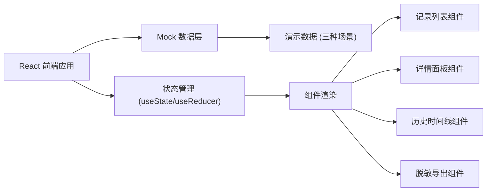
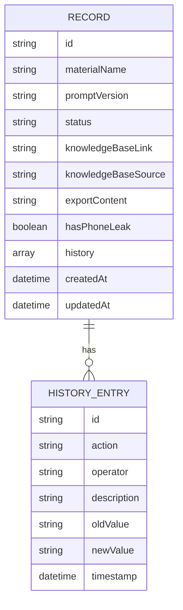

## 1. 架构设计

## 2. 技术描述
- **前端**：React@18 + tailwindcss@3 + vite
- **初始化工具**：vite-init
- **后端**：无（纯前端Mock数据）
- **数据库**：无（使用本地Mock数据）
- **状态管理**：React内置useState + useReducer
- **图标**：Lucide React

## 3. 数据模型

### 3.1 数据模型定义

### 3.2 数据结构说明

| 字段 | 类型 | 说明 | 示例值 |
|------|------|------|--------|
| id | string | 记录唯一ID | "rec-001" |
| materialName | string | 素材名称 | "古风山水背景图" |
| promptVersion | string | 提示词版本号 | "v2.3.1" |
| status | string | 当前状态 | "normal/pending_review/supplemented" |
| knowledgeBaseLink | string | 知识库引用链接 | "https://kb.example.com/article/123" |
| knowledgeBaseSource | string | 知识库来源说明 | "2024年版权口径第3版" |
| exportContent | string | 脱敏导出内容 | "导出的文本内容..." |
| hasPhoneLeak | boolean | 是否存在手机号漏遮 | true/false |
| history | array | 历史操作记录 | 见下方 |
| createdAt | datetime | 创建时间 | "2024-01-15T10:30:00" |
| updatedAt | datetime | 更新时间 | "2024-01-15T14:20:00" |

### 3.3 历史记录结构

| 字段 | 类型 | 说明 |
|------|------|------|
| id | string | 操作记录ID |
| action | string | 操作类型 |
| operator | string | 操作人 |
| description | string | 操作描述（人话） |
| oldValue | string | 变更前的值 |
| newValue | string | 变更后的值 |
| timestamp | datetime | 操作时间 |

## 4. 三种演示数据说明

### 4.1 顺利记录 (normal)
- 提示词版本：v2.3.1
- 知识库链接：已关联
- 脱敏导出：正常，无手机号漏遮
- 历史记录：导入 → 自动关联知识库 → 导出成功

### 4.2 手机号漏遮记录 (pending_review)
- 提示词版本：v2.2.0
- 知识库链接：已关联
- 脱敏导出：检测到手机号漏遮
- 历史记录：导入 → 导出检测异常 → 待算法复核

### 4.3 知识库补录记录 (supplemented)
- 提示词版本：v2.1.5
- 知识库链接：初始缺失，后由小乔补录
- 脱敏导出：补录后重新生成
- 历史记录：导入 → 知识库缺失 → 小乔补录链接 → 重新导出
