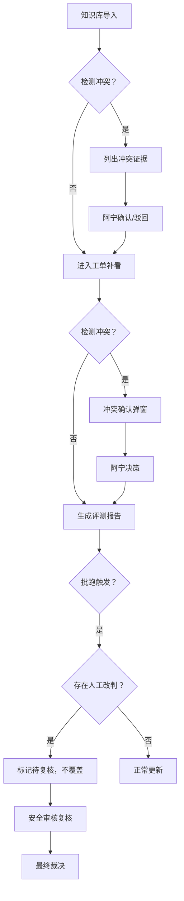

## 1. 产品概述

舱单OCR字段补录系统是面向AI产品经理阿宁的内部作业工具，解决舱单OCR识别后人工复核与补录过程中数据不一致、冲突难追溯、人工改判被批跑覆盖等核心痛点。系统强调人工决策优先级，不替业务自动拍板，确保知识库引用与线上工单证据可追溯、改判历史可审计、多端数据强一致。

- 核心价值：保护人工改判不被批跑覆盖，建立冲突证据链，实现端到端数据一致性
- 目标用户：AI产品经理阿宁、安全审核同事

---

## 2. 核心功能

### 2.1 用户角色

| 角色 | 注册方式 | 核心权限 |
|------|----------|----------|
| AI产品经理阿宁 | 内部账号 | 导入知识库链接、补看线上工单、确认/驳回冲突、更新评测报告、导出明细 |
| 安全审核同事 | 内部账号 | 复核人工改判被覆盖的记录、最终裁决异常状态 |

### 2.2 功能模块

1. **舱单列表页**：筛选检索、状态标签、批量操作、自检入口、导出按钮
2. **舱单详情页**：OCR原始字段、知识库引用、线上工单、改判历史时间线、参数版本说明
3. **冲突确认弹窗**：并列展示冲突证据、支持确认/驳回操作、记录决策理由
4. **自检面板**：重复导入检测、人工改判覆盖检测、补录重算校验、导出一致性校验
5. **评测报告页**：三步流程进度追踪、版本对比、更新记录

### 2.3 页面详情

| 页面名称 | 模块名称 | 功能描述 |
|----------|----------|----------|
| 舱单列表页 | 顶部操作栏 | 搜索框、状态筛选、批量选择、导入按钮、自检按钮、导出按钮 |
| 舱单列表页 | 数据表格 | 舱单编号、OCR识别结果、补录状态、冲突标记、改判覆盖标记、最近操作时间 |
| 舱单详情页 | 字段对比区 | OCR原值 vs 补录值 vs 知识库值 vs 工单值，四列并排对比 |
| 舱单详情页 | 证据来源区 | 知识库引用链接卡片、线上反馈工单卡片，分别展示置信度与参数版本 |
| 舱单详情页 | 改判时间线 | 所有操作按时间倒序，高亮标记"人工改判被批跑覆盖"事件 |
| 冲突确认弹窗 | 证据并列区 | 左右分栏展示冲突双方证据，中间冲突类型标签 |
| 冲突确认弹窗 | 决策操作区 | 确认知识库/确认工单/暂不裁决三选项，必填决策理由输入框 |
| 自检面板 | 检测项列表 | 四项自检：重复导入、改判覆盖、补录重算、导出一致，每项显示通过/失败数 |
| 评测报告页 | 三步流程卡 | 知识库导入→补看工单→更新评测，步骤进度条与状态标记 |

---

## 3. 核心流程

### 3.1 三步主流程

1. **第一步：知识库引用链接导入**  
   AI产品经理阿宁导入知识库引用链接，系统自动解析并补录字段，同时标记每条补录的参数版本和模型取舍理由。

2. **第二步：AI产品经理阿宁补看线上反馈工单**  
   系统自动拉取关联的线上反馈工单，与知识库补录结果对比。如发现冲突，弹出冲突确认弹窗，列出双方证据，由阿宁选择确认或驳回，不自动决策。

3. **第三步：评测报告更新**  
   前两步完成后，生成评测报告草稿，阿宁确认后更新正式评测报告。

### 3.2 人工改判被覆盖处理流程

当批跑任务执行时，如检测到某条记录已存在人工改判：
1. 不直接覆盖，标记为"待复核"状态
2. 在详情页高亮显示"人工改判被下一次批跑覆盖"警示
3. 自动通知安全审核同事进入复核流程
4. 安全审核同事复核前，该记录不自动归为正常

---

## 4. 用户界面设计

### 4.1 设计风格

- **主色调**：深炭灰 `#1a1d23` 作为背景，搭配琥珀橙 `#f59e0b` 作为冲突警示色，墨绿 `#059669` 作为正常状态色
- **辅助色**：石板蓝 `#6366f1` 用于知识库标识，玫红 `#ec4899` 用于工单标识
- **按钮风格**：微圆角（6px）、轻微阴影、hover时上移1px的微动效
- **字体**：标题使用 JetBrains Mono（等宽字体，强化数据工具感），正文使用 Inter
- **布局风格**：高密度信息卡片布局，强调数据对比的可读性，使用细线边框分隔
- **图标风格**：线性 Lucide 图标，冲突状态使用实心警告图标强化视觉

### 4.2 页面设计概述

| 页面名称 | 模块名称 | UI元素 |
|----------|----------|--------|
| 舱单列表页 | 数据表格 | 斑马纹行、状态徽章、冲突行琥珀色背景高亮、鼠标悬停行展开快捷操作 |
| 舱单详情页 | 字段对比区 | 四列网格布局，不同来源列使用不同边框色区分，差异单元格底色标记 |
| 冲突确认弹窗 | 证据并列区 | 左右卡片对比，中间VS分隔线，冲突点用红色虚线连接 |
| 自检面板 | 检测项列表 | 进度圆环+数字统计，展开后显示失败明细列表 |
| 评测报告页 | 三步流程卡 | 垂直时间线，当前步骤高亮，已完成步骤打勾 |

### 4.3 响应式

- Desktop-first 设计，优先保证 1440px 宽度下高密度信息展示
- 平板端（1024px）表格转为卡片式布局，四列对比转为两列堆叠
- 移动端仅保留查看功能，隐藏复杂操作

### 4.4 动效设计

- 页面加载：内容区块从上到下渐入， stagger 延迟 50ms
- 冲突检测：冲突标记徽章呼吸闪烁动画（琥珀色渐变）
- 改判覆盖警示：红色边框脉冲动画，吸引注意力
- 表格行hover：背景色平滑过渡，操作按钮从右侧滑入
