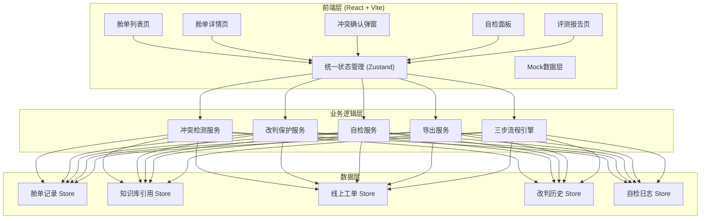
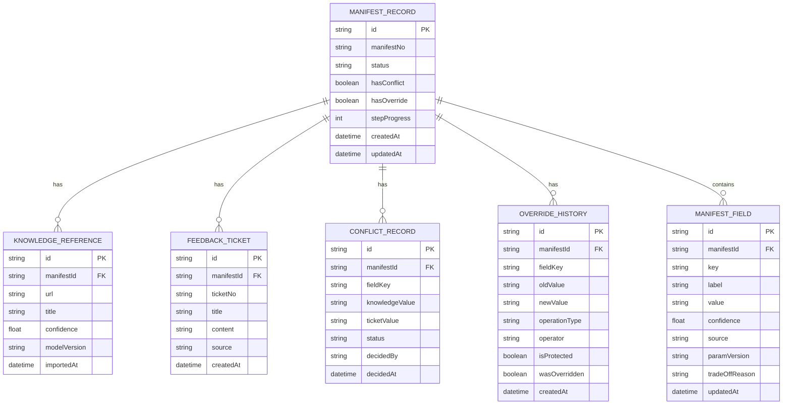

## 1. 架构设计



---

## 2. 技术描述

- **前端框架**：React@18 + TypeScript
- **构建工具**：Vite@5
- **样式方案**：TailwindCSS@3
- **状态管理**：Zustand
- **路由**：react-router-dom@6
- **图标库**：lucide-react
- **后端**：无后端，使用前端 Mock 数据模拟
- **数据持久化**：localStorage 存储操作记录

---

## 3. 路由定义

| Route | 页面 | 用途 |
|-------|------|------|
| `/` | 舱单列表页 | 主列表展示、筛选、批量操作入口 |
| `/manifest/:id` | 舱单详情页 | 单条舱单字段对比、证据查看、改判操作 |
| `/self-check` | 自检面板 | 四项自检功能执行与结果展示 |
| `/evaluation` | 评测报告页 | 三步流程进度、评测报告更新 |

---

## 4. 核心类型定义

```typescript
// 舱单记录
interface ManifestRecord {
  id: string;
  manifestNo: string;
  ocrFields: ManifestField[];
  supplementFields: ManifestField[];
  status: 'pending' | 'processing' | 'conflict' | 'overridden' | 'verified' | 'completed';
  hasConflict: boolean;
  hasOverride: boolean;
  stepProgress: 0 | 1 | 2 | 3;
  createdAt: string;
  updatedAt: string;
}

// 字段
interface ManifestField {
  key: string;
  label: string;
  value: string;
  confidence: number;
  source: 'ocr' | 'knowledge_base' | 'ticket' | 'manual';
  paramVersion?: string;
  tradeOffReason?: string;
  updatedAt: string;
  operator?: string;
}

// 知识库引用
interface KnowledgeReference {
  id: string;
  manifestId: string;
  url: string;
  title: string;
  extractedFields: Record<string, string>;
  confidence: number;
  modelVersion: string;
  importedAt: string;
  importedBy: string;
}

// 线上反馈工单
interface FeedbackTicket {
  id: string;
  manifestId: string;
  ticketNo: string;
  title: string;
  content: string;
  feedbackFields: Record<string, string>;
  source: string;
  createdAt: string;
}

// 冲突记录
interface ConflictRecord {
  id: string;
  manifestId: string;
  fieldKey: string;
  knowledgeValue: string;
  ticketValue: string;
  knowledgeSource: string;
  ticketSource: string;
  status: 'pending' | 'confirmed_knowledge' | 'confirmed_ticket' | 'deferred';
  decidedBy?: string;
  decidedAt?: string;
  decisionReason?: string;
}

// 改判历史
interface OverrideHistory {
  id: string;
  manifestId: string;
  fieldKey: string;
  oldValue: string;
  newValue: string;
  oldSource: string;
  newSource: string;
  operationType: 'manual_override' | 'batch_override' | 'system_override';
  operator: string;
  isProtected: boolean;
  wasOverridden: boolean;
  overriddenByBatch?: string;
  createdAt: string;
}

// 自检结果
interface SelfCheckResult {
  type: 'duplicate_import' | 'override_detection' | 'recalculation' | 'export_consistency';
  passed: boolean;
  totalCount: number;
  failedCount: number;
  failedItems: { manifestId: string; manifestNo: string; reason: string }[];
  checkedAt: string;
}
```

---

## 5. 数据模型 ER 图



---

## 6. 核心业务逻辑说明

### 6.1 冲突检测机制
- 导入知识库后，自动拉取关联工单
- 逐字段对比知识库值与工单值
- 值不一致时创建 ConflictRecord，状态为 pending
- 列表页标记冲突徽章，详情页高亮冲突字段

### 6.2 人工改判保护机制
- 人工改判时在 OverrideHistory 中标记 isProtected = true
- 批跑模拟时，检测到 isProtected 的记录：
  - 不直接更新值
  - 设置 wasOverridden = true
  - 记录 overriddenByBatch
  - manifest 状态标记为 'overridden'
- 安全审核复核前，状态保持不变

### 6.3 四项自检功能
1. **重复导入检测**：检查同一知识库URL是否被多次导入同一舱单
2. **改判覆盖检测**：列出所有 wasOverridden = true 的记录
3. **补录重算校验**：验证补录后字段值与计算逻辑一致
4. **导出一致性校验**：对比页面展示数据与导出数据结构是否一致

### 6.4 单一数据源原则
- 所有展示（页面、接口、导出）均从 Zustand Store 的同一份状态读取
- 修改操作统一通过 Store action 执行，确保数据同步
- 导出函数直接序列化当前 Store 状态
