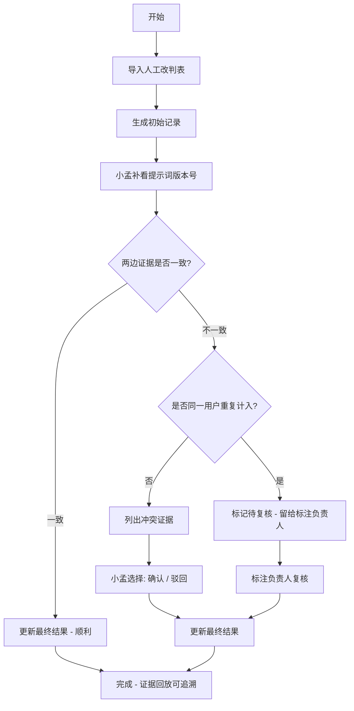

## 1. 产品概述

保险理赔材料识别系统，用于整合人工改判表（主流程）和提示词版本号（现场说法）两边的证据，统一展示识别结果。解决当前证据分散、追证据时断在半路的问题，让模型评测同事小孟能够清晰追溯每一条识别结果的证据来源。

目标用户：模型评测人员（小孟）、标注负责人
核心价值：证据可追溯、冲突可确认、重复计入可复核

## 2. 核心功能

### 2.1 用户角色
| 角色 | 核心权限 |
|------|----------|
| 模型评测人员（小孟） | 导入人工改判表、补看提示词版本号、查看证据回放、处理冲突确认/驳回 |
| 标注负责人 | 复核同一用户反馈被重复计入的记录 |

### 2.2 功能模块
1. **材料识别列表页**：展示所有保险理赔材料识别记录，支持按处理状态筛选
2. **识别详情页**：单条记录的完整证据展示，包含人工改判表和提示词版本号两边的证据
3. **人工改判表导入**：第一步，导入主流程的人工改判数据
4. **提示词版本号补看**：第二步，小孟补看现场说法的提示词版本数据
5. **证据回放更新**：第三步，整合两边证据，更新最终识别结果
6. **冲突处理**：人工改判表与提示词版本号矛盾时，列出冲突证据供选择
7. **重复计入复核**：同一用户反馈被重复计入时，标记待复核状态

### 2.3 页面详情
| 页面名称 | 模块名称 | 功能描述 |
|----------|----------|----------|
| 材料识别列表 | 筛选栏 | 按处理状态（待导入/待补看/待复核/已完成/有冲突）筛选 |
| 材料识别列表 | 记录卡片 | 显示记录概要、处理状态、证据来源标签 |
| 识别详情 | 基本信息区 | 用户信息、材料类型、提交时间 |
| 识别详情 | 证据时间线 | 按时间顺序展示所有操作和证据来源 |
| 识别详情 | 人工改判区 | 展示人工改判表的证据和结论 |
| 识别详情 | 提示词版本区 | 展示提示词版本号的证据和结论 |
| 识别详情 | 冲突处理区 | 列出两边矛盾点，提供确认/驳回按钮 |
| 识别详情 | 最终结果区 | 展示整合后的最终识别结论 |

## 3. 核心流程

### 3.1 三步处理流程
1. **人工改判表第一次导入**：系统导入主流程的人工改判数据，生成初始识别记录
2. **模型评测同事小孟补看提示词版本号**：小孟补充查看现场说法的提示词版本数据，系统自动比对
3. **证据回放更新**：整合两边证据，更新最终识别结果；如有冲突则进入冲突处理流程

### 3.2 特殊情况处理
- **同一用户反馈被重复计入**：不急着归为正常，标记为"待复核"状态，留给标注负责人处理
- **人工改判表与提示词版本号矛盾**：列出冲突证据，由小孟选择确认或驳回，不自动拍板

### 3.3 流程图

### 3.4 三种样例结果
1. **顺利记录**：人工改判表与提示词版本号结论一致，直接通过
2. **同一用户反馈被重复计入**：检测到同一用户多条反馈，标记待复核
3. **后来从提示词版本号补来的旧口径**：补看后发现旧口径与当前不一致，标记冲突

## 4. 用户界面设计

### 4.1 设计风格
- **主色调**：深蓝系 (#1e3a5f)，体现专业、可信赖
- **辅助色**：琥珀橙 (#f59e0b) 用于待处理状态，墨绿 (#065f46) 用于已完成，赤红 (#dc2626) 用于冲突
- **中性色**：灰白渐变背景，卡片式布局
- **字体**：标题用思源宋体（庄重），正文用Inter（清晰易读）
- **按钮风格**：直角微圆角，实线边框，hover时有轻微下沉效果
- **布局风格**：左侧导航 + 主内容区，详情页采用时间线布局展示证据链
- **图标风格**：Lucide 线性图标，简洁专业

### 4.2 页面设计概述
| 页面名称 | 模块名称 | UI 元素 |
|----------|----------|---------|
| 列表页 | 顶部筛选栏 | 状态标签组、搜索框、刷新按钮 |
| 列表页 | 记录列表 | 卡片式，每条显示状态色条、用户信息、证据来源标签、处理进度 |
| 详情页 | 顶部状态栏 | 大标题、状态徽章、三步流程进度条 |
| 详情页 | 证据时间线 | 竖线连接，每个节点带时间、操作人、操作内容 |
| 详情页 | 双栏证据区 | 左：人工改判表证据，右：提示词版本号证据 |
| 详情页 | 冲突对比区 | 表格对比两边差异，每行带确认/驳回单选 |
| 详情页 | 最终结果区 | 突出显示最终结论，下方附完整证据链链接 |

### 4.3 响应式
- 桌面端优先（1280px+），双栏证据并排展示
- 平板端（768-1279px），双栏改为上下堆叠
- 移动端（<768px），简化导航，时间线紧凑展示

### 4.4 动效设计
- 页面加载：内容区域淡入，卡片依次上浮出现
- 状态变更：状态徽章颜色切换时有平滑过渡
- 证据展开：点击展开证据详情时，高度平滑过渡
- 冲突处理：选择确认/驳回后，对应行高亮渐隐
