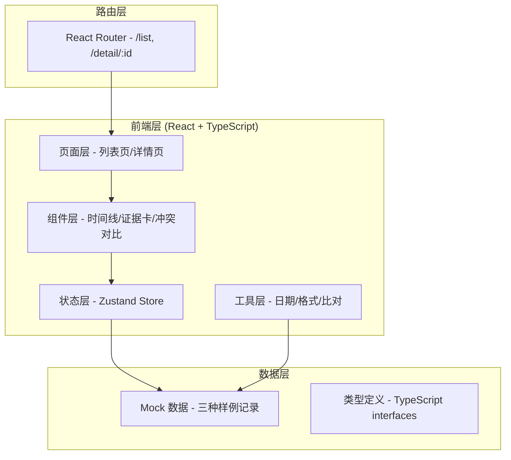

## 1. 架构设计



## 2. 技术描述

- **前端框架**: React@18 + TypeScript
- **构建工具**: Vite
- **样式方案**: TailwindCSS@3
- **状态管理**: Zustand
- **路由管理**: React Router DOM@6
- **图标库**: Lucide React
- **后端**: 无，纯前端 Mock 数据
- **数据存储**: 前端内存 + localStorage 持久化

## 3. 路由定义

| 路由 | 页面 | 用途 |
|------|------|------|
| `/` | 重定向到 `/list` | 首页跳转 |
| `/list` | 材料识别列表页 | 展示所有识别记录，筛选和搜索 |
| `/detail/:id` | 识别详情页 | 单条记录的完整证据展示和操作 |

## 4. 数据模型

### 4.1 核心类型定义

```typescript
// 识别记录状态
type RecordStatus = 
  | 'pending_import'    // 待导入人工改判表
  | 'pending_review'    // 待补看提示词版本号
  | 'pending_verify'    // 待复核（重复计入）
  | 'conflict'          // 有冲突
  | 'completed';        // 已完成

// 证据来源
type EvidenceSource = 'manual_judgment' | 'prompt_version';

// 处理结果类型
type ResultType = 'success' | 'duplicate' | 'old_criteria' | 'conflict';

// 证据项
interface EvidenceItem {
  id: string;
  source: EvidenceSource;
  field: string;        // 字段名，如"理赔金额"、"材料完整性"
  value: string;        // 该来源的值
  timestamp: string;
  operator: string;
  remark?: string;
}

// 冲突项
interface ConflictItem {
  id: string;
  field: string;
  manualValue: string;
  promptValue: string;
  resolution?: 'confirm_manual' | 'confirm_prompt' | 'reject_both';
}

// 时间线节点
interface TimelineNode {
  id: string;
  timestamp: string;
  operator: string;
  action: string;
  description: string;
  source?: EvidenceSource;
}

// 识别记录
interface ClaimRecord {
  id: string;
  userId: string;
  userName: string;
  materialType: string;
  submitTime: string;
  status: RecordStatus;
  resultType?: ResultType;
  finalConclusion?: string;
  
  // 人工改判表数据
  manualJudgment?: {
    importedAt: string;
    operator: string;
    conclusion: string;
    evidences: EvidenceItem[];
  };
  
  // 提示词版本号数据
  promptVersion?: {
    reviewedAt: string;
    operator: string;
    version: string;
    conclusion: string;
    evidences: EvidenceItem[];
    isOldCriteria?: boolean;  // 是否旧口径
  };
  
  // 冲突列表
  conflicts?: ConflictItem[];
  
  // 是否同一用户重复计入
  isDuplicateUser?: boolean;
  duplicateRecordIds?: string[];
  
  // 证据时间线
  timeline: TimelineNode[];
  
  // 复核信息
  verification?: {
    verifiedAt?: string;
    verifier?: string;
    result?: 'approved' | 'rejected';
    remark?: string;
  };
}
```

### 4.2 三种样例数据说明

1. **顺利记录 (success)**
   - 人工改判表与提示词版本号结论完全一致
   - 无冲突，无重复计入
   - 三步流程走完后直接标记为已完成

2. **同一用户反馈被重复计入 (duplicate)**
   - 检测到同一用户有多条提交记录
   - 补看提示词版本号后发现重复
   - 不急着归正常，标记为"待复核"
   - 需要标注负责人确认是否真的重复

3. **旧口径补录 (old_criteria)**
   - 人工改判表用的是新口径
   - 提示词版本号补来的是旧口径数据
   - 两边结论不一致，产生冲突
   - 列出冲突证据，由小孟选择确认或驳回

## 5. 状态管理设计

### 5.1 Zustand Store

```typescript
interface ClaimStore {
  records: ClaimRecord[];
  currentRecord: ClaimRecord | null;
  filter: RecordStatus | 'all';
  searchKeyword: string;
  
  // Actions
  setFilter: (status: RecordStatus | 'all') => void;
  setSearchKeyword: (keyword: string) => void;
  importManualJudgment: (recordId: string, data: any) => void;
  reviewPromptVersion: (recordId: string, data: any) => void;
  resolveConflict: (recordId: string, conflictId: string, resolution: ConflictItem['resolution']) => void;
  verifyDuplicate: (recordId: string, result: 'approved' | 'rejected', remark: string) => void;
  getFilteredRecords: () => ClaimRecord[];
}
```

## 6. 组件结构

```
src/
├── components/
│   ├── layout/
│   │   └── Sidebar.tsx        # 左侧导航
│   ├── claim/
│   │   ├── RecordCard.tsx     # 列表卡片
│   │   ├── FilterBar.tsx      # 筛选栏
│   │   ├── StatusBadge.tsx    # 状态徽章
│   │   ├── EvidenceTimeline.tsx  # 证据时间线
│   │   ├── EvidenceCard.tsx   # 单条证据卡片
│   │   ├── ConflictTable.tsx  # 冲突对比表
│   │   └── ProcessSteps.tsx   # 三步流程进度条
│   └── common/
│       └── Button.tsx         # 通用按钮
├── pages/
│   ├── ClaimList.tsx          # 列表页
│   └── ClaimDetail.tsx        # 详情页
├── store/
│   └── useClaimStore.ts       # Zustand store
├── types/
│   └── claim.ts               # 类型定义
├── data/
│   └── mockData.ts            # Mock 样例数据
└── utils/
    └── date.ts                # 日期工具
```
