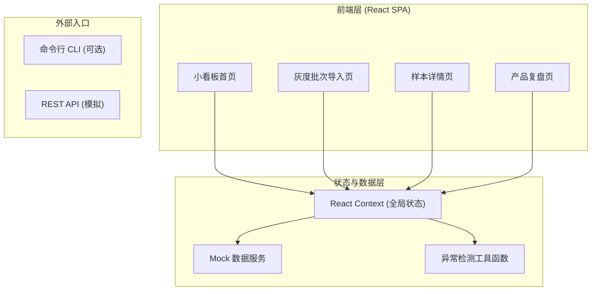
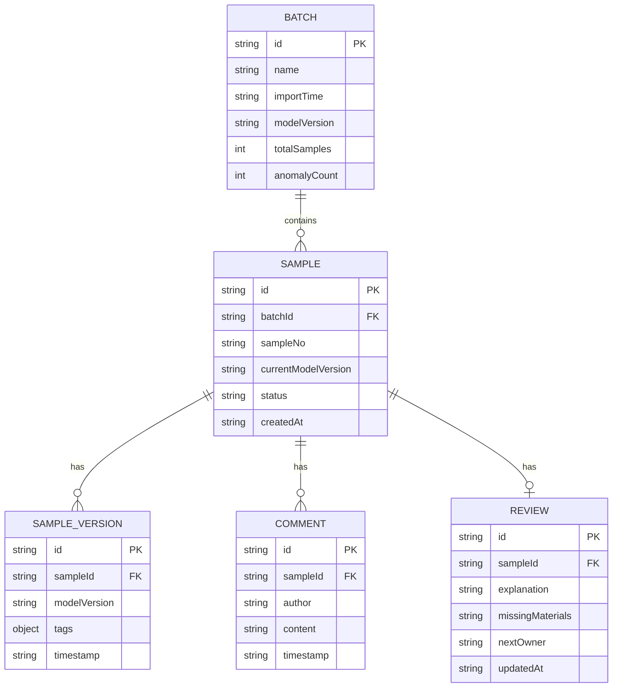

## 1. 架构设计



## 2. 技术描述

- **前端框架**：React@18 + TypeScript
- **构建工具**：Vite@5
- **样式方案**：TailwindCSS@3 + CSS 变量（设计令牌）
- **路由**：React Router@6
- **图表库**：Recharts（轻量 2D 图表）
- **图标**：Lucide React（细线风格）
- **状态管理**：React Context + useReducer（轻量，无 Redux）
- **数据持久化**：localStorage（模拟后端存储）
- **后端**：无真实后端，用 Mock 数据 + localStorage 模拟

## 3. 路由定义

| 路由 | 页面 | 用途 |
|------|------|------|
| `/` | 小看板首页 | 批次统计、异常概览、快速入口 |
| `/batch/import` | 灰度批次导入 | 文件上传、样本列表、异常检测 |
| `/sample/:id` | 样本详情 | 版本对比、留言补录、状态标记 |
| `/review/:id` | 产品复盘页 | 解释说明、材料清单、下一步指引 |
| `/batch/list` | 批次列表 | 历史批次管理 |

## 4. 数据模型

### 4.1 实体关系



### 4.2 核心类型定义

```typescript
// 批次
interface Batch {
  id: string;
  name: string;
  importTime: string;
  modelVersion: string;
  totalSamples: number;
  anomalyCount: number;
}

// 样本状态
type SampleStatus = 'pending_review' | 'confirmed_normal' | 'needs_attention';

// 样本
interface Sample {
  id: string;
  batchId: string;
  sampleNo: string;
  currentModelVersion: string;
  status: SampleStatus;
  createdAt: string;
  versions: SampleVersion[];
  comments: Comment[];
  review?: Review;
}

// 样本版本（模型版本换了但样本编号没变的关键）
interface SampleVersion {
  id: string;
  modelVersion: string;
  tags: Record<string, string>;
  timestamp: string;
}

// 标注员留言
interface Comment {
  id: string;
  author: '小孟' | '标注员' | '运营复核';
  content: string;
  timestamp: string;
}

// 复盘结论
interface Review {
  explanation: string;
  missingMaterials: string[];
  nextOwner: '运营复核人' | '模型评测小孟';
  updatedAt: string;
}
```

## 5. 异常检测逻辑

核心检测函数：

```
函数 detectAnomalies(samples):
  按 sampleNo 分组
  对每组：
    如果该组出现 >1 个不同的 modelVersion
    → 标记为"模型版本换了但样本编号没变"异常
    → 状态设为 pending_review（不急着归正常）
  返回异常样本列表
```

## 6. 目录结构

```
src/
├── components/          # 通用组件
│   ├── Layout.tsx       # 页面布局（侧边栏+内容）
│   ├── StatCard.tsx     # 统计卡片
│   ├── StatusBadge.tsx  # 状态标签
│   └── CommentCard.tsx  # 留言卡片
├── pages/               # 页面组件
│   ├── Dashboard.tsx
│   ├── BatchImport.tsx
│   ├── SampleDetail.tsx
│   └── ReviewPage.tsx
├── data/                # Mock 数据
│   ├── mockBatches.ts
│   └── mockSamples.ts
├── context/             # 全局状态
│   └── AppContext.tsx
├── utils/               # 工具函数
│   ├── anomalyDetector.ts
│   └── formatters.ts
├── types/               # 类型定义
│   └── index.ts
├── App.tsx
├── main.tsx
└── index.css
```
