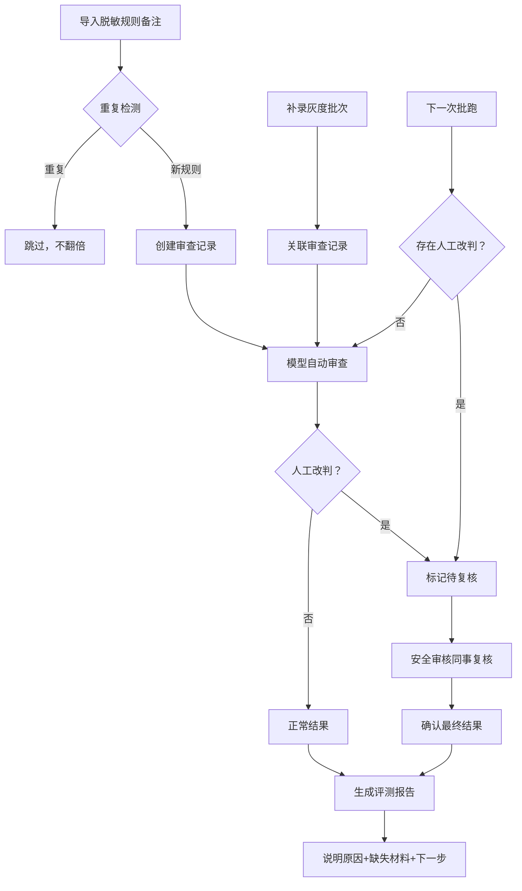

## 1. 产品概述

虚拟主播脚本安全审查系统是面向模型评测团队和安全审核团队的协作平台，用于管理脱敏规则备注、灰度批次、人工改判记录，并生成人性化的评测报告。解决脱敏规则重复导入数量翻倍、人工改判被批跑覆盖丢失、评测报告过于技术化难以理解等痛点。

- 目标用户：模型评测同事（小孟）、安全审核同事
- 核心价值：确保审查数据可追溯、人工改判不丢失、评测结果清晰可执行

## 2. 核心功能

### 2.1 用户角色
| 角色 | 说明 | 核心权限 |
|------|------|----------|
| 模型评测同事 | 如小孟，负责导入脱敏规则备注、补录灰度批次、更新评测报告 | 导入规则、编辑备注、查看历史、生成报告 |
| 安全审核同事 | 负责人工改判复核、最终确认 | 人工改判、复核确认、查看溯源 |

### 2.2 功能模块
1. **审查总览页**：统计仪表盘、审查列表、快速入口
2. **脱敏规则备注管理**：导入、去重、编辑、历史变更对比
3. **灰度批次管理**：补录批次、关联审查记录
4. **人工改判保护**：改判记录留存、批跑覆盖预警、复核流程
5. **3D/图表展示**：可视化审查结果、点击溯源跳转
6. **评测报告生成**：人性化报告、说明原因、标注下一步行动

### 2.3 页面详情
| 页面名称 | 模块名称 | 功能描述 |
|-----------|-------------|---------------------|
| 审查总览 | 统计卡片 | 展示审查总数、待复核数、通过率等关键指标 |
| 审查总览 | 审查列表 | 展示所有审查记录，支持筛选、搜索 |
| 脱敏规则备注 | 导入面板 | 支持批量导入，自动去重不翻倍 |
| 脱敏规则备注 | 历史对比 | 展示改前改后差异，高亮变更内容 |
| 灰度批次 | 批次列表 | 管理灰度批次，支持补录和关联 |
| 审查详情 | 人工改判 | 人工改判后标记为待复核，不被批跑直接覆盖 |
| 可视化展示 | 3D/图表 | 支持切换视图，点击元素可溯源到原始数据 |
| 评测报告 | 报告生成 | 生成包含原因、缺失材料、下一步行动的报告 |

## 3. 核心流程

### 3.1 主流程说明
1. 模型评测同事小孟第一次导入脱敏规则备注
2. 系统自动去重，相同规则不重复计数
3. 灰度批次后续补录，关联到对应审查记录
4. 小孟回看审查记录，修改备注内容
5. 系统记录变更历史，可对比改前改后
6. 安全审核同事进行人工改判
7. 下一次批跑时，人工改判标记为"待复核"，不直接覆盖
8. 安全审核同事复核后确认最终结果
9. 生成人性化评测报告，说明原因和下一步行动

### 3.2 流程图

## 4. 用户界面设计

### 4.1 设计风格
- **主色调**：深海蓝 #0F2B5B，代表专业和信任
- **辅助色**：琥珀橙 #FF9F1C 用于强调和警示，翠绿 #2EC4B6 用于通过/确认
- **中性色**：石板灰系列，确保良好的可读性
- **按钮风格**：微圆角（6px），轻微阴影，hover时有上浮效果
- **字体**：标题使用 Noto Serif SC 彰显专业感，正文使用 Noto Sans SC 保证可读性
- **布局风格**：卡片式布局，清晰的视觉层级，充足的留白
- **图标风格**：Lucide 线性图标，统一 20px 尺寸

### 4.2 页面设计概览
| 页面名称 | 模块名称 | UI 元素 |
|-----------|-------------|-------------|
| 审查总览 | 统计卡片 | 渐变背景、数字动画、图标点缀 |
| 审查总览 | 数据表格 | 斑马纹、hover高亮、状态标签彩色 |
| 审查详情 | 变更历史 | 左右分栏对比、新增绿色背景、删除红色删除线 |
| 审查详情 | 人工改判区 | 黄色边框警示、复核按钮突出 |
| 可视化 | 3D视图 | 可旋转的审查结果球体、点击高亮 |
| 评测报告 | 报告卡片 | 清晰的章节分隔、行动项突出显示 |

### 4.3 响应式
- 桌面端优先设计（1280px+）
- 平板端（768-1279px）：侧边栏收起，表格可横向滚动
- 移动端（<768px）：卡片堆叠展示，核心功能优先

### 4.4 3D 场景指导
- **环境**：深色渐变背景，模拟数据空间感
- **光照**：柔和的蓝色环境光 + 橙色点光源强调关键数据
- **相机**：默认透视视角，支持鼠标拖拽旋转
- **交互**：点击数据节点高亮，显示详情弹窗，支持溯源跳转
- **动效**：节点缓慢浮动，连线脉动，体现数据流动感
