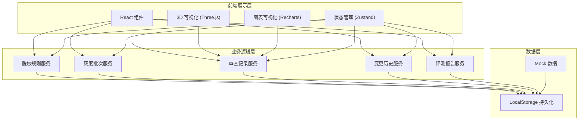
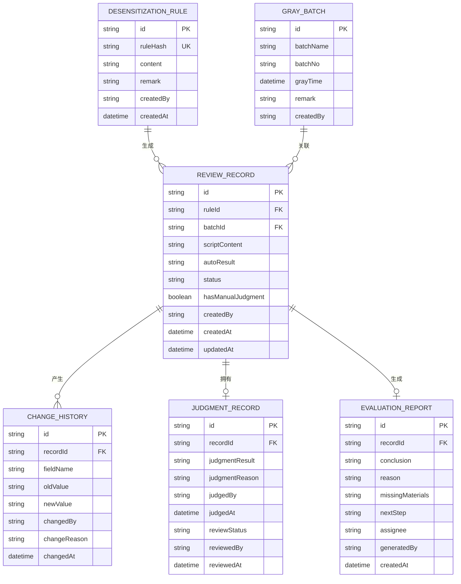

## 1. 架构设计



## 2. 技术描述

- **前端框架**: React@18 + TypeScript
- **构建工具**: Vite@5
- **样式方案**: TailwindCSS@3
- **状态管理**: Zustand@4
- **路由管理**: React Router@6
- **3D 可视化**: Three@0.160 + @react-three/fiber@8 + @react-three/drei@9
- **图表可视化**: Recharts@2
- **图标库**: Lucide React@0.312
- **数据持久化**: LocalStorage（纯前端演示）
- **后端**: 无（纯前端 Mock 数据）

## 3. 路由定义

| 路由 | 页面 | 用途 |
|-------|------|------|
| / | 审查总览页 | 仪表盘、统计数据、审查列表 |
| /review/:id | 审查详情页 | 查看详情、变更历史、人工改判、报告 |
| /rules | 脱敏规则管理 | 导入、查看、编辑脱敏规则备注 |
| /batches | 灰度批次管理 | 管理灰度批次、补录关联 |
| /visualization | 可视化展示 | 3D 视图、图表视图、溯源跳转 |

## 4. 数据模型

### 4.1 ER 图



### 4.2 TypeScript 类型定义

```typescript
// 脱敏规则
interface DesensitizationRule {
  id: string;
  ruleHash: string;
  content: string;
  remark: string;
  createdBy: string;
  createdAt: Date;
}

// 灰度批次
interface GrayBatch {
  id: string;
  batchName: string;
  batchNo: string;
  grayTime: Date;
  remark: string;
  createdBy: string;
}

// 审查记录
interface ReviewRecord {
  id: string;
  ruleId: string;
  batchId?: string;
  scriptContent: string;
  autoResult: 'PASS' | 'FAIL' | 'PENDING';
  status: 'DRAFT' | 'REVIEWING' | 'PENDING_REVIEW' | 'CONFIRMED';
  hasManualJudgment: boolean;
  createdBy: string;
  createdAt: Date;
  updatedAt: Date;
}

// 变更历史
interface ChangeHistory {
  id: string;
  recordId: string;
  fieldName: string;
  oldValue: string;
  newValue: string;
  changedBy: string;
  changeReason: string;
  changedAt: Date;
}

// 人工改判记录
interface JudgmentRecord {
  id: string;
  recordId: string;
  judgmentResult: 'PASS' | 'FAIL';
  judgmentReason: string;
  judgedBy: string;
  judgedAt: Date;
  reviewStatus: 'PENDING' | 'APPROVED' | 'REJECTED';
  reviewedBy?: string;
  reviewedAt?: Date;
}

// 评测报告
interface EvaluationReport {
  id: string;
  recordId: string;
  conclusion: string;
  reason: string;
  missingMaterials: string[];
  nextStep: string;
  assignee: '安全审核同事' | '模型评测同事小孟';
  generatedBy: string;
  createdAt: Date;
}
```

## 5. 核心模块设计

### 5.1 脱敏规则导入去重模块
- 输入: 规则内容数组
- 处理: 对每条规则计算 hash（SHA-256）
- 判断: 检查 hash 是否已存在
- 输出: 导入结果统计（新增 X 条，跳过 Y 条重复）

### 5.2 变更历史追踪模块
- 监听字段变更前值和后值
- 自动记录操作人、时间、变更原因
- 提供对比视图（diff 展示）

### 5.3 人工改判保护模块
- 标记有 `hasManualJudgment = true` 的记录
- 批跑时检测到标记，设置 `status = 'PENDING_REVIEW'`
- 不直接覆盖原改判结果，保留历史

### 5.4 可视化溯源模块
- 3D 节点关联审查记录 ID
- 点击节点获取 ID，跳转至详情页
- 支持高亮关联的规则和批次

### 5.5 评测报告生成模块
- 根据审查结果自动生成结论模板
- 智能推荐下一步负责人
- 支持编辑补充缺失材料说明
