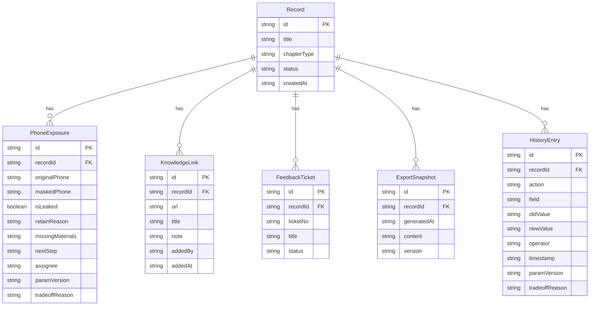

## 1. 架构设计

```mermaid
graph TB
    "前端 React" --> "状态管理 Zustand"
    "状态管理 Zustand" --> "Mock数据层"
    "前端 React" --> "页面路由"
    "页面路由" --> "记录列表页"
    "页面路由" --> "补录详情页"
    "页面路由" --> "脱敏导出页"
    "页面路由" --> "历史对比页"
    "页面路由" --> "3D图表展示页"
```

纯前端架构，使用 Zustand 管理状态，Mock 数据模拟后端行为。

## 2. 技术说明

- 前端：React@18 + TypeScript + Tailwind CSS@3 + Vite
- 状态管理：Zustand（含 persist 中间件）
- 路由：react-router-dom@6
- 图表：recharts
- 3D：@react-three/fiber + @react-three/drei
- 图标：lucide-react
- 初始化工具：vite-init
- 后端：无（纯前端，Mock 数据）

## 3. 路由定义

| 路由 | 用途 |
|------|------|
| / | 记录列表页，展示三条内置切分记录 |
| /record/:id/supplement | 补录详情页，小乔补充知识库链接 |
| /export | 脱敏导出页，查看和重新生成导出内容 |
| /history | 历史对比页，查看变更时间线和差异 |
| /visual | 3D/图表展示页，可视化切分结果 |

## 4. 数据模型

### 4.1 数据模型定义



### 4.2 初始数据

**Record 1**: "产品发布会-开场白"
- PhoneExposure: 1条漏遮（138****5678，保留理由：疑似客服号码需确认）
- KnowledgeLink: 2条已关联
- FeedbackTicket: 1个

**Record 2**: "技术分享-架构设计"
- PhoneExposure: 0条漏遮（全部遮盖）
- KnowledgeLink: 1条已关联
- FeedbackTicket: 0个

**Record 3**: "用户访谈-反馈收集"
- PhoneExposure: 2条漏遮（139****1234保留理由：受访者主动公开；136****9876保留理由：待确认是否为工作号码）
- KnowledgeLink: 初始0条（待小乔补录）
- FeedbackTicket: 1个
