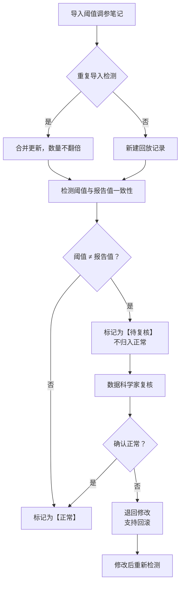

## 1. 产品概述

在线学习样本回放系统，专为数据科学家和评测运营人员设计，用于快速回溯和复核阈值调参过程中的样本数据。核心解决"阈值改过但报告仍写旧值"的一致性问题，确保调参过程可追溯、可复核、可回滚。

目标用户：数据科学家（10分钟快速复核）、评测运营小孟（日常阈值管理）
核心价值：消除口头约定，所有边界规则代码化，历史操作全链路可追溯

---

## 2. 核心功能

### 2.1 用户角色

| 角色 | 核心权限 |
|------|----------|
| 数据科学家 | 复核阈值变更、审批异常状态、查看全链路历史 |
| 评测运营（小孟） | 导入阈值调参笔记、补看线上实验桶、更新分层指标、修改备注 |

### 2.2 功能模块

1. **主工作流页面**：三步流程引导（导入调参笔记 → 补看实验桶 → 分层指标更新）
2. **样本回放列表**：所有回放记录，支持筛选和搜索
3. **异常检测面板**：自动识别"阈值改过但报告仍写旧值"的记录
4. **历史版本对比**：备注修改前后差异可视化
5. **可视化展示**：3D/图表方式展示阈值变化，支持点击回溯原始数据
6. **边界规则说明**：内置规则文档，明确判罚/修改/回滚流程

### 2.3 页面详情

| 页面名称 | 模块名称 | 功能描述 |
|----------|----------|----------|
| 主工作流 | 三步进度条 | 可视化当前所处步骤，支持回退跳转 |
| 主工作流 | 导入区域 | 拖拽/选择文件导入阈值调参笔记，自动去重 |
| 主工作流 | 实验桶关联 | 补看线上实验桶数据，支持一键跳转 |
| 主工作流 | 分层指标更新 | 展示指标变更，异常项高亮标记 |
| 样本回放列表 | 数据表格 | 展示所有回放记录，状态标签区分正常/待复核 |
| 样本回放列表 | 筛选器 | 按状态、时间、操作人员筛选 |
| 异常检测面板 | 异常列表 | 集中展示阈值与报告不一致的记录 |
| 异常检测面板 | 复核操作 | 数据科学家可标记"确认正常"或"需修改" |
| 历史详情 | 版本对比 | 备注修改前后diff展示，时间线回溯 |
| 可视化页面 | 3D/图表 | 阈值变化趋势可视化，点击数据点跳转原始笔记 |
| 规则说明 | 边界规则 | 代码化的判定规则、修改流程、回滚机制 |

---

## 3. 核心流程

### 3.1 常规工作流

评测运营小孟导入阈值调参笔记 → 系统自动去重检测 → 补看线上实验桶关联数据 → 系统自动检测阈值与报告一致性 → 若发现"阈值改过但报告仍写旧值"则标记为"待数据科学家复核" → 分层指标更新（异常项暂不归档） → 数据科学家开会前10分钟快速复核 → 确认正常或要求修改

### 3.2 边界判定流程

---

## 4. 用户界面设计

### 4.1 设计风格

- **主色调**：深邃科技蓝（#1E3A5F）搭配警示橙（#FF6B35），数据可视化用高对比度配色
- **辅助色**：成功绿（#10B981）、警告黄（#F59E0B）、错误红（#EF4444）
- **按钮风格**：直角微圆角（4px），悬停有微妙阴影提升
- **字体**：标题用 Space Grotesk（科技感），正文用 IBM Plex Mono（等宽适合数据展示）
- **布局风格**：左侧导航 + 右侧内容区，卡片式模块，数据密集型表格设计
- **图标风格**：线性简约图标，状态用彩色圆点标记

### 4.2 页面设计概述

| 页面名称 | 模块名称 | UI 元素 |
|----------|----------|---------|
| 主工作流 | 三步进度条 | 时间线样式，当前步骤高亮发光，已完成步骤打勾 |
| 主工作流 | 导入拖放区 | 虚线边框，拖入时背景变色，显示文件列表和去重统计 |
| 异常检测 | 异常卡片 | 橙色边框警示，左右对比展示阈值旧值/新值 |
| 历史详情 | 版本对比 | 左右分栏diff样式，删除线/下划线标记变更 |
| 可视化 | 3D图表区 | 悬浮数据点，点击弹出回溯链接菜单 |

### 4.3 响应式

- 桌面端优先设计（1280px+），数据表格支持横向滚动
- 平板端（768px-1279px）：导航折叠为汉堡菜单，表格简化列
- 移动端（<768px）：卡片堆叠展示，核心信息优先

### 4.4 数据可视化指引

- 环境：深色背景配网格线，营造数据控制台氛围
- 光照：环境光 + 方向光，确保数据点清晰可见
- 相机：默认正交视角，支持鼠标拖拽旋转（3D模式）
- 交互：悬停显示详情，点击弹出原始数据链接菜单
- 动画：数据点入场有淡入效果，阈值变更处有闪烁提示
