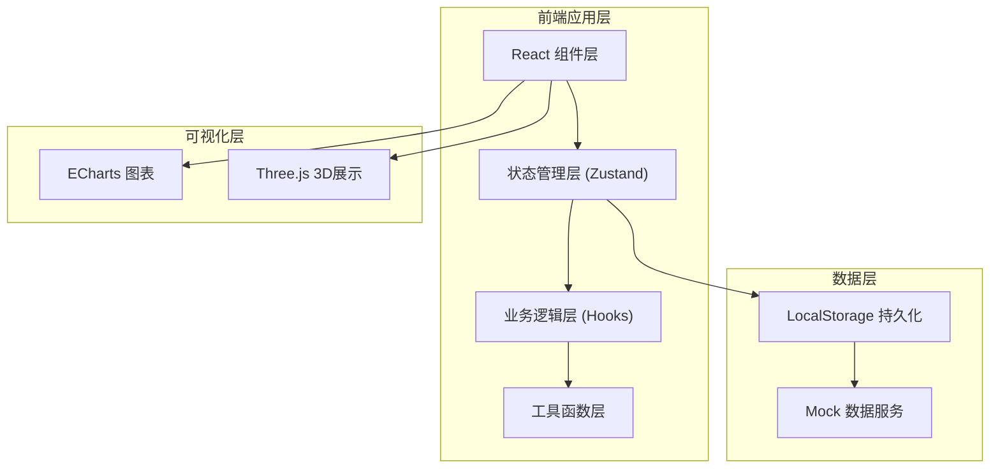
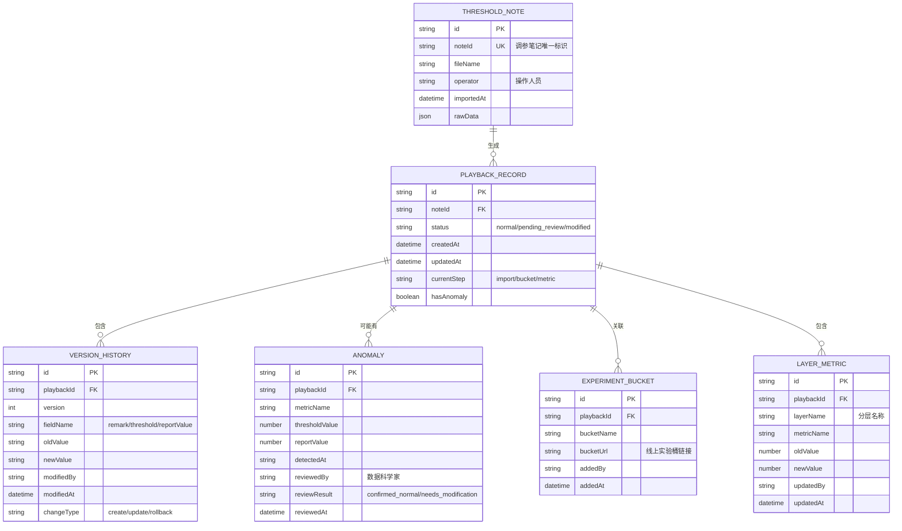

## 1. 架构设计



---

## 2. 技术描述

- **前端框架**: React@18 + TypeScript@5
- **构建工具**: Vite@5
- **样式方案**: TailwindCSS@3
- **状态管理**: Zustand（轻量级，适合中小规模应用）
- **路由**: React Router@6
- **图表库**: ECharts@5（2D图表）
- **3D引擎**: Three.js + @react-three/fiber + @react-three/drei
- **数据持久化**: LocalStorage（前端模拟后端）
- **UI组件**: 自定义组件（不引入重量级UI库，保持设计独特性）
- **后端**: 无纯前端应用，使用Mock数据

---

## 3. 路由定义

| 路由 | 页面 | 用途 |
|------|------|------|
| / | 主工作流页 | 三步流程引导：导入→补看实验桶→分层指标更新 |
| /playbacks | 样本回放列表 | 所有回放记录，筛选搜索 |
| /playbacks/:id | 回放详情页 | 单条记录详情，版本历史，异常标记 |
| /anomalies | 异常检测面板 | 集中展示阈值与报告不一致记录 |
| /visualization | 可视化展示 | 3D/图表方式展示阈值变化趋势 |
| /rules | 边界规则说明 | 判罚/修改/回滚规则文档 |

---

## 4. 数据模型

### 4.1 数据模型定义



### 4.2 TypeScript 类型定义

```typescript
// 阈值调参笔记
interface ThresholdNote {
  id: string;
  noteId: string;
  fileName: string;
  operator: string;
  importedAt: string;
  rawData: Record<string, any>;
}

// 回放记录状态
type PlaybackStatus = 'normal' | 'pending_review' | 'modified';
type WorkflowStep = 'import' | 'bucket' | 'metric';

// 回放记录
interface PlaybackRecord {
  id: string;
  noteId: string;
  status: PlaybackStatus;
  createdAt: string;
  updatedAt: string;
  currentStep: WorkflowStep;
  hasAnomaly: boolean;
  thresholds: ThresholdItem[];
}

// 阈值项
interface ThresholdItem {
  metricName: string;
  thresholdValue: number;
  reportValue: number;
  isConsistent: boolean;
}

// 版本历史
interface VersionHistory {
  id: string;
  playbackId: string;
  version: number;
  fieldName: string;
  oldValue: string;
  newValue: string;
  modifiedBy: string;
  modifiedAt: string;
  changeType: 'create' | 'update' | 'rollback';
}

// 异常记录
interface Anomaly {
  id: string;
  playbackId: string;
  metricName: string;
  thresholdValue: number;
  reportValue: number;
  detectedAt: string;
  reviewedBy?: string;
  reviewResult?: 'confirmed_normal' | 'needs_modification';
  reviewedAt?: string;
}

// 线上实验桶
interface ExperimentBucket {
  id: string;
  playbackId: string;
  bucketName: string;
  bucketUrl: string;
  addedBy: string;
  addedAt: string;
}

// 分层指标
interface LayerMetric {
  id: string;
  playbackId: string;
  layerName: string;
  metricName: string;
  oldValue: number;
  newValue: number;
  updatedBy: string;
  updatedAt: string;
}
```

---

## 5. 核心业务逻辑

### 5.1 去重导入逻辑

- 基于 `noteId`（调参笔记唯一标识）进行去重检测
- 重复导入时：
  - 数量不翻倍，仅更新字段（如备注、阈值）
  - 生成版本历史记录，标记 changeType 为 'update'
  - 保留所有历史版本，支持回滚

### 5.2 阈值一致性检测逻辑

- 每条阈值项对比 `thresholdValue` 和 `reportValue`
- 若不相等：
  - 标记 `hasAnomaly = true`
  - 回放状态设为 `pending_review`（待复核）
  - 创建异常记录 `Anomaly`
  - **不归入正常状态，等待数据科学家复核**

### 5.3 错误提示规则

- 所有错误信息使用自然语言，不暴露内部字段名
- 示例：
  - ❌ 错误：`field 'threshold_value' cannot be null`
  - ✅ 正确：`请填写阈值数值，不能为空`

### 5.4 回溯链接机制

- 可视化图表中的每个数据点绑定：
  - 关联的阈值调参笔记ID
  - 关联的线上实验桶URL
  - 点击时弹出菜单，支持一键跳转
