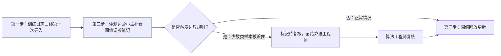
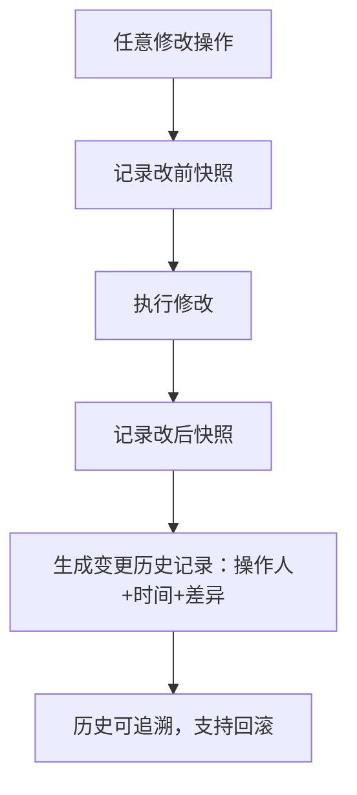

## 1. 产品概述

强化学习仓储调度评测追踪系统，用于管理训练日志曲线的导入、阈值调参笔记的晚到补录、变更历史追踪，以及边界规则的标准化处理。解决评测运营与算法工程师之间证据链断裂、结论无法追溯的问题。

- 核心目标：确保每一条结论都能追溯到原始日志行号，所有修改留痕可查
- 目标用户：评测运营（小孟）、算法工程师
- 核心价值：证据链完整、边界规则明确、变更可回溯

## 2. 核心 Features

### 2.1 用户角色

| 角色 | 注册方式 | 核心权限 |
|------|---------|---------|
| 评测运营 | 系统内置 | 导入训练日志、补录阈值笔记、修改备注、提交复核 |
| 算法工程师 | 系统内置 | 复核边界案例、调整阈值、查看完整证据链 |

### 2.2 功能模块

1. **训练日志管理页**：日志导入、原始行号展示、去重校验、处理状态追踪
2. **阈值调参笔记页**：晚到材料录入、关联日志明细、局部刷新不覆盖已确认内容
3. **变更历史页**：改前改后对比、操作人时间戳、备注修改痕迹
4. **边界规则中心**：少数类样本判定规则、回滚流程、代码与文档双记录
5. **三步工作流向导**：导入→补看→回放更新的引导式操作

### 2.3 页面详情

| 页面名称 | 模块名称 | 功能描述 |
|---------|---------|---------|
| 训练日志管理 | 日志导入模块 | 支持批量导入，自动记录原始行号、文件来源、导入时间 |
| 训练日志管理 | 去重校验模块 | 基于文件哈希+行号去重，重复导入不翻倍数量 |
| 训练日志管理 | 状态追踪模块 | 每条日志标记：未处理/待复核/已确认/已驳回 |
| 阈值调参笔记 | 晚到材料模块 | 阈值笔记补录时，仅刷新关联明细，不覆盖已确认日志 |
| 阈值调参笔记 | 关联展示模块 | 笔记与训练日志行号双向关联，一键跳转证据 |
| 变更历史 | 对比展示模块 | 同一记录的改前改后并排对比，高亮差异字段 |
| 变更历史 | 操作追踪模块 | 记录操作人、操作时间、操作类型、IP地址 |
| 边界规则中心 | 规则展示模块 | 少数类样本判定标准、总指标掩盖问题的处理流程 |
| 边界规则中心 | 回滚流程模块 | 标准化回滚步骤、回滚审批链、影响范围评估 |
| 工作流向导 | 三步引导模块 | 第一步导入、第二步补看笔记、第三步回放更新 |
| 工作流向导 | 边界拦截模块 | 少数类样本异常时自动拦截，不急于归为正常 |

## 3. 核心流程

### 3.1 正常评测流程
评测运营导入训练日志曲线 → 系统自动记录原始行号和处理状态 → 阈值调参笔记晚到补录 → 系统只刷新关联明细不覆盖已确认内容 → 算法工程师复核边界案例 → 确认结论入库

### 3.2 三步工作流

### 3.3 变更追踪流程

## 4. 用户界面设计

### 4.1 设计风格
- **主色调**：深蓝工业风（#1e3a5f），搭配琥珀色警示（#d97706）标记边界案例
- **辅色调**：深灰背景（#0f172a）、浅灰文字（#e2e8f0），营造专业严谨的工具感
- **按钮风格**：直角极简按钮，hover 时边框高亮，禁用态灰度显示
- **字体**：等宽字体（JetBrains Mono）展示代码和行号，思源黑体展示正文
- **布局风格**：左右分栏，左侧导航+状态，右侧内容区表格为主
- **图标风格**：lucide-react 线性图标，边界案例用警示图标突出

### 4.2 页面设计概述

| 页面名称 | 模块名称 | UI Elements |
|---------|---------|-------------|
| 训练日志管理 | 日志列表 | 斑马纹表格、行号固定列、状态标签色区分、悬停显示操作按钮 |
| 训练日志管理 | 导入区域 | 拖放上传区、进度条、去重提示弹窗 |
| 阈值调参笔记 | 笔记列表 | 时间线布局、关联日志预览卡片、晚到标记角标 |
| 变更历史 | 对比视图 | 左右分栏对比、差异行高亮红/绿、时间戳面包屑 |
| 边界规则中心 | 规则卡片 | 卡片式布局、代码块展示判定逻辑、回滚步骤有序列表 |
| 工作流向导 | 步骤条 | 顶部步骤指示器、当前步骤高亮、已完成步骤打勾 |

### 4.3 响应性
- 桌面端优先（1440px+），适配 1080p 显示器
- 表格支持横向滚动，列宽可调整
- 侧边栏可折叠，最大化内容区
- 触控优化：表格行高 48px，按钮最小 40×40px

### 4.4 动效设计
- 行号变更时闪烁高亮 2 秒后渐隐
- 状态变更时标签颜色过渡动画 300ms
- 导入进度条平滑增长，完成后有成功勾选动效
- 边界规则触发时警示图标呼吸动画
