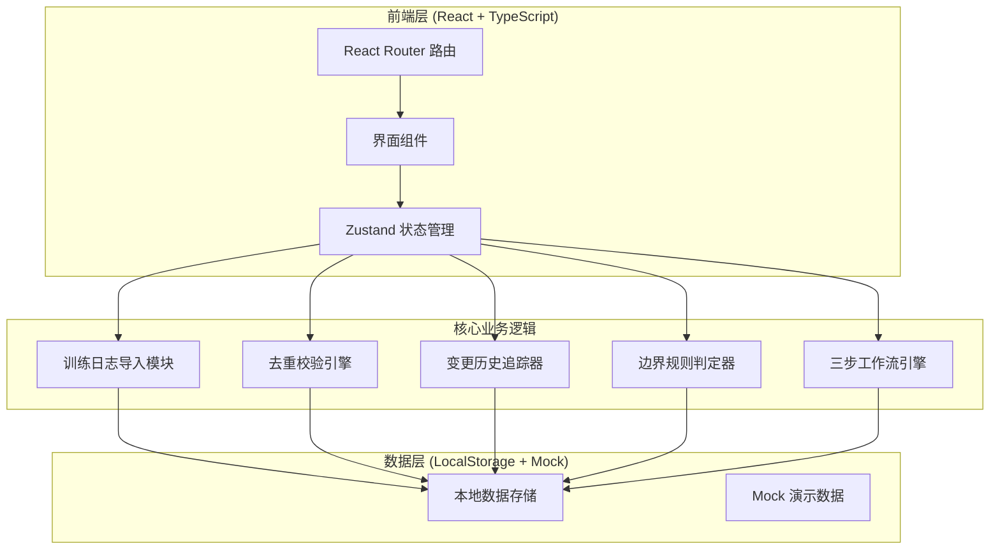
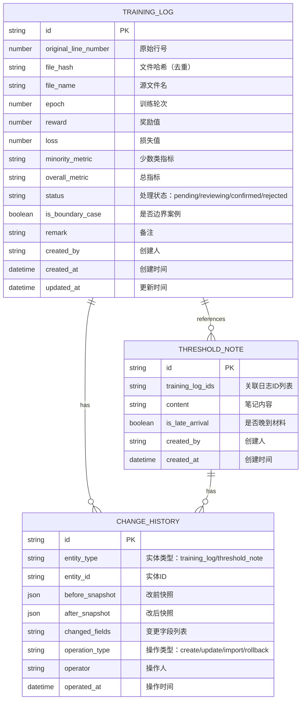

## 1. 架构设计



## 2. 技术描述

- **前端框架**：React@18 + TypeScript
- **构建工具**：Vite@5
- **样式方案**：TailwindCSS@3
- **状态管理**：Zustand
- **路由管理**：react-router-dom@6
- **图标库**：lucide-react
- **数据持久化**：LocalStorage（演示用，生产可替换为 IndexedDB）
- **后端**：无（纯前端演示，逻辑内聚在前端）
- **初始化模板**：react-ts

## 3. 路由定义

| 路由路径 | 页面名称 | 用途 |
|---------|---------|------|
| / | 首页 / 工作流向导 | 三步工作流引导入口 |
| /training-logs | 训练日志管理 | 日志列表、导入、状态管理 |
| /threshold-notes | 阈值调参笔记 | 晚到材料管理、关联展示 |
| /change-history | 变更历史 | 改前改后对比、操作追溯 |
| /boundary-rules | 边界规则中心 | 规则文档、回滚流程 |

## 4. 数据模型

### 4.1 ER 图



### 4.2 核心类型定义

```typescript
// 训练日志状态
type LogStatus = 'pending' | 'reviewing' | 'confirmed' | 'rejected';

interface TrainingLog {
  id: string;
  originalLineNumber: number;
  fileHash: string;
  fileName: string;
  epoch: number;
  reward: number;
  loss: number;
  minorityMetric: number;
  overallMetric: number;
  status: LogStatus;
  isBoundaryCase: boolean;
  boundaryReason?: string;
  remark: string;
  createdBy: string;
  createdAt: string;
  updatedAt: string;
}

interface ThresholdNote {
  id: string;
  trainingLogIds: string[];
  content: string;
  isLateArrival: boolean;
  createdBy: string;
  createdAt: string;
}

interface ChangeHistory {
  id: string;
  entityType: 'training_log' | 'threshold_note';
  entityId: string;
  beforeSnapshot: Record<string, any>;
  afterSnapshot: Record<string, any>;
  changedFields: string[];
  operationType: 'create' | 'update' | 'import' | 'rollback';
  operator: string;
  operatedAt: string;
}

// 边界规则配置
interface BoundaryRule {
  id: string;
  name: string;
  description: string;
  condition: (log: TrainingLog) => boolean;
  action: 'flag_for_review' | 'block_confirmation';
  codeReference: string;
}
```

## 5. 核心模块设计

### 5.1 去重校验引擎 (DeduplicationEngine)

```typescript
// 去重逻辑：基于 fileHash + originalLineNumber 作为唯一键
// 重复导入时：跳过已存在的行，返回导入报告
interface ImportReport {
  totalRows: number;
  newRows: number;
  duplicateRows: number;
  skippedRows: number;
}
```

### 5.2 边界规则判定器 (BoundaryRuleEngine)

```typescript
// 规则1：少数类样本被总指标盖住
// - 总指标 > 阈值，但少数类指标 < 阈值的 80%
// - 触发：标记为边界案例，状态设为 reviewing，不允许直接 confirmed

// 规则2：晚到材料刷新规则
// - 阈值笔记更新时，只刷新关联日志的阈值相关字段
// - 已 confirmed 状态的日志，其他字段不被覆盖
```

### 5.3 变更历史追踪器 (ChangeHistoryTracker)

```typescript
// 每次修改前：生成 beforeSnapshot
// 每次修改后：生成 afterSnapshot
// 计算 diff：changedFields
// 支持按实体ID查询完整历史链
```

## 6. 边界规则实现

### 6.1 代码内嵌规则（README 同步）

```typescript
// 规则编号: BR-001
// 规则名称: 少数类样本被总指标盖住
// 触发条件: overallMetric >= 0.85 && minorityMetric < 0.85 * 0.8
// 处理动作: isBoundaryCase = true, status = 'reviewing'
// 回滚路径: 算法工程师复核后，可手动确认或驳回
// 代码位置: src/utils/boundaryRules.ts checkMinorityClassMasked()
```

### 6.2 README 文档规则

README.md 中必须包含：
- 每条边界规则的编号、名称、触发条件、处理动作、回滚方式
- 与代码中函数的交叉引用（文件路径 + 行号）
- 变更记录（规则修改历史）
```

## 7. 项目结构

```
src/
├── components/          # 可复用组件
│   ├── DataTable.tsx    # 通用表格组件
│   ├── StatusBadge.tsx  # 状态标签
│   ├── StepIndicator.tsx # 步骤指示器
│   └── DiffViewer.tsx   # 改前改后对比组件
├── pages/               # 页面组件
│   ├── Home.tsx         # 工作流向导页
│   ├── TrainingLogs.tsx # 训练日志管理
│   ├── ThresholdNotes.tsx # 阈值笔记
│   ├── ChangeHistory.tsx # 变更历史
│   └── BoundaryRules.tsx # 边界规则中心
├── store/               # Zustand 状态
│   └── useAppStore.ts
├── utils/               # 工具函数
│   ├── deduplication.ts # 去重引擎
│   ├── boundaryRules.ts # 边界规则
│   ├── changeTracker.ts # 变更追踪
│   └── hash.ts          # 哈希计算
├── types/               # TypeScript 类型
│   └── index.ts
├── data/                # Mock 数据
│   └── mockData.ts
├── App.tsx
├── main.tsx
└── index.css
```
