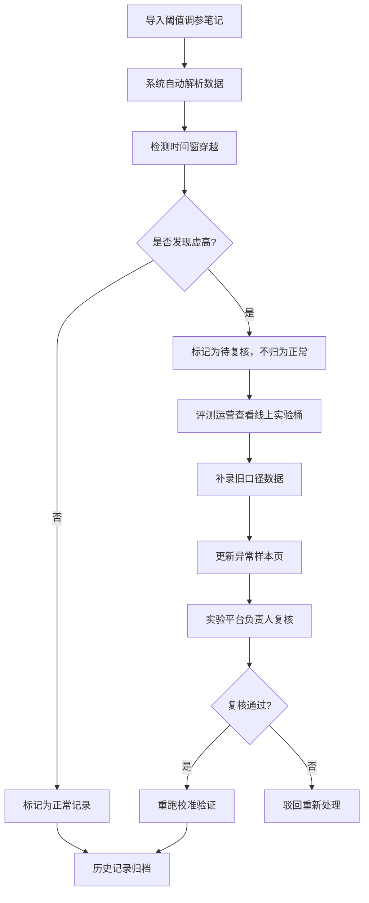

## 1. 产品概述

语音唤醒阈值校准演示系统，用于评测运营团队向新人展示阈值调参的完整流程。系统内置三种典型样本数据，帮助团队理解正常记录、时间窗穿越导致效果虚高、以及从线上实验桶补录旧口径数据的不同处理结果。

- 目标用户：评测运营人员、实验平台负责人、新入职评测人员
- 核心价值：标准化阈值校准流程演示，降低新人培训成本，统一异常处理口径

## 2. 核心功能

### 2.1 用户角色

| 角色 | 核心职责 | 核心权限 |
|------|----------|----------|
| 评测运营（小孟） | 导入调参笔记、查看线上实验桶、补录数据、人工修正 | 全功能操作 |
| 实验平台负责人 | 复核异常样本、确认最终校准结果 | 复核审批权限 |

### 2.2 功能模块

1. **仪表盘首页**：整体流程概览、三种样本卡片、快速操作入口
2. **阈值调参笔记**：导入调参记录、展示原始数据、时间窗穿越检测
3. **线上实验桶**：历史实验数据、旧口径数据查询、数据补录
4. **异常样本页**：异常样本列表、时间窗穿越标注、人工修正入口
5. **历史记录**：完整操作轨迹、状态变更日志、三种样本对比

### 2.3 页面详情

| 页面名称 | 模块名称 | 功能描述 |
|----------|----------|----------|
| 仪表盘首页 | 流程概览 | 三步流程可视化：导入调参笔记 → 查看实验桶 → 更新异常页 |
| 仪表盘首页 | 样本卡片 | 三种样本类型卡片：顺利记录、时间窗虚高、旧口径补录 |
| 阈值调参笔记 | 数据导入 | 支持批量导入调参记录，自动识别关键字段 |
| 阈值调参笔记 | 时间窗检测 | 自动检测并标记时间窗穿越导致的效果虚高 |
| 线上实验桶 | 实验列表 | 展示历史实验桶数据，支持按口径筛选 |
| 线上实验桶 | 数据补录 | 支持从历史实验桶补录旧口径数据到当前校准 |
| 异常样本页 | 异常列表 | 展示所有异常样本，区分虚高、旧口径、其他异常 |
| 异常样本页 | 人工修正 | 支持人工标注样本状态，提交给负责人复核 |
| 异常样本页 | 复核状态 | 显示样本复核进度，区分待复核/已通过/已驳回 |
| 历史记录 | 操作日志 | 完整记录每一步操作，包含时间、操作人、内容 |
| 历史记录 | 状态对比 | 三种样本处理结果对比展示 |

## 3. 核心流程

### 3.1 主流程描述

1. **第一步：阈值调参笔记导入** - 评测运营小孟导入调参笔记，系统自动解析数据并检测时间窗穿越问题
2. **第二步：查看线上实验桶** - 小孟补看线上实验桶，发现旧口径数据并补录到当前校准中
3. **第三步：更新异常样本页** - 系统自动更新异常样本列表，标记时间窗穿越样本为"待复核"状态，不直接归为正常
4. **第四步：负责人复核** - 实验平台负责人对时间窗穿越样本进行复核确认
5. **第五步：重跑验证** - 复核通过后，支持重跑校准，查看最终效果对比

## 4. 用户界面设计

### 4.1 设计风格

- **主色调**：科技蓝 (#1E40AF) 作为主色，代表专业和可信赖
- **辅助色**：警告橙 (#F59E0B) 标记待复核，成功绿 (#10B981) 标记正常，错误红 (#EF4444) 标记异常
- **背景**：深色渐变背景 (#0F172A → #1E293B)，营造科技感
- **卡片样式**：圆角8px，微妙的内阴影和边框，玻璃拟态效果
- **字体**：标题使用思源黑体粗体，正文使用思源黑体常规，代码使用 JetBrains Mono
- **交互**：悬停时微上浮效果，状态切换时平滑过渡动画

### 4.2 页面设计概述

| 页面名称 | 模块名称 | UI元素 |
|----------|----------|--------|
| 仪表盘首页 | 流程时间线 | 垂直时间线，三步流程节点，当前步骤高亮 |
| 仪表盘首页 | 样本卡片 | 三列等宽卡片，不同状态色边框，底部状态标签 |
| 阈值调参笔记 | 数据表格 | 斑马纹表格，异常行高亮，时间窗列特殊标记 |
| 线上实验桶 | 实验列表 | 可折叠实验详情，口径标签，补录按钮 |
| 异常样本页 | 异常卡片 | 左侧状态色条，样本详情，修正操作按钮组 |
| 历史记录 | 日志流 | 时间轴样式，操作人头像，操作内容详情 |

### 4.3 响应式

- 桌面端优先，支持1280px及以上分辨率
- 平板端自适应，卡片自动换行
- 移动端简化布局，优先展示核心数据

### 4.4 微交互细节

- 页面加载时，元素按顺序淡入上移（staggered animation）
- 状态变更时，数字滚动动画（count-up）
- 卡片悬停时，轻微上浮 + 阴影加深
- 按钮点击时，缩放反馈效果
- 异常检测完成时，脉冲动画提示

## 5. 错误提示设计

### 5.1 友好错误提示原则

- 不说内部字段名，直接说人话
- 告诉用户发生了什么 + 为什么 + 怎么解决
- 错误等级区分：警告（黄）、错误（红）、提示（蓝）

### 5.2 典型错误提示示例

| 场景 | 错误提示 |
|------|----------|
| 导入文件格式错误 | "这个文件格式不对哦～请上传 CSV 或 Excel 格式的调参笔记" |
| 时间窗穿越检测到 | "检测到这条记录跨了时间窗统计周期，效果可能虚高，已标记给负责人复核" |
| 补录数据重复 | "这条旧口径数据已经补录过了，不用重复添加哦" |
| 提交复核失败 | "提交复核失败，请检查网络连接后重试" |
| 重跑缺少数据 | "还缺少一些必要数据，先补全调参笔记再重跑吧" |
