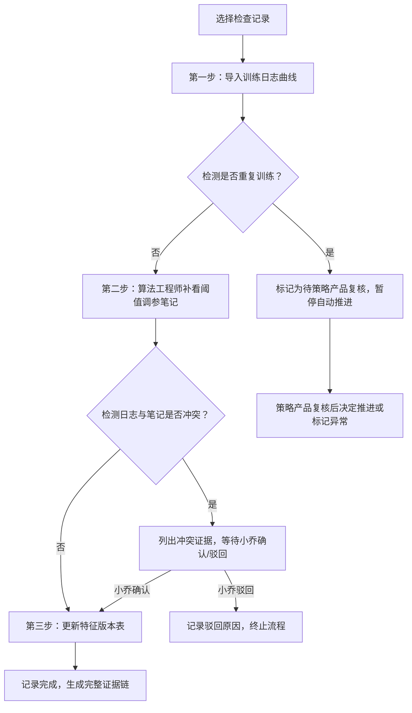

## 1. 产品概述

批流特征一致性检查工具，用于解决特征工程中批流数据训练结果不一致的问题。通过标准化的三步审核流程，帮助算法工程师和策略产品追踪特征版本变更、识别训练日志与调参笔记的冲突、处理重复训练等异常场景。

- 目标用户：算法工程师（小乔）、策略产品经理
- 核心价值：建立证据链完整的特征一致性审核机制，避免结论断层，减少人工解释成本

## 2. 核心功能

### 2.1 用户角色
| 角色 | 核心权限 |
|------|----------|
| 算法工程师 | 导入训练日志、补看阈值调参笔记、确认/驳回冲突、更新特征版本表 |
| 策略产品 | 查看记录详情、复核异常记录（重复训练）、追溯证据链 |

### 2.2 功能模块
1. **记录列表页**：展示所有检查记录，按状态分类筛选，支持三种典型记录样例
2. **记录详情页**：展示单条记录的完整证据链，包含三步审核流程进度
3. **特征版本对比**：特征版本表与历史记录的对照视图
4. **冲突处理面板**：训练日志曲线与阈值调参笔记冲突时的证据展示与人工裁决

### 2.3 页面详情
| 页面名称 | 模块名称 | 功能描述 |
|----------|----------|----------|
| 记录列表页 | 顶部筛选栏 | 按状态（正常/待复核/有冲突/已完成）筛选记录 |
| 记录列表页 | 记录卡片列表 | 展示记录概要、类型标签、当前步骤、状态标识 |
| 记录详情页 | 三步流程进度条 | 可视化展示：导入训练日志→补看调参笔记→更新特征版本表 |
| 记录详情页 | 证据链面板 | 训练日志曲线图、阈值调参笔记内容、特征版本快照 |
| 记录详情页 | 冲突检测区 | 自动识别矛盾点，列出冲突证据，提供确认/驳回按钮 |
| 记录详情页 | 特征版本对照表 | 展示版本号、特征口径、更新时间、操作人 |

## 3. 核心流程

用户选择一条检查记录进入详情页，按照三步流程逐步审核。系统自动检测异常情况：同一批数据重复训练两次时标记为"待策略产品复核"，不自动归为正常；训练日志与调参笔记矛盾时列出冲突证据，由算法工程师人工裁决。

## 4. 用户界面设计

### 4.1 设计风格
- **主色调**：深青色（#0F766E）代表专业严谨，搭配琥珀色（#D97706）作为异常提醒
- **辅助色**：红色（#DC2626）标记冲突，绿色（#059669）标记正常，蓝色（#2563EB）标记进行中
- **按钮风格**：直角矩形，2px边框，悬停时有轻微下沉效果
- **字体**：标题使用思源宋体（Serif）增强专业感，正文使用等宽字体便于数据对比
- **布局风格**：信息密度偏高的卡片式布局，强调数据可读性和证据链的完整性
- **视觉细节**：使用细边框分割不同证据区块，时间轴式展示审核流程

### 4.2 页面设计概述
| 页面名称 | 模块名称 | UI元素 |
|----------|----------|--------|
| 记录列表页 | 记录卡片 | 左侧状态色条、标题、类型标签、步骤指示器、更新时间 |
| 记录详情页 | 三步流程 | 时间轴样式，已完成步骤打勾，当前步骤高亮，异常步骤标红 |
| 记录详情页 | 证据区块 | 带标题栏的卡片，可折叠展开，内有表格/图表/文本 |
| 记录详情页 | 冲突面板 | 红色边框警告样式，左右分栏对比矛盾证据，底部操作按钮 |

### 4.3 响应式
- 桌面端优先设计（1280px+），适配1440px专业显示器
- 侧边信息栏在小屏幕转为底部抽屉
- 表格数据支持横向滚动查看

### 4.4 样例数据说明
必须内置三条典型记录供演示：
1. **顺利记录**：正常走完三步流程，无异常
2. **重复训练记录**：同一批数据重复训练两次，卡在"待策略产品复核"状态
3. **旧口径补录记录**：从阈值调参笔记补来的旧口径，存在冲突需人工确认
