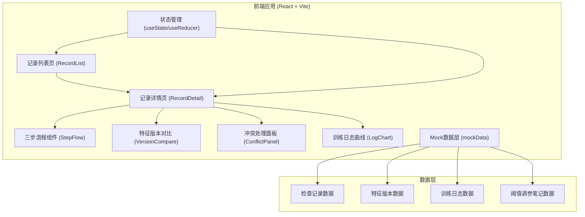

## 1. 架构设计



## 2. 技术描述

- **前端框架**: React@18 + TypeScript
- **构建工具**: Vite@5
- **样式方案**: TailwindCSS@3
- **图表库**: Recharts（用于训练日志曲线展示）
- **路由**: React Router DOM@6
- **图标**: Lucide React
- **后端**: 无后端，使用前端Mock数据
- **数据存储**: 前端状态管理 + localStorage持久化

## 3. 路由定义

| 路由 | 页面 | 用途 |
|------|------|------|
| / | 记录列表页 | 展示所有检查记录，支持筛选 |
| /record/:id | 记录详情页 | 展示单条记录完整信息、三步流程、证据链 |

## 4. 数据模型

### 4.1 核心类型定义

```typescript
// 检查记录状态
type RecordStatus = 'normal' | 'pending_review' | 'conflict' | 'completed';

// 记录类型
type RecordType = 'smooth' | 'duplicate_training' | 'old_caliber';

// 流程步骤
type StepKey = 'import_log' | 'review_notes' | 'update_version';

interface StepStatus {
  key: StepKey;
  label: string;
  status: 'completed' | 'current' | 'pending' | 'blocked';
  blockedReason?: string;
}

interface TrainingLogPoint {
  epoch: number;
  loss: number;
  accuracy: number;
}

interface TrainingLog {
  id: string;
  batchId: string;
  curveData: TrainingLogPoint[];
  importTime: string;
  isDuplicate: boolean;
  duplicateOf?: string;
}

interface ThresholdNote {
  id: string;
  version: string;
  content: string;
  updateTime: string;
  operator: string;
  isOldCaliber: boolean;
}

interface FeatureVersion {
  version: string;
  featureName: string;
  caliber: string;
  updateTime: string;
  operator: string;
  remark: string;
}

interface ConflictEvidence {
  id: string;
  type: 'log_vs_note' | 'version_mismatch';
  description: string;
  logEvidence?: string;
  noteEvidence?: string;
  resolution?: 'confirmed' | 'rejected' | null;
  resolvedBy?: string;
  resolvedAt?: string;
}

interface CheckRecord {
  id: string;
  title: string;
  type: RecordType;
  status: RecordStatus;
  currentStep: StepKey;
  steps: StepStatus[];
  batchId: string;
  featureName: string;
  createTime: string;
  updateTime: string;
  trainingLog: TrainingLog;
  thresholdNote: ThresholdNote;
  featureVersions: FeatureVersion[];
  conflicts: ConflictEvidence[];
  reviewHistory: {
    operator: string;
    action: string;
    time: string;
    remark: string;
  }[];
}
```

### 4.2 Mock数据说明

内置三条典型记录：

1. **顺利记录 (smooth)**:
   - 状态: completed
   - 三步全部完成
   - 无冲突，无重复训练
   - 特征版本表与历史记录一致

2. **重复训练记录 (duplicate_training)**:
   - 状态: pending_review
   - 卡在第一步后，检测到同一批数据重复训练
   - 显示"待策略产品复核"
   - 特征版本表显示两条相同batchId的记录

3. **旧口径补录记录 (old_caliber)**:
   - 状态: conflict
   - 卡在第二步，检测到训练日志与阈值调参笔记冲突
   - 阈值调参笔记标记为旧口径
   - 冲突面板展示矛盾证据，等待小乔确认/驳回

## 5. 组件结构

```
src/
├── pages/
│   ├── RecordList.tsx      # 记录列表页
│   └── RecordDetail.tsx    # 记录详情页
├── components/
│   ├── StepFlow.tsx        # 三步流程进度组件
│   ├── RecordCard.tsx      # 记录卡片组件
│   ├── LogChart.tsx        # 训练日志曲线图
│   ├── VersionTable.tsx    # 特征版本对照表
│   ├── ConflictPanel.tsx   # 冲突处理面板
│   ├── EvidenceBlock.tsx   # 证据区块组件
│   └── StatusBadge.tsx     # 状态标签组件
├── data/
│   └── mockRecords.ts      # Mock数据
├── types/
│   └── index.ts            # 类型定义
├── App.tsx
├── main.tsx
└── index.css
```
