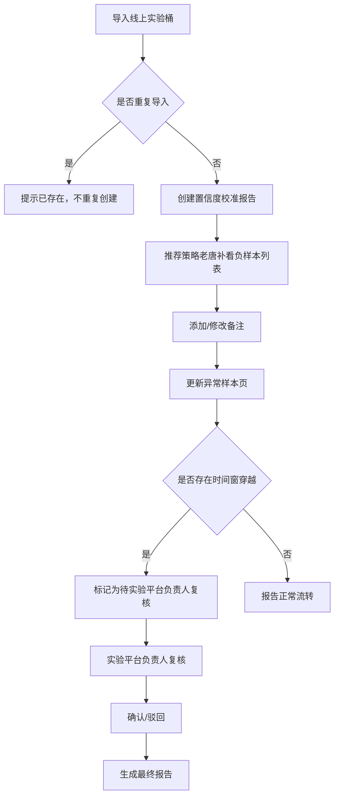

## 1. 产品概述

置信度校准报告系统，服务于推荐策略团队与实验平台团队的协作工具。将"置信度校准报告"从线上实验桶与负样本列表的临时拼接中解耦，提供完整的报告生命周期管理，包括导入去重、版本追溯、异常分析、可视化展示与跨团队协作复核。

目标用户：推荐策略负责人（老唐）、实验平台负责人、数据分析团队。

## 2. 核心功能

### 2.1 用户角色
| 角色 | 注册方式 | 核心权限 |
|------|----------|----------|
| 推荐策略负责人 | 单点登录 | 导入实验桶、补充负样本备注、查看报告、修改备注 |
| 实验平台负责人 | 单点登录 | 复核时间窗穿越问题、确认异常样本、导出报告 |
| 数据分析团队 | 单点登录 | 查看报告、查看历史版本、查看参数说明 |

### 2.2 功能模块
1. **报告列表页**：报告概览、导入入口、状态筛选、搜索
2. **报告详情页**：核心指标展示、版本历史、参数记录
3. **可视化展示页**：2D图表/3D展示、数据回溯导航
4. **异常样本页**：异常列表、样本详情、责任分工说明
5. **三步流程引导**：导入实验桶→补看负样本→更新异常页

### 2.3 页面详情
| 页面名称 | 模块名称 | 功能描述 |
|----------|----------|----------|
| 报告列表页 | 报告卡片 | 展示报告名称、导入时间、状态、最新备注摘要 |
| 报告列表页 | 导入区域 | 支持拖拽上传线上实验桶数据、去重校验提示 |
| 报告详情页 | 版本时间轴 | 展示每次修改的备注对比、修改人、修改时间 |
| 报告详情页 | 参数说明卡 | 展示专业计算的参数版本、取舍理由 |
| 可视化展示页 | 图表/3D切换 | 支持2D折线图与3D散点图切换 |
| 可视化展示页 | 回溯导航 | 点击数据点可跳转至对应线上实验桶或负样本列表 |
| 异常样本页 | 异常卡片 | 展示异常原因、缺失材料、下一步责任人 |
| 异常样本页 | 复核标记 | 时间窗穿越问题标记为待复核状态 |

## 3. 核心流程

用户核心操作流程：导入线上实验桶→系统自动去重→推荐策略老唐补看负样本列表并添加备注→系统更新异常样本页→发现时间窗穿越时标记待复核→实验平台负责人复核→生成最终置信度校准报告。

## 4. 用户界面设计

### 4.1 设计风格
- **主色调**：深海蓝 #1E3A5F，体现专业与可信赖
- **辅助色**：珊瑚橙 #FF6B6B 用于异常标记、薄荷绿 #4ECDC4 用于正常状态、琥珀黄 #FFD93D 用于待复核
- **按钮风格**：轻微圆角（8px），悬停时有微妙的阴影变化
- **字体**：标题使用 Noto Serif SC（衬线字体体现专业性），正文使用 Noto Sans SC
- **布局风格**：卡片式布局，信息层级分明，左侧导航+右侧内容区
- **图标风格**：线性图标，统一2px描边，与整体专业风格一致

### 4.2 页面设计概述
| 页面名称 | 模块名称 | UI元素 |
|----------|----------|--------|
| 报告列表页 | 报告卡片 | 白色卡片、阴影、悬停上浮动画、状态标签颜色区分 |
| 报告详情页 | 版本时间轴 | 左侧垂直线、节点圆点、修改前后对比色块 |
| 可视化展示页 | 图表区域 | 深色背景图表、数据点悬停提示、回溯按钮 |
| 异常样本页 | 异常卡片 | 左对齐信息块、责任人标签、下一步行动按钮 |

### 4.3 响应性
- Desktop-first 设计
- 断点：1200px+ 完整三栏布局
- 992px-1200px 两栏布局，导航收起
- 768px-992px 单栏布局，顶部导航
- 768px以下 移动端适配

### 4.4 3D场景指引
- 环境：深色背景，微弱环境光
- 光照：三点布光，突出3D散点图的立体感
- 相机：可旋转视角，支持缩放
- 交互：点击散点可高亮并显示详情面板
- 后处理：Bloom效果增强科技感
