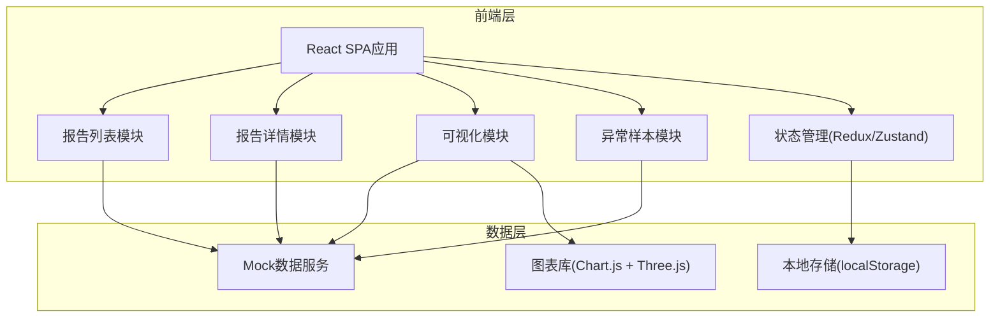
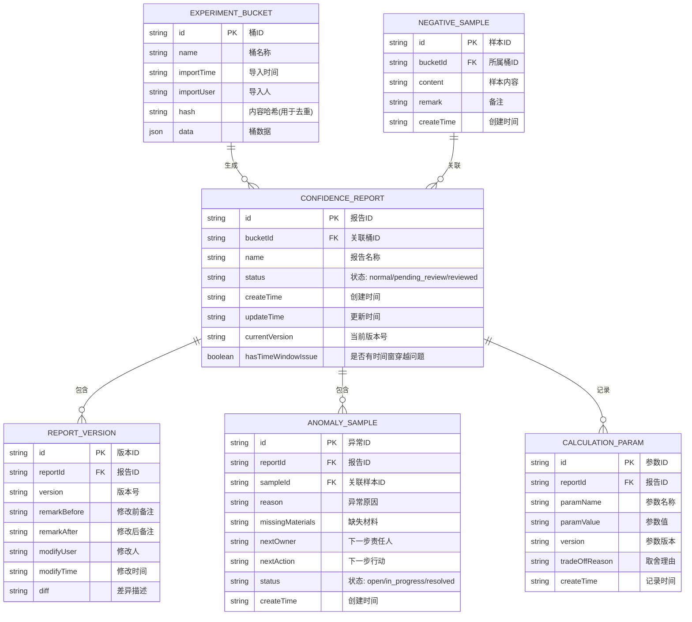

## 1. 架构设计



## 2. 技术描述

- **前端框架**: React@18 + TypeScript
- **构建工具**: Vite@5
- **样式方案**: TailwindCSS@3
- **路由管理**: React Router@6
- **状态管理**: Zustand（轻量高效）
- **图表库**: Chart.js + react-chartjs-2（2D图表）
- **3D渲染**: Three.js + @react-three/fiber + @react-three/drei
- **UI组件**: 自定义组件 + Lucide Icons
- **数据持久化**: localStorage 模拟后端存储
- **Mock数据**: 内置JSON数据，模拟真实业务场景

## 3. 路由定义

| 路由 | 页面 | 说明 |
|------|------|------|
| / | 报告列表页 | 展示所有置信度校准报告列表 |
| /report/:id | 报告详情页 | 展示单个报告的详细信息、版本历史、参数记录 |
| /report/:id/visualization | 可视化展示页 | 2D图表/3D展示与数据回溯 |
| /report/:id/anomalies | 异常样本页 | 异常样本列表与详情 |
| /import | 导入页 | 线上实验桶导入与去重校验 |

## 4. 数据模型

### 4.1 数据模型定义



### 4.2 核心业务逻辑

1. **去重机制**: 基于实验桶内容生成hash值，重复导入时比对hash，相同则提示不重复创建
2. **版本追踪**: 每次备注修改生成新版本记录，保存修改前后对比
3. **三步流程**: 
   - 步骤1：导入线上实验桶 → 生成初始报告
   - 步骤2：推荐策略老唐补看负样本列表 → 添加备注
   - 步骤3：系统更新异常样本页 → 生成异常分析
4. **时间窗穿越检测**: 检测到数据中存在时间窗穿越问题时，自动标记为待复核状态，不自动归为正常

## 5. 核心组件结构

```
src/
├── components/
│   ├── layout/
│   │   ├── Sidebar.tsx
│   │   └── Header.tsx
│   ├── report/
│   │   ├── ReportCard.tsx
│   │   ├── VersionTimeline.tsx
│   │   └── ParamCard.tsx
│   ├── visualization/
│   │   ├── Chart2D.tsx
│   │   ├── Scene3D.tsx
│   │   └── BacktrackButton.tsx
│   ├── anomaly/
│   │   ├── AnomalyCard.tsx
│   │   └── OwnerTag.tsx
│   └── common/
│       ├── StatusBadge.tsx
│       └── StepIndicator.tsx
├── pages/
│   ├── ReportList.tsx
│   ├── ReportDetail.tsx
│   ├── Visualization.tsx
│   ├── AnomalyList.tsx
│   └── ImportPage.tsx
├── store/
│   └── useReportStore.ts
├── types/
│   └── index.ts
├── utils/
│   ├── hash.ts
│   └── mockData.ts
└── App.tsx
```
