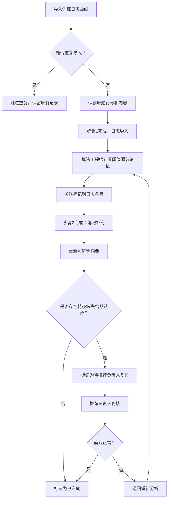

## 1. 产品概述

特征缓存失效复盘系统是面向算法团队的复盘工具，解决线上特征缺失给默认分后，训练日志曲线与阈值调参笔记证据链断裂的问题。目标用户为算法工程师和推荐负责人，核心价值是让每一条复盘结论都能追溯到原始证据。

## 2. 核心特性

### 2.1 用户角色

| 角色 | 注册方式 | 核心权限 |
|------|----------|----------|
| 算法工程师（小乔） | 系统内置 | 导入训练日志、补充阈值笔记、修改备注、更新摘要 |
| 推荐负责人 | 系统内置 | 复核异常案例、查看完整证据链、快速浏览摘要 |

### 2.2 功能模块

1. **复盘列表页**：复盘记录概览、状态筛选、快速摘要视图
2. **复盘详情页**：三步流程引导、训练日志证据、修改历史、阈值笔记、复核操作
3. **训练日志导入**：文件导入、去重校验、原始行号保留

### 2.3 页面详情

| 页面名称 | 模块名称 | 功能描述 |
|----------|----------|----------|
| 复盘列表页 | 顶部筛选区 | 按状态、日期、负责人筛选复盘记录 |
| 复盘列表页 | 复盘卡片列表 | 展示核心信息、状态标签、来源标记 |
| 复盘列表页 | 快速摘要视图 | 会前10分钟模式，仅展示可解释摘要和待复核项 |
| 复盘详情页 | 三步流程进度条 | 导入日志→补充笔记→更新摘要，显示当前步骤 |
| 复盘详情页 | 训练日志证据区 | 展示原始行号、内容、人工改动标记、当前状态 |
| 复盘详情页 | 修改历史区 | 展示每次修改的前后对比、操作人、时间 |
| 复盘详情页 | 阈值调参笔记区 | 关联笔记、补充说明、证据引用 |
| 复盘详情页 | 复核操作区 | 异常案例标记、负责人复核意见、状态流转 |
| 复盘详情页 | 可解释摘要区 | 汇总结论、来源标记、待确认项高亮 |

## 3. 核心流程

### 3.1 标准复盘三步流程

算法工程师小乔导入训练日志曲线，系统自动去重并保留原始行号；小乔补充查看阈值调参笔记，关联到对应日志条目；更新可解释摘要，标记每条结论的来源。若发现线上特征缺失给默认分的情况，标记为待复核，由推荐负责人确认后才能归为正常。

### 3.2 修改历史追踪

任何对复盘记录的修改（包括备注、状态、摘要）都会记录改前改后的值，操作人、时间戳，形成完整的审计链。

## 4. 用户界面设计

### 4.1 设计风格

- **主色调**：深蓝灰（#1E293B）作为主色，代表专业、可靠；橙红色（#F97316）作为强调色，标记异常和待复核项
- **辅助色**：墨绿（#059669）表示已完成、已确认；金黄（#EAB308）表示进行中
- **按钮风格**：直角微圆角（4px），扁平化设计，hover时有轻微的背景色加深
- **字体**：标题使用 JetBrains Mono（等宽字体，突出技术感），正文使用 Inter（清晰易读）
- **布局风格**：左侧导航 + 主内容区，卡片式布局，信息密度适中
- **视觉元素**：使用代码行号样式、diff对比样式、时间轴样式强化证据追溯感

### 4.2 页面设计概览

| 页面名称 | 模块名称 | UI元素 |
|----------|----------|--------|
| 复盘列表页 | 顶部筛选区 | 标签式筛选、搜索框、视图切换按钮（标准/摘要） |
| 复盘列表页 | 复盘卡片 | 状态标签（颜色区分）、来源标记（📊训练日志/📝阈值笔记）、时间戳 |
| 复盘详情页 | 三步进度条 | 步骤节点、连接线、当前步骤高亮、已完成打勾 |
| 复盘详情页 | 训练日志区 | 行号列（灰色背景）、内容列、改动标记（+/-背景色）、状态徽章 |
| 复盘详情页 | 修改历史区 | 时间轴布局、操作人头像、改前改后diff对比 |
| 复盘详情页 | 可解释摘要区 | 结论条目带来源引用角标、待确认项橙色边框高亮 |

### 4.3 响应式

- Desktop-first设计，主内容区最小宽度1024px
- 平板端自适应，卡片变为单列布局
- 移动端简化视图，优先展示摘要和状态

### 4.4 动效设计

- 页面加载：内容区域淡入，卡片依次出现（staggered animation）
- 状态变更：状态标签有颜色过渡动画
- 折叠/展开：平滑的高度过渡
- Diff展示：新增内容绿色淡入，删除内容红色淡出
