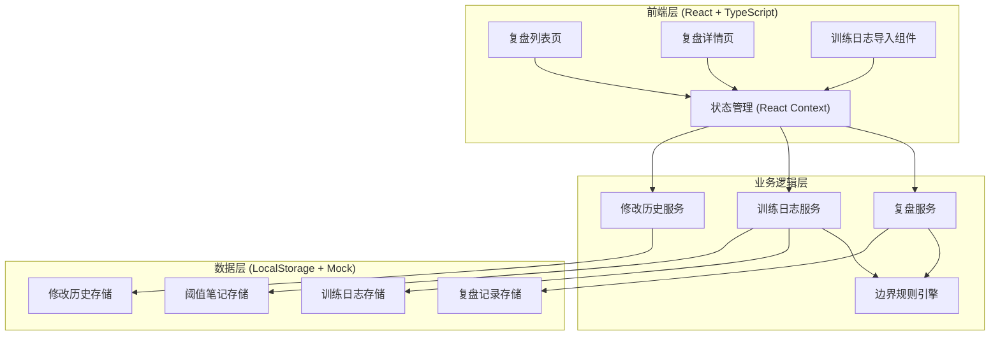
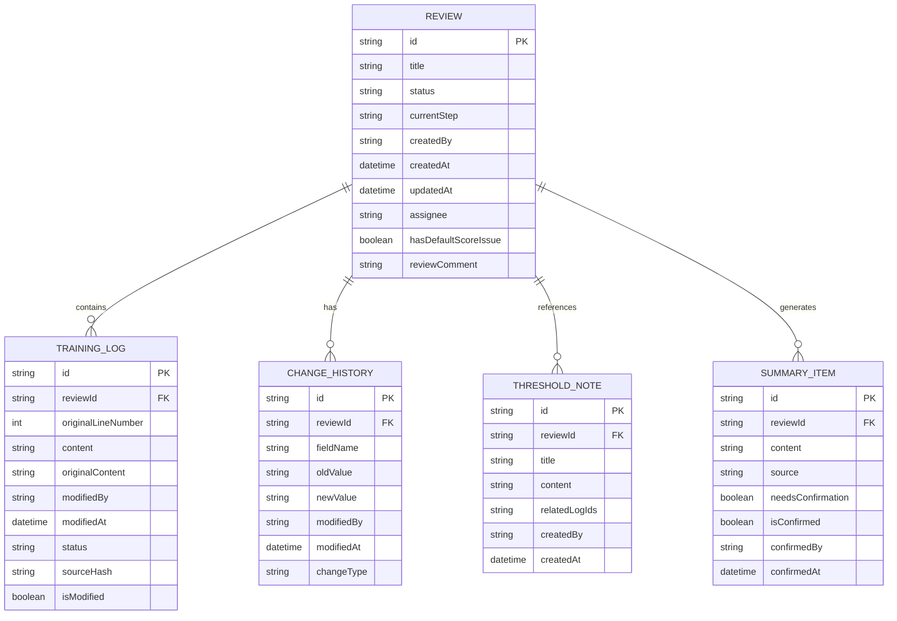
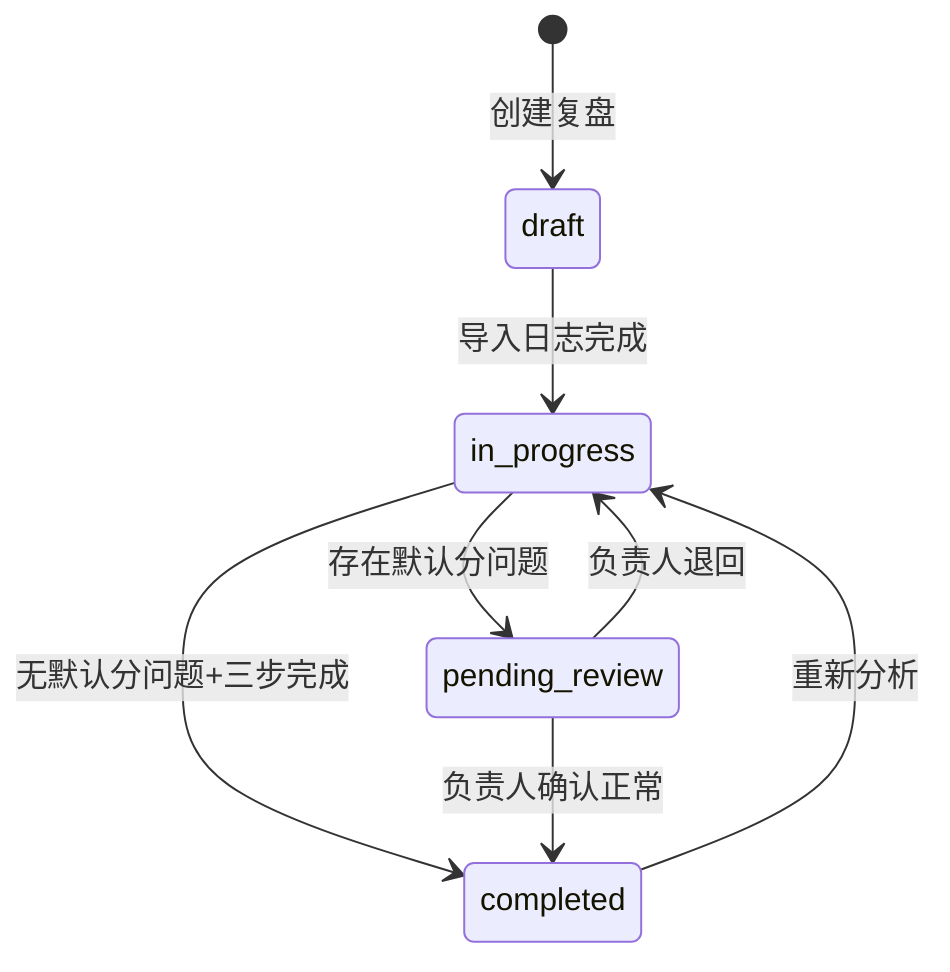

## 1. 架构设计



## 2. 技术描述

- **前端框架**: React@18 + TypeScript
- **构建工具**: Vite@5
- **样式方案**: TailwindCSS@3
- **状态管理**: React Context + useReducer
- **数据持久化**: LocalStorage（模拟后端）
- **路由**: React Router DOM@6
- **图标**: Lucide React

选择纯前端LocalStorage方案，无需后端服务，便于快速验证和单机使用。

## 3. 路由定义

| 路由 | 用途 |
|------|------|
| / | 复盘列表页（默认） |
| /review/:id | 复盘详情页 |
| /import | 训练日志导入页 |

## 4. 数据模型

### 4.1 数据模型定义



### 4.2 核心TypeScript类型定义

```typescript
// 复盘状态
type ReviewStatus = 'draft' | 'in_progress' | 'pending_review' | 'completed';

// 三步流程步骤
type ReviewStep = 'log_import' | 'threshold_note' | 'summary_update';

// 复盘记录
interface Review {
  id: string;
  title: string;
  status: ReviewStatus;
  currentStep: ReviewStep;
  createdBy: string;
  createdAt: string;
  updatedAt: string;
  assignee: string;
  hasDefaultScoreIssue: boolean;
  reviewComment?: string;
}

// 训练日志条目
interface TrainingLog {
  id: string;
  reviewId: string;
  originalLineNumber: number;
  content: string;
  originalContent: string;
  modifiedBy?: string;
  modifiedAt?: string;
  status: 'original' | 'modified' | 'verified';
  sourceHash: string;
  isModified: boolean;
}

// 修改历史
interface ChangeHistory {
  id: string;
  reviewId: string;
  fieldName: string;
  oldValue: string;
  newValue: string;
  modifiedBy: string;
  modifiedAt: string;
  changeType: 'create' | 'update' | 'status_change';
}

// 阈值调参笔记
interface ThresholdNote {
  id: string;
  reviewId: string;
  title: string;
  content: string;
  relatedLogIds: string[];
  createdBy: string;
  createdAt: string;
}

// 可解释摘要条目
interface SummaryItem {
  id: string;
  reviewId: string;
  content: string;
  source: 'training_log' | 'threshold_note' | 'manual';
  needsConfirmation: boolean;
  isConfirmed: boolean;
  confirmedBy?: string;
  confirmedAt?: string;
}
```

## 5. 边界规则引擎

### 5.1 核心规则（代码中实现，README中同步）

| 规则ID | 规则描述 | 处理方式 | 回滚方案 |
|--------|----------|----------|----------|
| RULE-001 | 线上特征缺失却给了默认分 | 自动标记hasDefaultScoreIssue=true，状态流转到pending_review，必须推荐负责人复核 | 清除标记，退回到in_progress状态 |
| RULE-002 | 重复导入同一批训练日志 | 通过sourceHash去重，相同hash的日志不重复创建 | 无（不产生重复数据） |
| RULE-003 | 修改训练日志内容 | 自动记录originalContent，生成CHANGE_HISTORY | 从历史记录恢复oldValue |
| RULE-004 | 三步流程未完成 | 禁止标记为completed，必须走完log_import→threshold_note→summary_update | 无 |
| RULE-005 | 待复核项未确认 | hasDefaultScoreIssue=true且未确认时，禁止标记为completed | 无 |

### 5.2 状态流转规则


