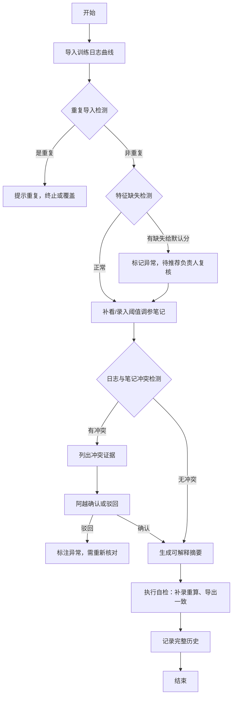

## 1. 产品概述

多目标排序权衡实验平台，解决推荐系统实验中训练日志曲线与阈值调参笔记不一致的问题。通过三步核心流程（导入日志→补看笔记→更新摘要）实现可解释性追踪，内置自检机制和冲突检测，确保实验结论可追溯、可验证。

- 目标用户：实验平台负责人阿越、推荐负责人
- 核心价值：避免"结论看着很满，追证据时断在半路"的问题

## 2. 核心功能

### 2.1 用户角色

| 角色 | 核心权限 |
|------|----------|
| 实验平台负责人（阿越） | 导入训练日志、补录调参笔记、查看冲突、确认/驳回冲突、执行自检 |
| 推荐负责人 | 复核特征缺失异常、最终确认实验结论 |

### 2.2 功能模块

1. **实验工作台**：三步流程引导、实验列表管理、状态追踪
2. **数据导入**：训练日志曲线导入、阈值调参笔记补录、历史版本管理
3. **可解释摘要**：自动生成摘要、版本对比、导出功能
4. **冲突检测**：日志与笔记一致性校验、冲突证据列示、人工确认机制
5. **自检中心**：重复导入检测、特征缺失检测、补录重算验证、导出一致性校验
6. **历史记录**：操作日志、版本回溯、审计追踪

### 2.3 页面详情

| 页面名称 | 模块名称 | 功能描述 |
|-----------|-------------|---------------------|
| 实验工作台 | 三步流程引导 | 可视化展示导入日志→补看笔记→更新摘要的进度状态 |
| 实验工作台 | 实验列表 | 展示所有实验及其状态（进行中/待确认/已完成/有冲突） |
| 数据导入页 | 训练日志导入 | 支持曲线数据上传、预览、解析、重复导入检测 |
| 数据导入页 | 调参笔记补录 | 文本/表格形式录入阈值参数、备注说明 |
| 可解释摘要页 | 摘要展示 | 展示实验结论、关键指标、来源追溯 |
| 可解释摘要页 | 版本对比 | 对比补录前后的摘要差异 |
| 冲突中心 | 冲突列表 | 列出所有检测到的日志与笔记矛盾点 |
| 冲突中心 | 证据展示 | 每条冲突展示具体证据，支持确认/驳回操作 |
| 自检中心 | 自检仪表盘 | 展示四项自检项的执行结果和详情 |
| 历史记录页 | 操作日志 | 时间线展示所有操作记录和变更 |

## 3. 核心流程

### 主流程描述
实验平台负责人阿越首先导入训练日志曲线，系统进行重复导入检测和特征缺失检测；若检测到线上特征缺失却给了默认分，标记异常待推荐负责人复核；随后阿越补看阈值调参笔记并录入系统；系统自动对比日志与笔记，如发现矛盾则列出冲突证据，由阿越选择确认或驳回；无冲突或冲突解决后，系统生成可解释摘要并记录完整历史；最后执行自检确保导出一致性。

## 4. 用户界面设计

### 4.1 设计风格
- 主色调：深蓝 (#1e3a5f) 代表专业可信，搭配琥珀橙 (#f59e0b) 作为警告/提醒色
- 辅助色：浅灰蓝背景 (#f1f5f9)，卡片白色底，边框浅灰
- 按钮风格：圆角 6px，主按钮深蓝色填充带轻微阴影，次要按钮描边
- 字体：标题使用 Source Serif Pro（专业感衬线），正文使用 Inter（清晰易读）
- 布局风格：左侧导航 + 主内容区卡片式布局，强调数据可视化和证据追溯
- 图标风格：Lucide 线性图标，保持简约专业

### 4.2 页面设计概述

| 页面名称 | 模块名称 | UI Elements |
|-----------|-------------|-------------|
| 实验工作台 | 三步流程引导 | 时间轴式步骤条，当前步骤高亮，已完成步骤打勾 |
| 实验工作台 | 实验列表 | 表格展示，状态标签用不同颜色区分，悬停显示操作 |
| 数据导入页 | 日志导入 | 拖拽上传区 + 曲线预览图 + 检测结果提示条 |
| 冲突中心 | 冲突列表 | 卡片式布局，每条冲突展示证据对比，底部操作按钮 |
| 自检中心 | 仪表盘 | 四个自检项状态卡片，绿色通过/黄色警告/红色失败 |

### 4.3 响应式
- 桌面端优先（1280px+），三栏布局
- 平板端（768-1279px）：左侧导航可折叠，主内容自适应
- 移动端（<768px）：底部导航标签，内容垂直堆叠
