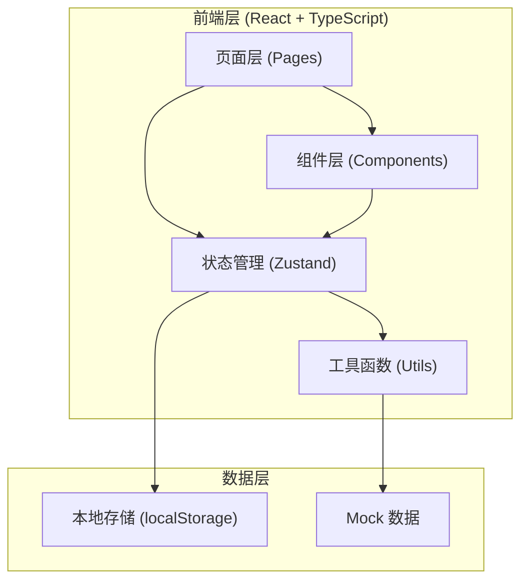
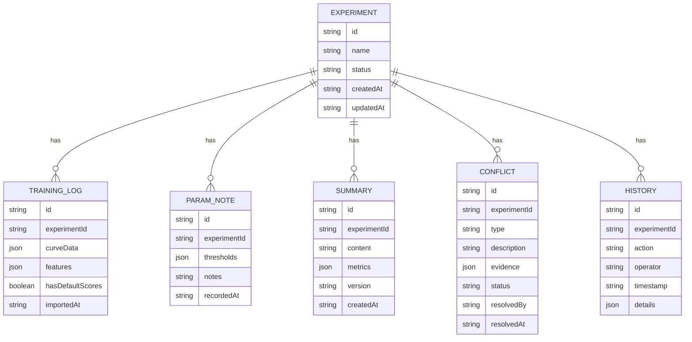

## 1. 架构设计



## 2. 技术描述

- 前端：React@18 + TypeScript + tailwindcss@3 + vite
- 初始化工具：vite-init
- 后端：无后端，纯前端实现，数据通过 localStorage 持久化
- 数据存储：localStorage 存储实验数据，内置多份 Mock 数据（正常、错口径、补录）
- 状态管理：zustand
- 路由：react-router-dom
- 图表：recharts
- 图标：lucide-react

## 3. 路由定义

| Route | 页面名称 | 用途 |
|-------|---------|------|
| / | 实验工作台 | 三步流程引导、实验列表 |
| /experiment/:id | 实验详情 | 单实验详情、数据导入 |
| /summary | 可解释摘要 | 摘要展示、版本对比 |
| /conflicts | 冲突中心 | 冲突列表、证据展示、确认/驳回 |
| /self-check | 自检中心 | 四项自检仪表盘 |
| /history | 历史记录 | 操作日志时间线 |

## 4. 数据模型

### 4.1 数据模型定义



### 4.2 TypeScript 类型定义

```typescript
interface Experiment {
  id: string;
  name: string;
  status: 'draft' | 'importing' | 'notes_pending' | 'conflicts_found' | 'ready' | 'completed';
  createdAt: string;
  updatedAt: string;
}

interface TrainingLog {
  id: string;
  experimentId: string;
  curveData: Array<{ epoch: number; metric: string; value: number }>;
  features: Array<{ name: string; present: boolean; defaultValue?: number }>;
  hasDefaultScores: boolean;
  importedAt: string;
}

interface ParamNote {
  id: string;
  experimentId: string;
  thresholds: Array<{ metric: string; value: number; note?: string }>;
  notes: string;
  recordedAt: string;
}

interface Summary {
  id: string;
  experimentId: string;
  content: string;
  metrics: Record<string, number>;
  version: number;
  createdAt: string;
}

interface Conflict {
  id: string;
  experimentId: string;
  type: 'log_vs_note' | 'feature_missing' | 'data_inconsistency';
  description: string;
  evidence: { log: string; note: string };
  status: 'pending' | 'confirmed' | 'rejected';
  resolvedBy?: string;
  resolvedAt?: string;
}

interface HistoryRecord {
  id: string;
  experimentId: string;
  action: string;
  operator: string;
  timestamp: string;
  details: Record<string, any>;
}

interface SelfCheckResult {
  duplicateImport: { passed: boolean; details: string };
  missingFeatures: { passed: boolean; details: string };
  recalculation: { passed: boolean; details: string };
  exportConsistency: { passed: boolean; details: string };
}
```

## 5. 目录结构

```
src/
├── components/
│   ├── Layout/
│   │   ├── Sidebar.tsx
│   │   └── StepProgress.tsx
│   ├── Experiment/
│   │   ├── ExperimentList.tsx
│   │   └── ExperimentCard.tsx
│   ├── DataImport/
│   │   ├── LogImporter.tsx
│   │   ├── NoteEditor.tsx
│   │   └── CurveChart.tsx
│   ├── Summary/
│   │   ├── SummaryView.tsx
│   │   └── VersionCompare.tsx
│   ├── Conflict/
│   │   ├── ConflictList.tsx
│   │   └── ConflictCard.tsx
│   ├── SelfCheck/
│   │   ├── CheckDashboard.tsx
│   │   └── CheckItemCard.tsx
│   └── History/
│       └── HistoryTimeline.tsx
├── pages/
│   ├── Dashboard.tsx
│   ├── ExperimentDetail.tsx
│   ├── Summary.tsx
│   ├── Conflicts.tsx
│   ├── SelfCheck.tsx
│   └── History.tsx
├── store/
│   └── useExperimentStore.ts
├── utils/
│   ├── conflictDetector.ts
│   ├── selfChecker.ts
│   ├── summaryGenerator.ts
│   └── mockData.ts
├── types/
│   └── index.ts
└── App.tsx
```
