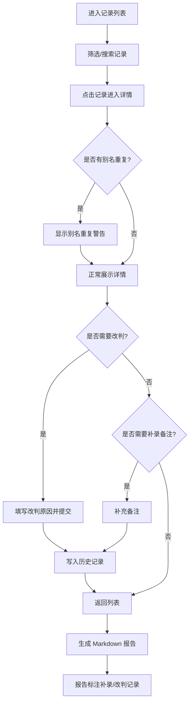

## 1. 产品概述

犬只疫苗记录复核系统，面向宠物训练师与排班同事，解决月底封账时疫苗记录与主人临时补充信息不一致的核对问题。系统保留原始数据来源、标注补录与改判痕迹，确保脏数据不会被"修得看不出痕迹"，同时生成可追溯的 Markdown 复核报告。

- 核心用户：宠物训练师阿岑及排班同事
- 核心价值：疫苗记录复核可审计、可追溯，补录/改判有据可查，报告清晰呈现异常

## 2. 核心功能

### 2.1 用户角色

| 角色 | 核心权限 |
|------|----------|
| 宠物训练师 | 浏览记录、查看详情、执行改判、补充备注、导出报告 |
| 排班同事（只读） | 浏览记录、查看详情、查看历史、查看导出报告 |

### 2.2 功能模块

1. **记录列表页**：展示所有犬只疫苗记录复核项，支持状态筛选与搜索
2. **记录详情页**：展示单条记录完整信息、体重曲线、原始来源、补录/改判标记
3. **改判功能**：对记录结论执行改判，需填写改判原因，保留历史
4. **历史追溯**：查看单条记录的所有变更历史（原始→补录→改判→最新导出）
5. **Markdown 报告**：生成包含补录标记、改判标记的复核报告

### 2.3 页面详情

| 页面名称 | 模块名称 | 功能描述 |
|----------|----------|----------|
| 记录列表页 | 搜索与筛选栏 | 按犬名/疫苗名称搜索，按状态（待复核/已复核/已改判）筛选 |
| 记录列表页 | 记录表格 | 展示犬名、疫苗名称、接种日期、状态、原始来源、是否有别名重复标记 |
| 记录详情页 | 基本信息卡 | 犬名、别名、品种、主人信息、原始数据来源标签 |
| 记录详情页 | 疫苗信息卡 | 疫苗名称、批号、接种日期、有效期、接种机构 |
| 记录详情页 | 体重曲线图 | 展示犬只体重历史，保留原始数据点（含缺失标记） |
| 记录详情页 | 别名重复警告 | 当犬只存在别名重复时，醒目提示"此记录涉及宠物别名重复，非普通记录" |
| 记录详情页 | 补录/改判时间线 | 展示该记录的所有变更节点：原始→补录备注→改判→最新导出 |
| 记录详情页 | 改判操作区 | 改判按钮、改判原因输入、提交 |
| 改判页 | 改判表单 | 选择新结论、填写改判原因、确认提交 |
| 历史追溯页 | 变更时间线 | 按时间展示所有变更，区分"原始处理"、"后补备注"、"最新导出" |
| Markdown 报告页 | 报告预览 | 在线预览生成的 Markdown 报告 |
| Markdown 报告页 | 报告导出 | 下载 .md 文件，报告内用标记区分补录与改判记录 |

## 3. 核心流程

用户打开系统进入记录列表 → 点击某条记录进入详情 → 查看原始来源与体重曲线 → 发现信息不一致可补充备注或执行改判 → 改判需填写原因并记录历史 → 所有操作留痕 → 最终生成 Markdown 报告供排班同事查看

## 4. 用户界面设计

### 4.1 设计风格

- 主色调：深青色(#0D5C63)搭配暖橙(#E8A87C)作为强调色，营造专业但不冰冷的医疗复核氛围
- 辅助色：浅灰底(#F5F5F0)、深灰文字(#2D2D2D)、红色警告(#D64045)
- 按钮风格：圆角 8px，主按钮实心深青色，次按钮描边，警告按钮红色
- 字体：标题使用 Noto Serif SC（衬线体增强权威感），正文使用 Noto Sans SC
- 布局风格：左侧导航栏 + 右侧内容区，卡片式布局
- 图标风格：线性图标，2px 描边

### 4.2 页面设计概览

| 页面名称 | 模块名称 | UI 元素 |
|----------|----------|----------|
| 记录列表页 | 搜索筛选栏 | 圆角搜索框、下拉筛选器、标签式状态切换 |
| 记录列表页 | 记录表格 | 条纹表格行、状态徽章、别名重复橙色警告图标 |
| 记录详情页 | 基本信息卡 | 白色卡片、左侧竖线颜色标识来源类型 |
| 记录详情页 | 体重曲线图 | SVG 折线图、缺失数据用虚线连接、数据点 tooltip |
| 记录详情页 | 别名重复警告 | 橙色横幅式警告条，图标+文字 |
| 记录详情页 | 变更时间线 | 左侧竖线+节点圆点，不同颜色区分类型 |
| 改判页 | 改判表单 | 卡片式表单、下拉选择+文本域、确认弹窗 |
| Markdown 报告页 | 报告预览 | 等宽字体渲染区、补录/改判行用底色区分 |
| Markdown 报告页 | 导出按钮 | 右上角固定操作栏 |

### 4.3 响应式设计

- 桌面优先设计，最小宽度 1024px
- 表格在窄屏下横向滚动
- 详情页卡片在窄屏下单列堆叠

### 4.4 特殊交互

- 改判提交前弹出确认对话框
- 别名重复记录在列表中以橙色图标醒目标记
- 体重曲线图 hover 显示具体数值
- Markdown 报告中补录记录用 `⚠️ 补录` 标记，改判记录用 `🔄 改判` 标记
