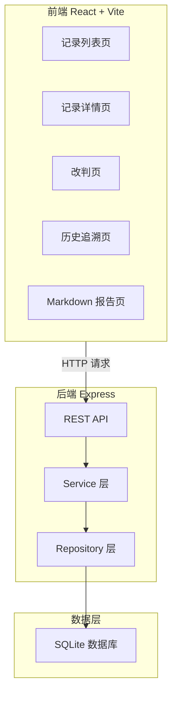
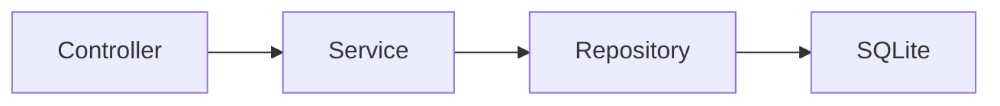
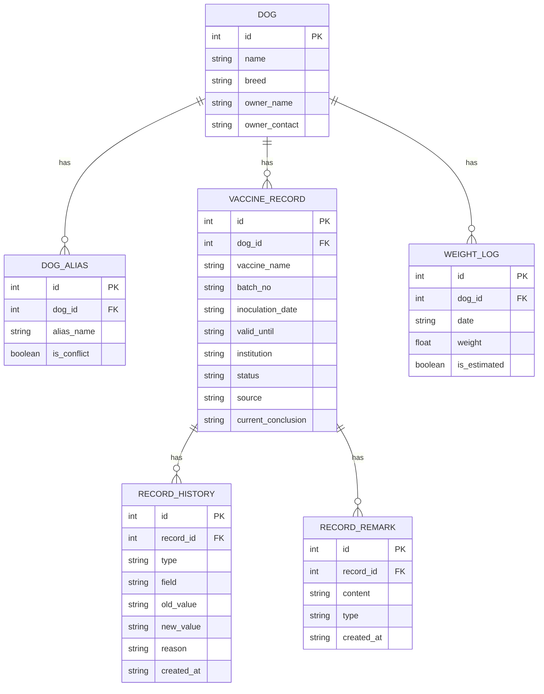

## 1. 架构设计



## 2. 技术说明

- 前端：React@18 + TailwindCSS@3 + Vite
- 初始化工具：Vite
- 后端：Express@4
- 数据库：SQLite（better-sqlite3），轻量单文件，无需额外服务
- 图表：recharts（体重曲线）
- Markdown 渲染：react-markdown
- 前后端同仓，Vite 开发代理转发 API 到 Express

## 3. 路由定义

| 路由 | 用途 |
|------|------|
| `/` | 记录列表页 |
| `/records/:id` | 记录详情页 |
| `/records/:id/rejudge` | 改判页 |
| `/records/:id/history` | 历史追溯页 |
| `/report` | Markdown 报告页 |

## 4. API 定义

### 4.1 获取记录列表

```typescript
GET /api/records
Query: { status?: "pending"|"reviewed"|"rejudged", keyword?: string }
Response: {
  records: Array<{
    id: number
    dogName: string
    aliasNames: string[]
    vaccineName: string
    inoculationDate: string
    status: "pending"|"reviewed"|"rejudged"
    source: string
    hasAliasConflict: boolean
    currentConclusion: string
  }>
}
```

### 4.2 获取记录详情

```typescript
GET /api/records/:id
Response: {
  id: number
  dogName: string
  aliasNames: string[]
  breed: string
  ownerName: string
  ownerContact: string
  vaccineName: string
  batchNo: string
  inoculationDate: string
  validUntil: string
  institution: string
  status: "pending"|"reviewed"|"rejudged"
  source: "original"|"supplementary"|"rejudged"
  sourceLabel: string
  currentConclusion: string
  hasAliasConflict: boolean
  aliasConflictDetail: string | null
  weightHistory: Array<{ date: string; weight: number | null; isEstimated: boolean }>
  remarks: Array<{ id: number; content: string; createdAt: string; type: "original"|"supplementary"|"rejudge"|"export" }>
}
```

### 4.3 执行改判

```typescript
POST /api/records/:id/rejudge
Body: { newConclusion: string; reason: string }
Response: { success: boolean; historyId: number }
```

### 4.4 补充备注

```typescript
POST /api/records/:id/remarks
Body: { content: string }
Response: { success: boolean; remarkId: number }
```

### 4.5 获取变更历史

```typescript
GET /api/records/:id/history
Response: {
  changes: Array<{
    id: number
    recordId: number
    type: "original"|"supplementary"|"rejudge"|"export"
    field: string
    oldValue: string | null
    newValue: string
    reason: string | null
    createdAt: string
  }>
}
```

### 4.6 生成 Markdown 报告

```typescript
GET /api/report
Query: { format?: "preview"|"download" }
Response: {
  markdown: string
  summary: {
    total: number
    pending: number
    reviewed: number
    rejudged: number
    aliasConflicts: number
    supplementaryCount: number
  }
}
```

## 5. 服务器架构图



## 6. 数据模型

### 6.1 数据模型定义



### 6.2 数据定义语言

```sql
CREATE TABLE dog (
    id INTEGER PRIMARY KEY AUTOINCREMENT,
    name TEXT NOT NULL,
    breed TEXT NOT NULL,
    owner_name TEXT NOT NULL,
    owner_contact TEXT NOT NULL
);

CREATE TABLE dog_alias (
    id INTEGER PRIMARY KEY AUTOINCREMENT,
    dog_id INTEGER NOT NULL REFERENCES dog(id),
    alias_name TEXT NOT NULL,
    is_conflict INTEGER NOT NULL DEFAULT 0
);

CREATE TABLE vaccine_record (
    id INTEGER PRIMARY KEY AUTOINCREMENT,
    dog_id INTEGER NOT NULL REFERENCES dog(id),
    vaccine_name TEXT NOT NULL,
    batch_no TEXT NOT NULL,
    inoculation_date TEXT NOT NULL,
    valid_until TEXT NOT NULL,
    institution TEXT NOT NULL,
    status TEXT NOT NULL DEFAULT 'pending',
    source TEXT NOT NULL DEFAULT 'original',
    current_conclusion TEXT NOT NULL DEFAULT ''
);

CREATE TABLE weight_log (
    id INTEGER PRIMARY KEY AUTOINCREMENT,
    dog_id INTEGER NOT NULL REFERENCES dog(id),
    date TEXT NOT NULL,
    weight REAL,
    is_estimated INTEGER NOT NULL DEFAULT 0
);

CREATE TABLE record_history (
    id INTEGER PRIMARY KEY AUTOINCREMENT,
    record_id INTEGER NOT NULL REFERENCES vaccine_record(id),
    type TEXT NOT NULL,
    field TEXT NOT NULL,
    old_value TEXT,
    new_value TEXT,
    reason TEXT,
    created_at TEXT NOT NULL DEFAULT (datetime('now'))
);

CREATE TABLE record_remark (
    id INTEGER PRIMARY KEY AUTOINCREMENT,
    record_id INTEGER NOT NULL REFERENCES vaccine_record(id),
    content TEXT NOT NULL,
    type TEXT NOT NULL DEFAULT 'supplementary',
    created_at TEXT NOT NULL DEFAULT (datetime('now'))
);
```

### 6.3 演示数据

演示数据包含两条记录：
1. **正常记录**：犬名"大福"，金毛寻回犬，狂犬疫苗接种，数据完整无别名冲突
2. **别名重复记录**：犬名"豆豆"同时被叫作"小黑"和"旺财"，且"旺财"与另一只犬同名，触发别名冲突警告，体重数据有缺失和估算值
