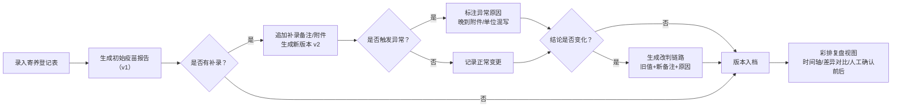

## 1. 产品概述

宠物医院寄养登记系统，核心解决"犬只疫苗报告导出"中历史信息对不上、补录信息影响结论讲不清的问题。面向宠物医院前台小温（日常操作）和现场老师（彩排复盘）两类用户，确保晚到附件、补录备注、单位混写等异常情况的来龙去脉一目了然。

- 核心痛点：疫苗报告导出只留最终值，旧记录截图、补录备注、改判原因丢失，复盘时无法解释结论变化
- 产品价值：每条报告保留完整的版本历史链，支持差异对比、异常标注、改判原因追溯

---

## 2. 核心功能

### 2.1 用户角色

| 角色 | 说明 | 核心权限 |
|------|------|----------|
| 前台小温 | 日常登记操作人员 | 录入寄养登记表、上传疫苗附件、补录备注、导出报告 |
| 现场老师 | 彩排复盘审核人员 | 查看完整历史链、版本差异、人工确认前后对比 |

### 2.2 功能模块

1. **寄养登记表页**：犬只基本信息录入、疫苗记录录入、附件上传、补充备注
2. **疫苗报告导出分析页（核心）**：报告列表卡片、版本时间轴、字段级差异对比、异常原因说明、改判链路、人工确认差异视图
3. **彩排复盘视图**：3-4 条演示数据的快速切换，可走通"正常→补录→异常→改判"全流程

### 2.3 页面详情

| 页面名称 | 模块名称 | 功能描述 |
|-----------|-------------|---------------------|
| 寄养登记表页 | 犬只信息表单 | 姓名/品种/性别/年龄/体重（带单位选择）录入 |
| 寄养登记表页 | 疫苗记录列表 | 疫苗名称/接种日期/有效期/附件上传，支持多针次 |
| 寄养登记表页 | 补录备注区 | 时间戳+操作人+备注内容，追加式不可删除 |
| 寄养登记表页 | 提交/保存 | 保存草稿、提交生成疫苗报告导出记录 |
| 疫苗报告导出分析页 | 报告列表卡片 | 4 条演示数据（正常/补录/单位混写/改判），状态标签区分 |
| 疫苗报告导出分析页 | 版本时间轴 | 每条记录的版本节点，可点击查看任一历史快照 |
| 疫苗报告导出分析页 | 字段级差异对比 | 选中两个版本后，高亮变化字段（新增/修改/删除） |
| 疫苗报告导出分析页 | 异常原因标注 | 晚到附件、体重单位混写等异常有醒目说明卡，解释"为什么影响结论" |
| 疫苗报告导出分析页 | 改判链路 | 结论从 A→B→C 的变化过程，每条变化对应备注和材料 |
| 疫苗报告导出分析页 | 人工确认对比 | 确认前/确认后的并列双栏视图，标注具体修改点 |

---

## 3. 核心流程

前台小温在寄养登记表录入犬只信息和疫苗记录，提交后生成初始疫苗报告。后续收到主人补充的附件、备注、修正信息后，在同一条记录上追加补录（覆盖旧值但保留历史快照），系统自动标注异常原因并生成改判链路。现场老师彩排时，打开疫苗报告导出分析页，通过时间轴、差异对比、异常说明卡，快速理解每条报告从初始到最终结论的完整演变过程。

---

## 4. 用户界面设计

### 4.1 设计风格

- **设计方向**：医用档案感 + 时间轴可视化，偏严肃行政风但不呆板。主色采用医疗系统常用的深青色（teal）配暖米色背景，异常状态用琥珀橙，改判用玫红点标。
- **主色**：`#0F766E`（深青）/ `#FEF3C7`（暖米背景）/ `#D97706`（琥珀橙-异常）/ `#BE185D`（玫红-改判）
- **字体**：标题用「思源宋体」（档案标题感），正文用「思源黑体」，代码/数据字段用等宽字体 `JetBrains Mono`
- **布局**：顶部导航栏 + 左右分栏（左报告列表，右分析详情），详情区用垂直时间轴贯穿
- **卡片风格**：圆角 12px，细微阴影（shadow-sm），hover 时上抬 2px + 边框高亮
- **动效**：版本切换用淡入 + 位移过渡 300ms，差异高亮用背景色脉冲动画

### 4.2 页面设计概述

| 页面名称 | 模块名称 | UI 元素 |
|-----------|-------------|-------------|
| 寄养登记表页 | 表单区 | 卡片式分组，标签左对齐+输入框右对齐，体重字段附单位下拉（kg/lb/斤） |
| 寄养登记表页 | 疫苗记录 | 可展开的多针次行，每行带附件上传按钮 |
| 寄养登记表页 | 补录备注 | 聊天气泡式追加条目，顶部带时间戳和操作人标签 |
| 疫苗报告导出分析页 | 报告列表 | 卡片网格 2×2，卡片右上角状态徽章（正常/补录/异常/改判） |
| 疫苗报告导出分析页 | 版本时间轴 | 左侧垂直色带，每个节点圆点+版本号+时间，选中态加粗描边 |
| 疫苗报告导出分析页 | 差异对比 | 两栏并列（旧 vs 新），变化字段用黄色背景 + 删除线/新增标记 |
| 疫苗报告导出分析页 | 异常说明卡 | 琥珀色边框 + 警示三角图标，内文解释：「晚到附件 → 结论从 X 变 Y 的原因是…」 |
| 疫苗报告导出分析页 | 人工确认对比 | 左右双栏带「确认前 / 确认后」标题头，中间箭头指示流向 |

### 4.3 响应式

桌面端优先（1280px+），平板端列表与详情上下堆叠，移动端报告列表单列，时间轴改为水平滑动。

### 4.4 3D 场景指导

不适用。
