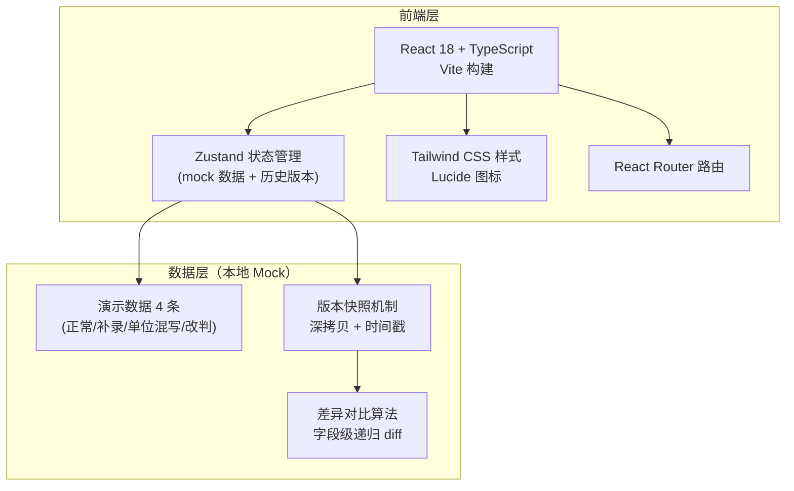
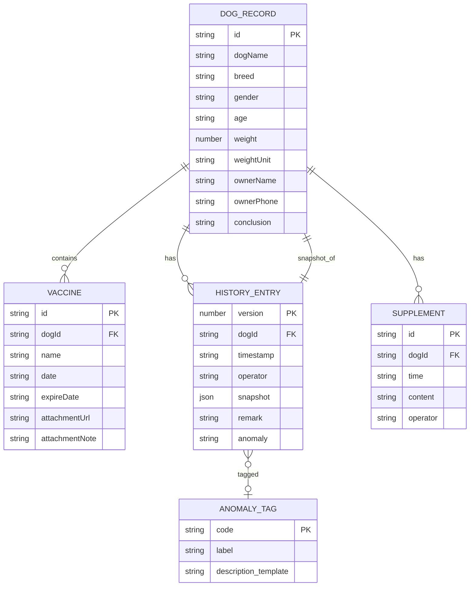

## 1. 架构设计



## 2. 技术描述

- **前端框架**：React@18 + TypeScript + Vite
- **路由**：react-router-dom@6
- **状态管理**：zustand（含内置 mock 数据，无需后端）
- **样式**：tailwindcss@3 + CSS 变量（设计 token）
- **图标**：lucide-react
- **后端**：无（纯前端 mock，数据持久化到 localStorage 可选）
- **初始化工具**：`pnpm create vite-init@latest . --template react-ts --force`

## 3. 路由定义

| 路由 | 页面 | 用途 |
|-------|------|------|
| `/` | 寄养登记表页 | 录入犬只信息、疫苗记录、补录备注，提交生成报告 |
| `/reports` | 疫苗报告导出分析页 | 报告列表 + 版本时间轴 + 差异对比 + 异常说明 + 人工确认对比 |
| `/reports/:id` | 报告详情（同页锚点定位） | 深链到某条报告的某个版本 |

## 4. API 定义

无后端，所有操作为 zustand store 内的纯函数：

```typescript
// 核心数据类型
type WeightUnit = 'kg' | 'lb' | 'jin';

interface VaccineRecord {
  id: string;
  name: string;           // 疫苗名称
  date: string;           // 接种日期
  expireDate: string;     // 有效期
  attachmentUrl?: string; // 附件
  attachmentNote?: string;// 附件备注（晚到说明等）
}

interface HistoryEntry {
  version: number;
  timestamp: string;
  operator: '小温' | '主人补录' | '系统自动';
  snapshot: DogRecord;
  remark?: string;        // 本次变更备注
  anomaly?: AnomalyTag;   // 异常标注
}

type AnomalyTag =
  | 'late_attachment'     // 晚到附件
  | 'weight_unit_mixed'   // 体重单位混写
  | 'conclusion_changed'  // 结论改判
  | 'manual_confirm';     // 人工确认

type Conclusion =
  | '待审核'
  | '疫苗合格 可寄养'
  | '疫苗缺失 需补打'
  | '资料不全 暂缓';

interface DogRecord {
  id: string;
  dogName: string;
  breed: string;
  gender: '公' | '母';
  age: string;
  weight: number;
  weightUnit: WeightUnit;
  ownerName: string;
  ownerPhone: string;
  vaccines: VaccineRecord[];
  supplements: Array<{ time: string; content: string; operator: string }>;
  conclusion: Conclusion;
  versionHistory: HistoryEntry[];
}
```

## 5. 服务器架构图

无后端，纯前端。数据流转：Store Action → 生成新版本快照 → 计算差异 → 触发 UI 更新。

## 6. 数据模型

### 6.1 ER 图



### 6.2 初始数据（4 条演示记录）

1. **豆豆（正常记录）**：所有疫苗齐全，单位一致，结论一次通过
2. **旺财（补录记录 + 晚到附件）**：初始缺少狂犬疫苗 → 主人 2 天后补发附件 → 结论从"需补打"改判为"合格"，时间轴上标注晚到附件原因
3. **胖胖（体重单位混写）**：首次录入用"斤"（32 斤），后修正为"kg"（16kg），数值未变但单位变更触发异常标注，解释「为什么没按正常记录走——初始单位与系统默认不一致」
4. **可乐（改判 + 人工确认）**：疫苗齐全但附件截图模糊 → 初始"待审核" → 主人补发清晰截图 + 前台人工确认 → 结论改判为"合格"，提供确认前/后双栏对比

所有数据以 TypeScript 常量形式写入 `src/data/mockData.ts`，通过 zustand store 暴露给 UI。
