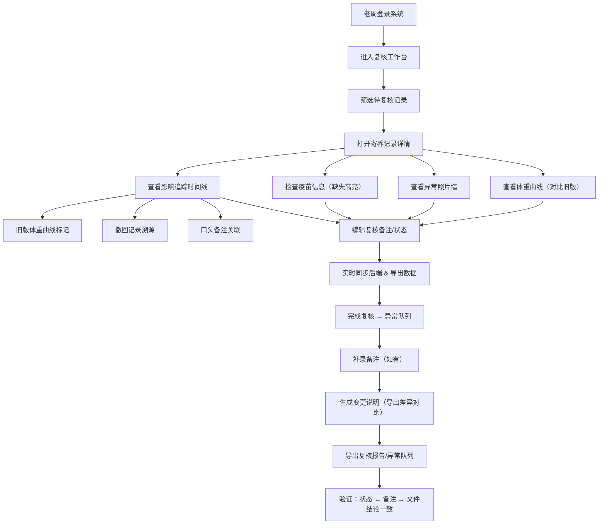

## 1. 产品概述
宠物寄养记录复核系统，专为寄养店长老周设计，解决复核过程中体重曲线翻阅繁琐、异常照片散落聊天记录的痛点，实现备注修改实时同步、复核影响全链路追溯、异常痕迹清晰标记，让复核工作高效透明、可追溯。

## 2. 核心功能

### 2.1 用户角色
| 角色 | 注册方式 | 核心权限 |
|------|----------|----------|
| 寄养店长（老周） | 系统内置账号 | 查看寄养记录、复核备注编辑、体重曲线追溯、异常队列管理、导出复核报告 |
| 复核员 | 系统分配账号 | 复核记录、编辑备注、标记异常、补录备注 |

### 2.2 功能模块
1. **复核工作台首页**：待复核列表、统计概览、快捷筛选
2. **寄养记录详情页**：体重曲线（多版本对比）、异常照片墙、疫苗信息、复核面板
3. **复核影响追踪面板**：旧版体重曲线标记、撤回记录溯源、口头备注关联
4. **异常队列管理页**：异常记录聚合、状态流转、导出异常报告
5. **导出中心**：复核报告下载、变更说明对比、导出历史

### 2.3 页面详情
| 页面名称 | 模块名称 | 功能描述 |
|-----------|-------------|---------------------|
| 复核工作台首页 | 统计概览卡片 | 待复核数、异常数、疫苗缺失数、今日已复核数，数字动态展示 |
| 复核工作台首页 | 待复核列表 | 按宠物姓名/寄养日期/复核状态筛选，每行展示基本信息+异常标记徽章 |
| 复核工作台首页 | 快捷筛选栏 | 按复核状态、异常类型、疫苗缺失、体重异常多条件组合筛选 |
| 寄养记录详情页 | 基本信息栏 | 宠物姓名、品种、寄养时段、主人联系方式 |
| 寄养记录详情页 | 体重曲线图 | 折线图展示每日体重，叠加旧版曲线（虚线），点击节点查看当日照片和备注 |
| 寄养记录详情页 | 异常照片墙 | 集中展示所有异常图片，支持放大查看，关联对应复核节点 |
| 寄养记录详情页 | 疫苗信息区 | 表格展示疫苗记录，缺失项高亮红色边框并附异常标记 |
| 寄养记录详情页 | 复核编辑面板 | 富文本备注编辑、复核状态切换（通过/异常/需补充）、实时保存提示 |
| 寄养记录详情页 | 影响追踪时间线 | 垂直时间线展示：旧版曲线版本、撤回记录（灰色删除线）、口头备注（💬图标），每项标注是否影响最终结论 |
| 异常队列管理页 | 异常列表 | 按异常类型分组，展示状态、关联备注、文件结论一致性检查 |
| 异常队列管理页 | 状态流转操作 | 批量处理、分配处理人、标记已解决 |
| 导出中心 | 导出配置 | 选择导出范围、包含字段、异常标记样式 |
| 导出中心 | 变更对比 | 补录备注前后导出内容差异对比高亮，标注变更位置和原因 |
| 导出中心 | 导出历史 | 每次导出的时间、操作人、变更摘要、下载按钮 |

## 3. 核心流程
老周登录系统后，从复核工作台找到待复核记录，进入详情页查看体重曲线（含旧版）、异常照片、疫苗信息，通过时间线了解影响结论的各项因素（撤回记录、口头备注等），在复核面板编辑备注后实时同步后端，确认疫苗缺失等异常已被标记，完成复核后记录进入异常队列。补录备注时系统自动生成变更说明，导出时可查看前后差异。异常队列中状态、备注和文件结论三者保持一致。

## 4. 用户界面设计

### 4.1 设计风格
- **主色调**：沉稳深青色 `#1B4332`（专业可信）+ 暖橙色 `#E76F51`（异常警示）
- **辅助色**：鼠尾草绿 `#95D5B2`（通过/正常）、土黄色 `#E9C46A`（警告/待补充）、珊瑚红 `#F4A261`（需关注）
- **中性色**：暖白 `#FAFAF7` 背景 + 炭灰 `#264653` 文字
- **按钮风格**：圆润胶囊型（rounded-full），主按钮实心带细微阴影，次按钮描边+悬停渐变
- **字体**：标题用 "Noto Serif SC"（衬线体稳重），正文用 "Noto Sans SC"（清晰易读）
- **布局风格**：卡片式分区布局，左侧窄边导航 + 右侧主工作区，卡片间充足留白
- **图标风格**：Lucide 线性图标，异常标记搭配圆角徽章

### 4.2 页面设计概述
| 页面名称 | 模块名称 | UI 元素 |
|-----------|-------------|-------------|
| 复核工作台 | 统计概览卡片 | 渐变背景 + 大数字 + 迷你趋势图 + 悬停上浮动画 |
| 复核工作台 | 待复核列表 | 斑马纹表格行 + 异常徽章角标 + 悬停展开预览 |
| 寄养记录详情 | 体重曲线图 | 平滑曲线 + 节点气泡 + 旧版虚线叠加 + 图例交互 |
| 寄养记录详情 | 异常照片墙 | 瀑布流 + 悬停放大 + 边框异常色标记 |
| 寄养记录详情 | 复核编辑面板 | 聚焦蓝光环 + 自动保存指示器 + 版本对比提示 |
| 寄养记录详情 | 影响追踪时间线 | 左侧彩色竖线 + 节点图标 + 悬停高亮关联项 |
| 异常队列 | 异常列表 | 分组折叠 + 一致性检查图标（✓/✗）+ 状态胶囊 |
| 导出中心 | 变更对比 | 左右分栏 + 删除线/插入色高亮 + 变更编号标注 |

### 4.3 响应式
桌面优先（1280px+），平板自适应（768px 折叠侧栏为抽屉），移动端简化为列表+详情卡片纵向排布，图表自适应容器宽度。

### 4.4 动画与交互
- 页面加载：卡片依次淡入上浮（staggered fade-in-up）
- 保存备注：顶部浮现 "已同步" 绿色 toast，0.8s 淡出
- 异常标记：轻微脉冲动画（pulse）提醒注意
- 时间线节点：悬停时关联曲线节点同步闪烁
- 导出完成：下载按钮缩放 + 飘落纸屑微动画
