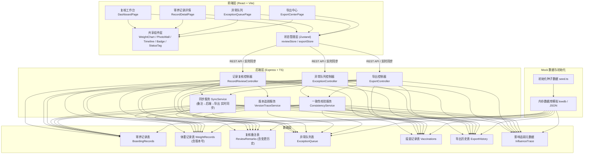
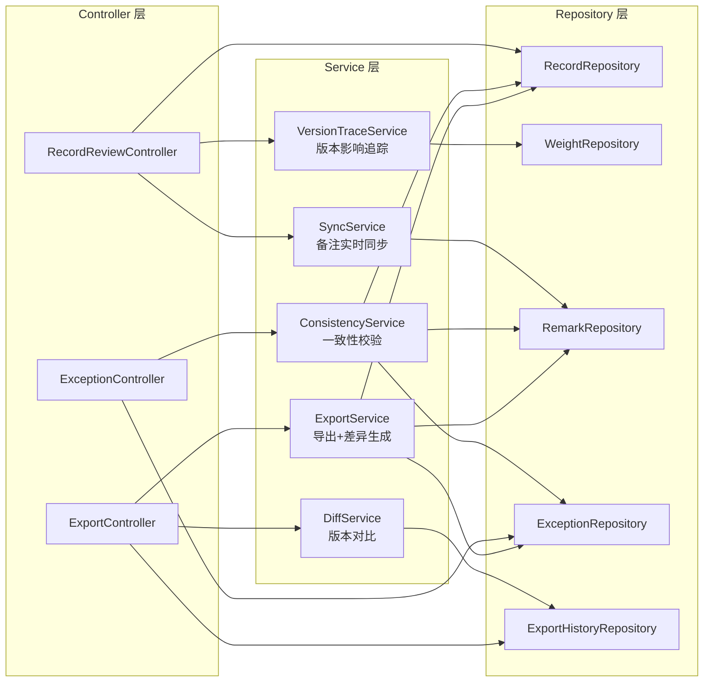
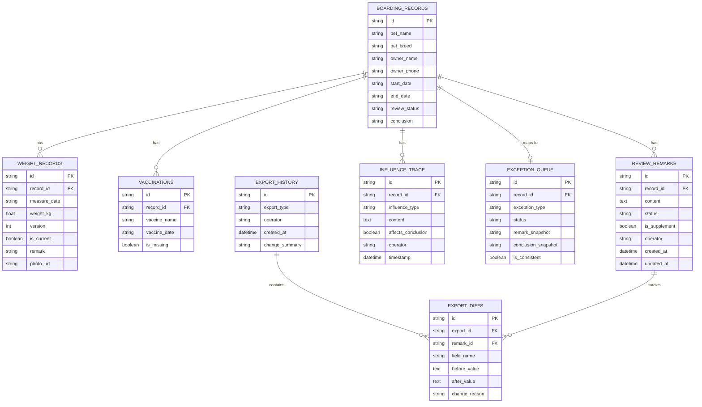

## 1. 架构设计



## 2. 技术描述
- **前端**：React@18 + TypeScript + tailwindcss@3 + vite@5 + react-router-dom@6 + zustand@4 + recharts@2（体重曲线）+ lucide-react（图标）+ date-fns（日期处理）
- **初始化工具**：vite-init 模板 react-express-ts
- **后端**：Express@4 + TypeScript（ESM）+ cors + body-parser
- **数据库**：开发阶段使用 JSON 文件模拟（lowdb 风格的内存 JSON），预置完整 Mock 数据
- **图表库**：recharts@2 实现体重曲线图（含双版本叠加、交互节点）
- **导出功能**：SheetJS (xlsx) 生成 Excel，jsPDF 生成 PDF，差异对比使用自定义 diff 工具

## 3. 路由定义
| 路由 | 页面组件 | 用途 |
|-------|---------|------|
| `/` | `DashboardPage` | 复核工作台首页，待复核列表+统计+筛选 |
| `/record/:id` | `RecordDetailPage` | 寄养记录详情，体重曲线+照片+复核+时间线 |
| `/exceptions` | `ExceptionQueuePage` | 异常队列管理，状态流转+一致性校验 |
| `/export` | `ExportCenterPage` | 导出中心，报告下载+变更对比+历史 |

后端 API 路由：
| 路由 | 方法 | 用途 |
|-------|------|------|
| `/api/records` | GET | 获取寄养记录列表（支持筛选参数） |
| `/api/records/:id` | GET | 获取单条寄养记录详情（含体重、疫苗、追踪元数据） |
| `/api/records/:id/remarks` | PATCH | 更新复核备注（实时同步导出数据） |
| `/api/records/:id/remarks/supplement` | POST | 补录备注（生成变更说明+导出版本对比） |
| `/api/exceptions` | GET | 获取异常队列 |
| `/api/exceptions/:id/status` | PATCH | 更新异常状态（同步校验与结论一致性） |
| `/api/export/report` | POST | 生成复核报告（含异常痕迹标记） |
| `/api/export/exceptions` | POST | 导出异常队列（状态/备注/结论一致性校验） |
| `/api/export/:id/diff` | GET | 获取导出前后版本差异对比 |
| `/api/export/history` | GET | 获取导出历史列表 |

## 4. API 定义（类型签名）

```typescript
// ===== 共享类型定义 =====
export type ReviewStatus = 'pending' | 'approved' | 'exception' | 'needsInfo';
export type ExceptionType = 'weight' | 'vaccine' | 'photo' | 'verbal' | 'withdrawn';
export type InfluenceType = 'weightVersion' | 'withdrawnRecord' | 'verbalNote';

export interface WeightPoint {
  date: string;
  weight: number;
  version: number;        // 版本号，用于旧版曲线对比
  isCurrent: boolean;     // 是否为当前版本
  remark: string;
  photoUrl?: string;
}

export interface VaccineRecord {
  name: string;
  date: string | null;    // null 表示缺失，会被标异常
  isMissing: boolean;     // 缺失标记，导出和筛选使用
}

export interface InfluenceTraceItem {
  id: string;
  type: InfluenceType;
  timestamp: string;
  content: string;
  affectsConclusion: boolean;  // 是否影响最终结论
  operator: string;
}

export interface ReviewRemark {
  id: string;
  recordId: string;
  content: string;
  status: ReviewStatus;
  createdAt: string;
  updatedAt: string;
  isSupplement: boolean;      // 是否为补录备注
  operator: string;
}

export interface ExceptionQueueItem {
  id: string;
  recordId: string;
  petName: string;
  exceptionType: ExceptionType;
  status: ReviewStatus;
  remark: string;             // 备注
  fileConclusion: string;     // 文件中结论
  isConsistent: boolean;      // 状态↔备注↔结论一致性
  createdAt: string;
}

export interface ExportDiff {
  field: string;
  before: string;
  after: string;
  changeReason: string;       // 补录备注原因
  rowIndex: number;
}
```

## 5. 服务层架构图



## 6. 数据模型

### 6.1 数据模型 ER 图



### 6.2 Mock 数据初始化（种子数据）
预置以下演示数据，确保老周可完整走通流程：
- **5 条寄养记录**：覆盖不同复核状态（待复核/通过/异常/需补充）
- **每条记录 5-7 个体重测量点**：其中 1-2 条包含旧版本曲线（version=1 旧版、version=2 当前版）
- **疫苗记录**：其中 2 条存在缺失（如狂犬疫苗日期为 null）
- **3-5 条复核备注**：含 1 条补录备注（is_supplement=true）用于演示导出差异
- **影响追踪条目**：每条记录至少含 1 条撤回记录、1 条口头备注、1 条旧版体重曲线标记
- **异常队列**：6 条异常记录（体重异常×2、疫苗缺失×2、照片异常×1、撤回记录×1），其中故意设置 1 条状态与结论不一致用于演示校验功能
- **导出历史**：3 条导出记录（含补录前后各 1 条，用于演示 diff 对比）
