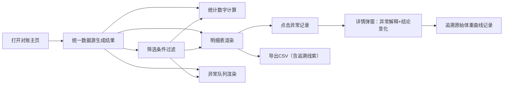

## 1. 产品概述
宠物医院寄养场景下的排程对账工具，将体重曲线背后的用药提醒从口头记忆转为系统化对账，杜绝漏记。面向前台小温提、运营主管、复核人三类角色，提供统一数据源驱动的筛选、统计、明细、异常视图，支持单位混写追溯与坏数据线索留存。

- 核心目标：用药提醒零遗漏、异常全链路可追溯、坏数据不丢线索
- 价值：替代口头交接，形成标准化对账流程，降低运营风险

## 2. 核心功能

### 2.1 用户角色
| 角色 | 使用场景 | 核心诉求 |
|------|----------|----------|
| 前台小温提 | 日常寄养排程录入与对账 | 筛选方便、异常一眼可见、不用再靠脑子记 |
| 复核人 | 次日复核数据一致性 | 单位混写能追到、筛选-详情-导出链路完整 |
| 运营主管 | 汇总分析与问题追溯 | 异常记录可解释结论变化、能回溯原始记录 |

### 2.2 功能模块
1. **对账主页**：筛选条件区、统计卡片区、明细表区、异常队列区、详情弹窗
2. **体重曲线追溯**：从对账记录跳回原始体重曲线记录、保留坏数据原始线索
3. **导出中心**：导出当前结果集，包含追溯线索字段

### 2.3 页面详情
| 页面名称 | 模块名称 | 功能描述 |
|----------|----------|----------|
| 对账主页 | 筛选条件区 | 寄养日期范围、宠物类型、异常类型、体重单位混写标记 |
| 对账主页 | 统计卡片区 | 总记录数、正常数、异常数、用药待提醒数、单位混写数 |
| 对账主页 | 明细表区 | 完整记录列表，含追溯原始记录链接、异常标记高亮 |
| 对账主页 | 异常队列区 | 仅异常记录独立队列，按严重程度排序 |
| 对账主页 | 详情弹窗 | 单条完整信息、异常解释、前后结论变化对比、原始记录跳转 |
| 对账主页 | 导出按钮 | 导出CSV，含追溯线索列、异常解释列 |

## 3. 核心流程
小温提打开对账主页 → 系统自动加载昨日至今全部记录（试跑时混入正常记录）→ 小温提按日期/异常类型筛选 → 点击异常记录查看详情 → 系统展示异常解释与结论变化原因 → 点击追溯链接跳转原始体重曲线 → 确认无误后导出CSV交付复核人 → 复核人通过导出文件中的追溯线索列定位问题记录。

## 4. 用户界面设计
### 4.1 设计风格
- **主色调**：医疗蓝 `#2563EB` 搭配暖橙 `#F97316`（异常高亮）、柔和绿 `#10B981`（正常）
- **辅助色**：中性灰 `#64748B` 系列用于文本与边框
- **卡片风格**：圆角12px，浅阴影 `0 2px 8px rgba(0,0,0,0.06)`，边框1px
- **字体**：标题使用思源黑体 Bold，正文使用思源宋体 Regular，数字使用等宽字体
- **布局**：顶部筛选条 + 四列统计卡片 + 左侧明细表（70%）+ 右侧异常队列（30%）的双栏布局
- **图标风格**：线性图标，异常使用带边框的警示图标，单位混写使用重叠字符图标

### 4.2 页面设计概览
| 页面名称 | 模块名称 | UI元素 |
|----------|----------|--------|
| 对账主页 | 筛选条 | 日期范围选择器、下拉筛选、重置按钮、蓝色渐变背景条 |
| 对账主页 | 统计卡片 | 数字大号显示、底部趋势迷你条、左右图标装饰、hover上浮 |
| 对账主页 | 明细表 | 斑马纹行、异常行橙红左边界、单位混写单元格加下划线 |
| 对账主页 | 异常队列 | 卡片式列表、严重程度色块、微动画提示新异常 |
| 对账主页 | 详情弹窗 | 居中模态框、双栏信息区+对比区、底部操作按钮 |

### 4.3 响应式
- 桌面优先（≥1280px）：双栏布局
- 平板（768-1279px）：异常队列折叠到明细表下方
- 移动（<768px）：单列堆叠，筛选条件折叠

### 4.4 动效细节
- 页面加载：统计卡片依次上浮淡入（stagger 80ms）
- 异常队列：新异常记录轻微脉冲提示
- 详情弹窗：背景模糊+缩放出现
- 追溯链接：hover时下划线颜色从蓝变橙
