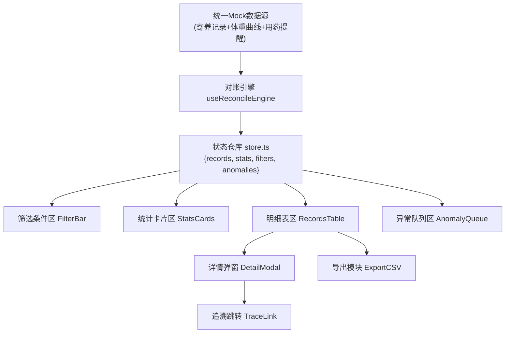
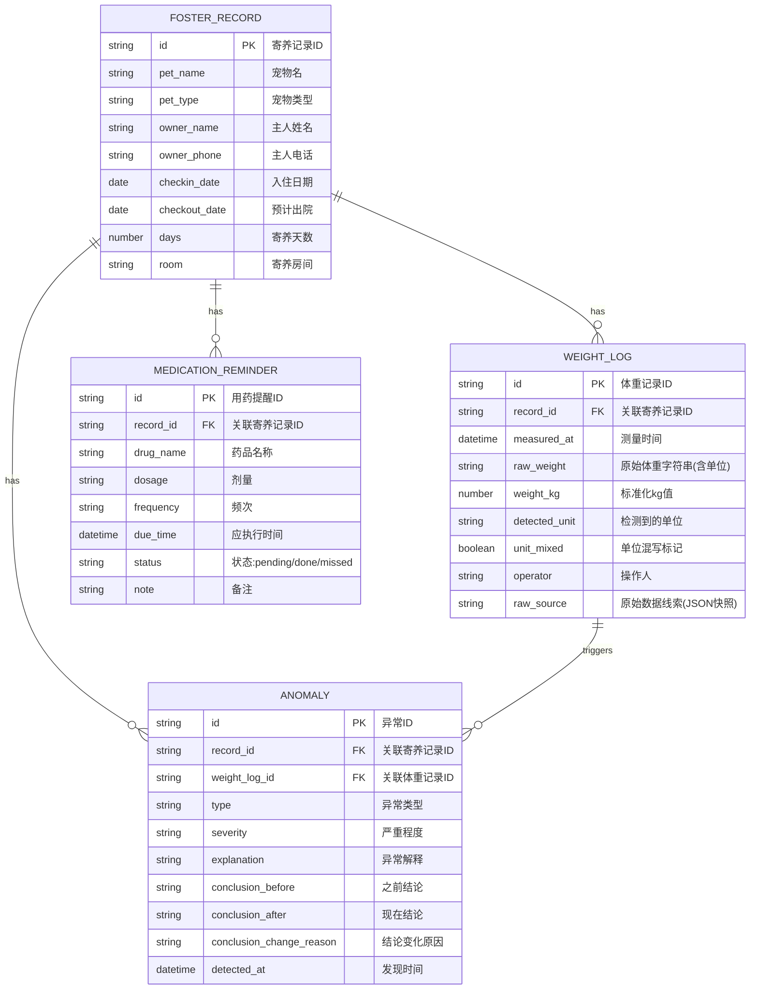

## 1. 架构设计
纯前端单页应用，数据处理层在浏览器内完成，无需后端服务。对账引擎从统一 Mock 数据源生成结果，筛选/统计/明细/异常共享同一状态树，保证一致性。



## 2. 技术说明
- **前端框架**：React@18 + TypeScript
- **构建工具**：Vite@5
- **样式方案**：TailwindCSS@3 + CSS 变量主题
- **状态管理**：React Context + useReducer（轻量场景）
- **图标库**：Lucide React（线性风格）
- **数据处理**：date-fns（日期）、papaparse（CSV导出）
- **数据来源**：内置 Mock 数据，包含正常记录、单位混写(kg/g/lb)、坏数据、异常结论变化

## 3. 路由定义
| 路由 | 用途 |
|------|------|
| / | 对账主页（单页应用唯一入口） |
| /trace/:recordId | 追溯视图（跳转后展示原始体重曲线上下文） |

## 4. 数据模型

### 4.1 数据模型定义


### 4.2 TypeScript 类型定义
```typescript
// 寄养记录
interface FosterRecord {
  id: string;
  petName: string;
  petType: 'cat' | 'dog' | 'other';
  ownerName: string;
  ownerPhone: string;
  checkinDate: string;
  checkoutDate: string;
  days: number;
  room: string;
}

// 体重日志
interface WeightLog {
  id: string;
  recordId: string;
  measuredAt: string;
  rawWeight: string;          // 原始字符串，保留线索
  weightKg: number | null;    // 标准化后，坏数据为null
  detectedUnit: 'kg' | 'g' | 'lb' | 'unknown';
  unitMixed: boolean;         // 单位混写标记
  operator: string;
  rawSource: string;          // 原始数据快照JSON，保留坏数据线索
}

// 用药提醒
interface MedicationReminder {
  id: string;
  recordId: string;
  drugName: string;
  dosage: string;
  frequency: string;
  dueTime: string;
  status: 'pending' | 'done' | 'missed';
  note: string;
}

// 异常记录
type AnomalyType = 
  | 'unit_mixed'        // 单位混写
  | 'weight_missing'    // 体重缺失
  | 'weight_abnormal'   // 体重异常波动
  | 'medication_missed' // 用药漏执行
  | 'bad_data';         // 坏数据

type Severity = 'high' | 'medium' | 'low';

interface Anomaly {
  id: string;
  recordId: string;
  weightLogId?: string;
  type: AnomalyType;
  severity: Severity;
  explanation: string;
  conclusionBefore: string;
  conclusionAfter: string;
  conclusionChangeReason: string;
  detectedAt: string;
}

// 对账引擎输出（统一结果）
interface ReconcileResult {
  records: (FosterRecord & {
    weightLogs: WeightLog[];
    medications: MedicationReminder[];
    anomalies: Anomaly[];
    hasAnomaly: boolean;
  })[];
  stats: {
    total: number;
    normal: number;
    anomaly: number;
    medicationPending: number;
    unitMixed: number;
  };
  filters: FilterState;
}
```

## 5. 核心对账引擎设计
```
useReconcileEngine 流程：
  1. 加载 Mock 数据源（寄养+体重+用药）
  2. 体重单位检测与混写标记：
     - 正则匹配 /(\d+(\.\d+)?)\s*(kg|g|lb|KG|G|LB)?/i
     - 同一记录下多次出现不同单位 → unitMixed=true
     - 无法解析 → weightKg=null + bad_data异常
  3. 异常检测：
     - 单位混写 → anomaly(type=unit_mixed)
     - 坏数据 → anomaly(type=bad_data, 保留rawSource)
     - 体重波动>30% → anomaly(type=weight_abnormal)
     - 用药status=missed → anomaly(type=medication_missed)
  4. 结论变化记录：
     - 对每条异常，生成 before/after 对比
     - 如 "kg转g换算前认为偏瘦→换算后体重正常，因原始单位写成g未换算"
  5. 生成 ReconcileResult（统一结果供所有视图消费）
  6. 筛选条件变化时，对统一结果过滤，不重新计算异常
```

## 6. 追溯机制设计
- **筛选→详情→导出链路**：每条记录携带 `record.id`，筛选基于同一结果集过滤
- **单位混写追踪**：明细表单元格 hover 显示 rawWeight，导出包含 raw_weight 列
- **坏数据线索**：Anomaly.rawSource 字段保存原始JSON，详情弹窗"原始线索"tab展示
- **结论变化解释**：详情弹窗"结论对比"区并排展示 before/after + 变化原因
- **跳转原始记录**：详情弹窗底部"查看原始体重曲线"按钮，带 weight_log_id 参数
