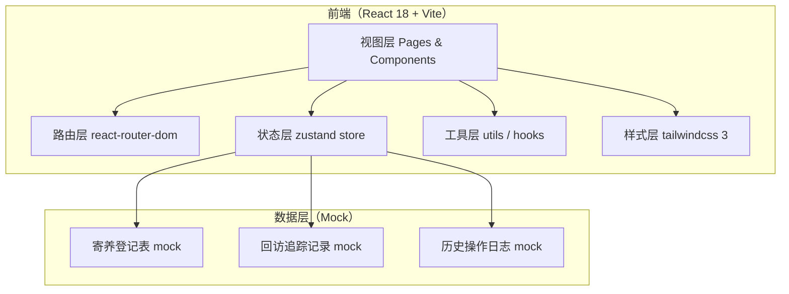
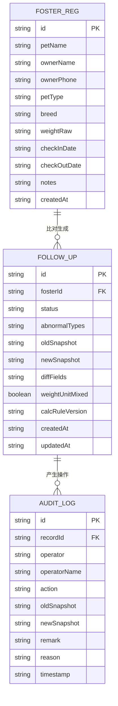

## 1. 架构设计



## 2. 技术说明
- **前端**：React@18 + TypeScript + tailwindcss@3 + vite
- **初始化工具**：vite-init（react-ts 模板），含 react-router-dom、zustand
- **后端**：无，全量 Mock 数据内置于前端
- **数据库**：无，状态用 zustand 管理，刷新不保留（演示用途）
- **图标库**：lucide-react

## 3. 路由定义
| 路由 | 用途 |
|-------|---------|
| / | 主看板（复核人视角，默认页） |
| /handover | 算法值班人交接页 |
| /reception | 前台小温接班页 |

## 4. API 定义（无后端，Mock 类型）
```typescript
// 寄养登记表
interface FosterRegistration {
  id: string;
  petName: string;
  ownerName: string;
  ownerPhone: string;
  petType: 'dog' | 'cat' | 'other';
  breed: string;
  weightRaw: string;        // 现场手写，可能 "5kg" "11 磅" "约 4500g"
  checkInDate: string;
  checkOutDate: string;
  notes: string;             // 前台现场备注，含"毛边"
  createdAt: string;
}

// 回访追踪记录（新旧比对结果）
interface FollowUpRecord {
  id: string;
  fosterId: string;
  status: 'normal' | 'abnormal' | 'pending' | 'released' | 'need_material';
  abnormalTypes: AbnormalType[];
  oldSnapshot: Partial<FosterRegistration>;  // 旧记录
  newSnapshot: Partial<FosterRegistration>;  // 本次登记表
  diffFields: string[];
  weightUnitMixed: boolean;   // 体重单位是否混写
  calcRuleVersion: string;    // 计算口径版本
  createdAt: string;
  updatedAt: string;
}

// 异常类型
type AbnormalType =
  | 'weight_mismatch'
  | 'phone_mismatch'
  | 'date_mismatch'
  | 'breed_mismatch'
  | 'weight_unit_mixed'
  | 'supplement_mismatch';

// 操作日志（历史追溯）
interface AuditLog {
  id: string;
  recordId: string;
  operator: '复核人' | '算法值班人' | '前台';
  operatorName: string;
  action: 'create' | 'update_status' | 'confirm_pending' | 'reverse' | 'add_note';
  oldSnapshot?: Partial<FollowUpRecord>;
  newSnapshot?: Partial<FollowUpRecord>;
  remark?: string;
  reason?: string;
  timestamp: string;
}
```

## 5. 数据模型



## 6. Mock 数据要点（样例中必须包含）

| 样例名称 | 设计意图 | 关键字段特征 |
|----------|----------|--------------|
| 正常样本 A | 展示"放行"流程 | weightRaw="5.2kg"，新旧一致 |
| 边界样本 B（体重单位混写） | 触发挂起逻辑 | oldSnapshot.weightRaw="5kg"，newSnapshot.weightRaw="11 磅"，weightUnitMixed=true |
| 信息不一致样本 C | 展示差异高亮对比 | 旧 phone="138****1234"，新 phone="138****4321"；旧 breed="金毛巡回犬"，新 breed="金毛" |
| 补录改判样本 D | 展示历史追溯面板 | 初始 status=abnormal，补录后 status=released，含 auditLog 旧材料+新备注+改判原因 |
| 待补材料样本 E | 交接页"待补材料"栏 | status=need_material，remark="主人未回电，需再次联系" |
| 现场毛边样本 F | 登记表留手写模糊痕迹 | notes 含"主人临时补充：疫苗本忘带，周一补送"、"前台手误后划改：原入住 6/3 改为 6/5" |
