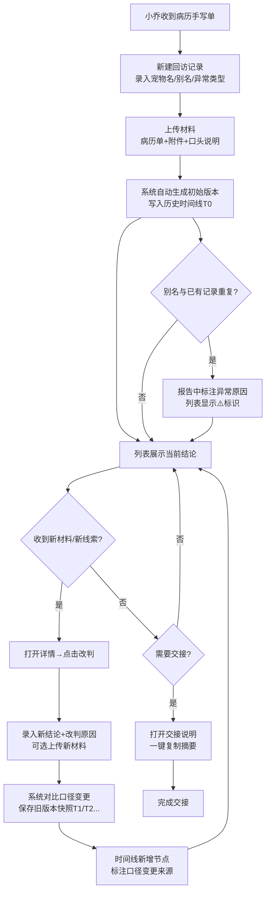

## 1. 产品概述

救助站志愿者"猫砂盆异常回访追踪"系统，用于管理宠物病历手写单的回访记录，解决回访结论无人承接、材料口径变更无法追溯、宠物别名混淆等问题。

- 核心用户：救助站志愿者小乔及同事
- 核心问题：手写病历单回访结论断层、材料变更无迹可查、别名重复导致误判
- 目标价值：让每一次回访改判都有据可查，交接时一目了然

## 2. 核心功能

### 2.1 用户角色

| 角色 | 注册方式 | 核心权限 |
|------|----------|----------|
| 志愿者 | 系统内置账号 | 创建回访记录、上传材料、改判结论、查看历史、导出交接说明 |

### 2.2 功能模块

1. **回访追踪列表页**：按状态筛选的回访记录列表，支持搜索、别名重复告警
2. **回访详情页**：单条记录完整信息展示，含材料附件、当前结论、异常原因
3. **改判弹窗**：结论变更录入，含改判原因、新备注、新材料上传
4. **历史记录面板**：所有版本的结论、材料、备注快照
5. **历史时间线**：可视化时间轴展示每次变更的操作人、时间、内容差异
6. **交接说明导出**：一键生成简洁的交接说明文本

### 2.3 页面详情

| 页面名称 | 模块名称 | 功能描述 |
|----------|----------|----------|
| 列表页 | 顶部筛选栏 | 按宠物名/别名搜索、按状态筛选（待回访/回访中/已结案/异常）、按回访日期排序 |
| 列表页 | 记录卡片列表 | 显示宠物名+别名、回访日期、当前结论、材料数量、告警标识（别名重复/口径变更） |
| 列表页 | 新建回访按钮 | 录入初始回访信息：宠物名/别名、初诊日期、猫砂盆异常类型、初始结论、上传病历单/附件 |
| 详情页 | 基本信息区 | 宠物名、所有别名、创建时间、当前状态、累计改判次数 |
| 详情页 | 材料附件区 | 每份材料的上传时间、版本号、内容摘要、"口径变更"标记、变更前后对比 |
| 详情页 | 当前结论区 | 结论状态、异常原因（如有）、最后改判人、改判时间 |
| 详情页 | 改判按钮 | 打开改判弹窗录入新结论 |
| 详情页 | 历史时间线 | 垂直时间轴：每次操作的图标、时间、操作人、结论变更、备注摘要、材料版本链接 |
| 详情页 | 交接说明 | 可折叠区域，自动生成"病历手写单+处理记录+历史时间线"的简洁摘要，支持复制 |
| 改判弹窗 | 结论选择 | 已恢复/需继续观察/转医/结案-异常/结案-正常 |
| 改判弹窗 | 改判原因 | 文本框，必填，说明为何改判 |
| 改判弹窗 | 新备注 | 补充说明文本 |
| 改判弹窗 | 新材料上传 | 可选上传新附件（晚到材料、补充说明） |
| 改判弹窗 | 版本对比 | 展示旧结论与新结论的差异 |

## 3. 核心流程

志愿者小乔收到宠物病历手写单 → 在系统新建回访记录，上传病历单+附件+口头说明转录 → 回访列表实时展示 → 后续收到补充材料/新线索时，打开详情页点击"改判" → 录入新结论、改判原因、上传新材料 → 系统自动保存旧版本快照，时间线新增节点 → 若宠物名/别名与已有记录重复，系统在报告中标注异常原因 → 交接时打开"交接说明"复制给下一位志愿者

## 4. 用户界面设计

### 4.1 设计风格

- **设计调性**：温暖、专业、信赖感——救助站场景需要人文关怀，同时数据追踪需要严谨
- **主色**：暖砂棕 `#B8956A` —— 呼应猫砂盆的自然质感
- **辅助色**：鼠尾草绿 `#7A9E7E`（正常/恢复）、赭石橙 `#D97706`（待观察/告警）、砖红 `#B91C1C`（异常/转医）、石板灰 `#475569`（中性文本）
- **按钮风格**：微圆角（8px），悬停上浮+轻微阴影，主按钮为暖砂棕实色，次按钮为描边
- **字体**：标题用「思源宋体 CN」体现人文温度，正文用「思源黑体 CN」保证可读性；行高1.7
- **布局**：卡片式布局，每张回访记录为独立卡片，顶部导航+左侧筛选+右侧内容区
- **图标**：lucide-react线性图标，时间线节点用圆点+连接线，材料变更用双向箭头图标，告警用三角感叹号

### 4.2 页面设计概述

| 页面名称 | 模块名称 | UI元素 |
|----------|----------|--------|
| 列表页 | 顶部导航栏 | 暖砂棕渐变背景，左侧logo"猫砂盆回访追踪"+🐾图标，右侧志愿者头像+姓名 |
| 列表页 | 筛选栏 | 白色卡片，搜索框（带🐾前缀图标）+状态下拉+日期范围选择+新建按钮（暖砂棕渐变） |
| 列表页 | 记录卡片 | 白底+浅棕边框，悬停阴影；左上宠物名字号20px加粗，右上状态标签（带色圆点）；中部别名标签组（灰色小标签）、材料数量徽标、改判次数徽标；底部最近回访时间；若有异常叠加⚠️红色角标 |
| 详情页 | 页头返回 | 返回按钮+宠物大名+所有别名胶囊标签 |
| 详情页 | 状态横幅 | 大色块横幅：当前结论大字+状态色背景，右侧异常原因卡片（如有）、改判按钮 |
| 详情页 | 材料网格 | 2列网格，每个材料卡片：文件类型图标+文件名+上传时间+版本号；若口径变更，卡片顶部橙色条带+「口径变更 v1→v2」标签+查看对比链接 |
| 详情页 | 历史时间线 | 左侧垂直棕色实线，每个节点：圆形图标（创建/改判/上传分别用不同图标）+日期时间+操作人卡片，卡片内结论标签、备注摘要、材料链接、口径变更高亮 |
| 详情页 | 交接说明 | 可折叠卡片，浅黄色背景（便利贴感），标题"📋 交接说明"，内容为结构化纯文本，末尾一键复制按钮 |
| 改判弹窗 | 模态框 | 半透明遮罩，白色圆角弹窗；顶部标题+版本对比条；表单区：结论选择（按钮组）+改判原因（必填文本域）+备注（可选）+文件上传区；底部取消/确认按钮 |

### 4.3 响应式

桌面优先（1280px以上），侧边栏固定；平板（768-1280px）筛选栏折行；移动端（<768px）列表卡片单列、时间线简化为左右交替、交接说明默认展开

### 4.4 动画细节

- 列表卡片入场：100ms延迟的stagger上浮渐入
- 时间线节点：滚动触发从左侧滑入+淡入
- 改判弹窗：scale 0.95→1 + 背景淡入，150ms
- 口径变更标记：呼吸式橙色光晕动画，提醒注意
- 复制成功按钮：✓图标弹跳反馈
