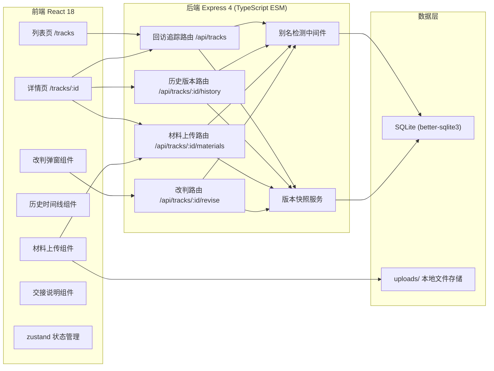
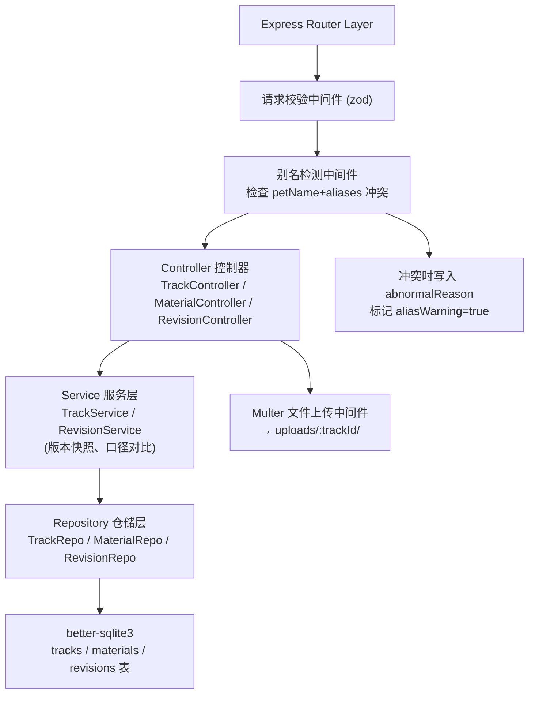
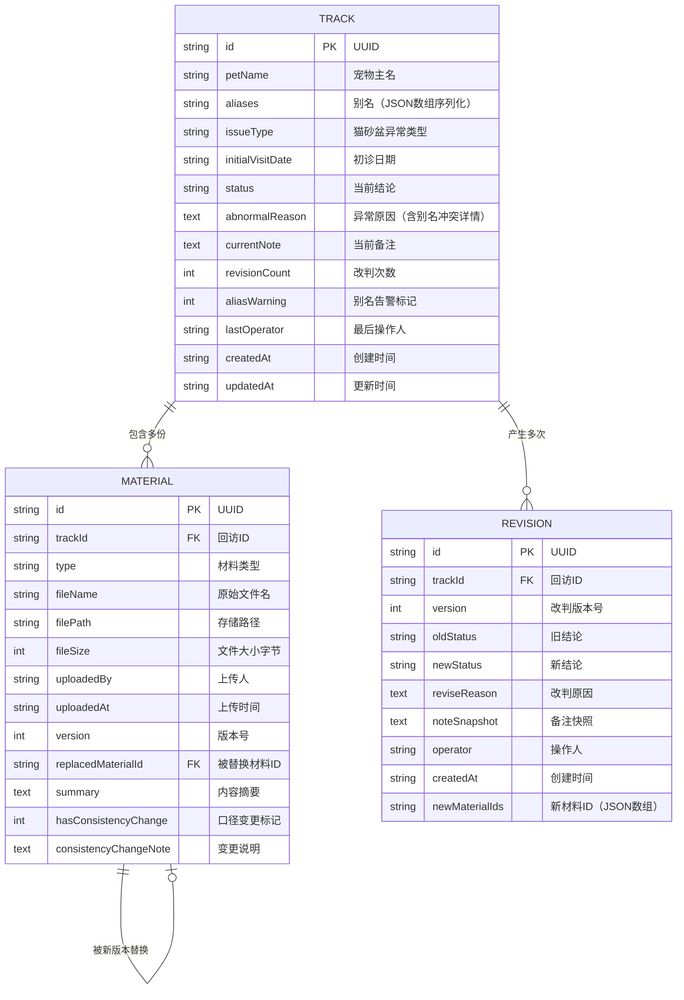

## 1. 架构设计



## 2. 技术说明

- **前端**：React@18 + TypeScript + Vite + React Router v6 + Tailwind CSS 3 + zustand + lucide-react
- **初始化工具**：vite-init（react-express-ts 模板）
- **后端**：Express@4 + TypeScript (ESM) + better-sqlite3 + multer（文件上传）
- **数据库**：SQLite（本地文件，零运维，适合救助站单机部署场景）
- **文件存储**：本地 `uploads/` 目录，材料文件按记录ID分子目录

## 3. 路由定义

| 路由 | 用途 |
|------|------|
| `/` | 重定向至 `/tracks` |
| `/tracks` | 回访追踪列表页（搜索、筛选、排序、新建） |
| `/tracks/:id` | 回访详情页（基本信息、材料、时间线、交接说明、改判入口） |

## 4. API 定义

### 4.1 类型定义（前后端共享 shared/types.ts）

```typescript
// 回访结论状态
export type TrackStatus = 
  | 'pending'      // 待回访
  | 'observing'    // 回访中/观察中
  | 'recovered'    // 已恢复
  | 'transferred'  // 转医
  | 'closed_normal' // 结案-正常
  | 'closed_abnormal'; // 结案-异常

// 猫砂盆异常类型
export type LitterIssueType = 
  | 'odor'         // 异味严重
  | 'usage'        // 使用异常（不使用/过度使用）
  | 'appearance'   // 外观异常（便血/软便/尿闭）
  | 'cleanliness'  // 清洁度异常
  | 'other';       // 其他

// 材料类型
export type MaterialType = 
  | 'medical_record'  // 病历手写单
  | 'attachment'      // 附件（照片/报告）
  | 'oral_note';      // 口头说明转录

// 回访记录（当前版本）
export interface Track {
  id: string;
  petName: string;
  aliases: string[];            // 所有别名数组
  issueType: LitterIssueType;
  initialVisitDate: string;     // 初诊日期 ISO
  status: TrackStatus;
  abnormalReason?: string;      // 异常原因（别名重复等）
  currentNote: string;          // 当前备注
  revisionCount: number;        // 累计改判次数
  aliasWarning: boolean;        // 是否存在别名重复告警
  createdAt: string;
  updatedAt: string;
  lastOperator: string;
  materials: Material[];        // 所有材料（含版本）
}

// 材料附件
export interface Material {
  id: string;
  trackId: string;
  type: MaterialType;
  fileName: string;
  filePath: string;             // 服务端相对路径
  fileSize: number;
  uploadedBy: string;
  uploadedAt: string;
  version: number;              // 版本号，同一份材料修改后递增
  replacedMaterialId?: string;  // 被替换的旧材料ID
  summary: string;              // 内容摘要
  hasConsistencyChange: boolean;// 是否存在口径变更
  consistencyChangeNote?: string; // 口径变更说明
}

// 改判记录（历史快照）
export interface Revision {
  id: string;
  trackId: string;
  version: number;              // 第几次改判（从0开始，0为初始版本）
  oldStatus: TrackStatus | null;
  newStatus: TrackStatus;
  reviseReason: string;         // 改判原因（必填）
  noteSnapshot: string;         // 当时备注快照
  operator: string;
  createdAt: string;
  newMaterialIds: string[];     // 本次新增/替换的材料ID
}

// 历史时间线节点（Revision + 材料上传合并展示）
export interface TimelineNode {
  id: string;
  type: 'create' | 'revise' | 'upload';
  timestamp: string;
  operator: string;
  title: string;
  summary: string;
  details: {
    statusChange?: { old: TrackStatus | null; new: TrackStatus };
    reviseReason?: string;
    materials?: { id: string; name: string; version: number; changed?: boolean }[];
    note?: string;
  };
}
```

### 4.2 API 端点

| 方法 | 路径 | 说明 | 请求体 | 响应 |
|------|------|------|--------|------|
| GET | `/api/tracks` | 获取回访列表（支持查询） | query: search, status, sortBy | `{ data: Track[] }` |
| POST | `/api/tracks` | 新建回访记录 | `{ petName, aliases, issueType, initialVisitDate, status, currentNote, materials: [{type, summary, file}] }` | `{ data: Track }` |
| GET | `/api/tracks/:id` | 获取单条回访详情 | - | `{ data: Track }` |
| GET | `/api/tracks/:id/history` | 获取历史版本列表 | - | `{ data: Revision[] }` |
| GET | `/api/tracks/:id/timeline` | 获取历史时间线（聚合视图） | - | `{ data: TimelineNode[] }` |
| POST | `/api/tracks/:id/revise` | 改判结论（创建新版本快照） | `{ newStatus, reviseReason, note?, materials?: [{...}] }` | `{ data: { track: Track; revision: Revision } }` |
| POST | `/api/tracks/:id/materials` | 单独上传材料（不改判） | `{ type, summary, file?, replacedMaterialId? }` | `{ data: Material }` |
| GET | `/api/tracks/:id/handoff` | 生成交接说明文本 | - | `{ data: string }` |
| GET | `/api/materials/:materialId/download` | 下载材料文件 | - | 文件流 |

## 5. 服务端架构图



## 6. 数据模型

### 6.1 ER 图



### 6.2 DDL 语句（SQLite）

```sql
-- 回访主表
CREATE TABLE IF NOT EXISTS tracks (
  id TEXT PRIMARY KEY,
  pet_name TEXT NOT NULL,
  aliases TEXT NOT NULL DEFAULT '[]',
  issue_type TEXT NOT NULL,
  initial_visit_date TEXT NOT NULL,
  status TEXT NOT NULL,
  abnormal_reason TEXT,
  current_note TEXT NOT NULL DEFAULT '',
  revision_count INTEGER NOT NULL DEFAULT 0,
  alias_warning INTEGER NOT NULL DEFAULT 0,
  last_operator TEXT NOT NULL DEFAULT '小乔',
  created_at TEXT NOT NULL,
  updated_at TEXT NOT NULL
);

CREATE INDEX idx_tracks_status ON tracks(status);
CREATE INDEX idx_tracks_pet_name ON tracks(pet_name);
CREATE INDEX idx_tracks_created_at ON tracks(created_at);

-- 材料附件表
CREATE TABLE IF NOT EXISTS materials (
  id TEXT PRIMARY KEY,
  track_id TEXT NOT NULL,
  type TEXT NOT NULL,
  file_name TEXT NOT NULL,
  file_path TEXT NOT NULL,
  file_size INTEGER NOT NULL DEFAULT 0,
  uploaded_by TEXT NOT NULL,
  uploaded_at TEXT NOT NULL,
  version INTEGER NOT NULL DEFAULT 1,
  replaced_material_id TEXT,
  summary TEXT NOT NULL DEFAULT '',
  has_consistency_change INTEGER NOT NULL DEFAULT 0,
  consistency_change_note TEXT,
  FOREIGN KEY (track_id) REFERENCES tracks(id) ON DELETE CASCADE,
  FOREIGN KEY (replaced_material_id) REFERENCES materials(id) ON DELETE SET NULL
);

CREATE INDEX idx_materials_track_id ON materials(track_id);

-- 改判历史表（版本快照）
CREATE TABLE IF NOT EXISTS revisions (
  id TEXT PRIMARY KEY,
  track_id TEXT NOT NULL,
  version INTEGER NOT NULL,
  old_status TEXT,
  new_status TEXT NOT NULL,
  revise_reason TEXT NOT NULL,
  note_snapshot TEXT NOT NULL DEFAULT '',
  operator TEXT NOT NULL,
  created_at TEXT NOT NULL,
  new_material_ids TEXT NOT NULL DEFAULT '[]',
  FOREIGN KEY (track_id) REFERENCES tracks(id) ON DELETE CASCADE
);

CREATE INDEX idx_revisions_track_id ON revisions(track_id, version);

-- 初始化示例数据（3条典型案例）
INSERT OR IGNORE INTO tracks (id, pet_name, aliases, issue_type, initial_visit_date, status, abnormal_reason, current_note, revision_count, alias_warning, last_operator, created_at, updated_at) VALUES
('track-001', '橘子', '["桔子","小橘","橘座"]', 'appearance', '2026-05-20', 'observing', NULL, '初诊软便，配益生菌，3天后复查', 1, 0, '小乔', '2026-05-20T10:00:00', '2026-06-01T14:30:00'),
('track-002', '奶盖', '["小白","棉花糖"]', 'odor', '2026-05-25', 'closed_normal', NULL, '更换猫砂后异味消失，连续7天正常', 0, 0, '小乔', '2026-05-25T09:15:00', '2026-06-02T11:00:00'),
('track-003', '小橘', '["橘猫","小黄"]', 'usage', '2026-05-28', 'observing', '⚠️ 别名冲突：宠物名「小橘」与 track-001 的别名「小橘」重复，请确认是否为同一只猫。若为不同猫请区分标记，避免回访结论混淆。', '拒绝使用猫砂盆，疑似应激，观察中', 2, 1, '小乔', '2026-05-28T16:45:00', '2026-06-05T10:20:00');
```
