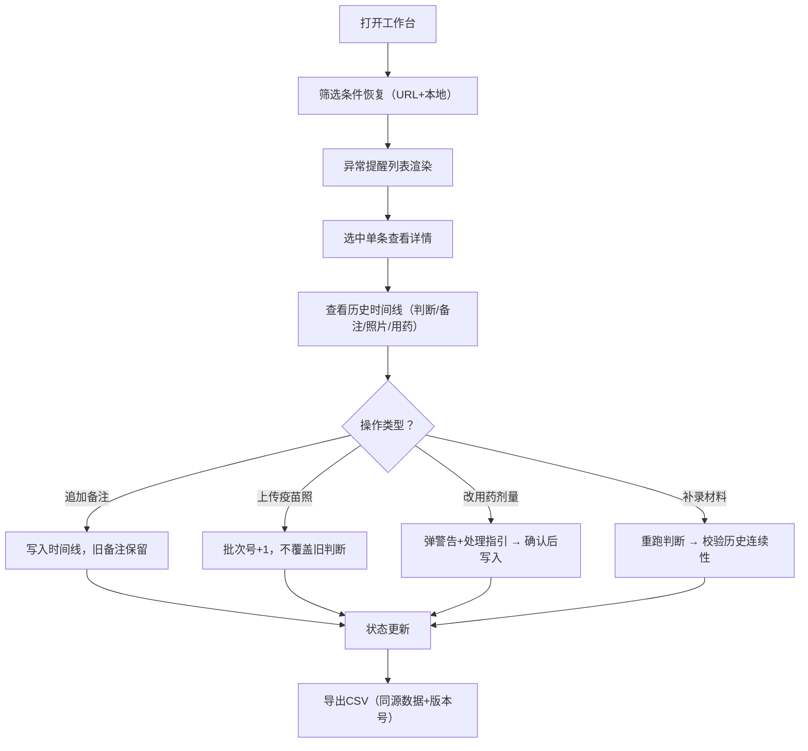

## 1. 产品概述
面向宠物医院兽医助理的"宠物减重异常提醒"工作台，解决疫苗本照片手工核对效率低、回访断档、补录覆盖、导出口径不一致等问题。
- 目标用户：兽医助理（如阿宁）、现场老师、回访接手人
- 核心价值：筛选/备注/导出三位一体、历史判断可追溯、异常操作有指引、数据口径统一

## 2. 核心功能

### 2.1 用户角色
| 角色 | 场景 | 核心权限 |
|------|------|---------|
| 兽医助理 | 日常核对、记录异常、导出CSV | 查看/筛选/记录/补录/导出 |
| 回访接手人 | 接手未完成病例、查看历史 | 查看完整时间线、处理异常 |
| 现场老师 | 演示/培训流程 | 全流程操作、查看演示数据 |

### 2.2 功能模块
1. **主工作台页面**：筛选条件区、异常提醒列表、详情侧栏、操作区
2. **历史时间线**：记录每次判断、备注、疫苗照、用药变更的完整轨迹
3. **疫苗本照片上传**：分次上传、不覆盖旧判断、自动关联时间节点
4. **用药剂量变更**：弹出警告 + 处理指引（接手人可读）
5. **CSV导出**：与当前页面完全同源，带重跑校验签名
6. **演示数据集**：3-4条小数据，覆盖正常/异常/补录/用药变更场景

### 2.3 页面详情
| 页面名称 | 模块名称 | 功能描述 |
|---------|---------|---------|
| 主工作台 | 顶部筛选区 | 宠物名/主人/日期范围/异常等级/处理状态筛选，刷新不丢失（URL+localStorage双持久化） |
| 主工作台 | 异常提醒列表 | 卡片式列表，显示宠物头像、减重差值、异常标签、最新状态、未读标记 |
| 主工作台 | 详情侧栏 | 宠物基本信息、减重趋势迷你图、历史时间线、操作按钮区 |
| 主工作台 | 人工备注区 | 带时间戳/操作人，不覆盖旧备注，支持追加模式 |
| 主工作台 | 疫苗本照片区 | 分次上传（第N批），缩略图+上传时间+批次号，不触发旧判断覆盖 |
| 主工作台 | 用药记录区 | 剂量修改时弹警告+处理指引对话框，指引作为特殊条目写入时间线 |
| 主工作台 | 操作按钮栏 | 记录处理、补录材料、重跑判断、导出CSV |
| 主工作台 | CSV导出 | 与当前筛选/当前判断完全一致，导出文件带导出时间+判断版本号 |

## 3. 核心流程
兽医助理登录工作台 → 查看筛选后的异常提醒列表 → 选中某条查看详情和历史时间线 → 核对疫苗本照片（分次上传不覆盖）→ 追加人工备注 → 如需调整用药则按指引操作 → 补录后点击重跑判断（校验历史连续）→ 导出CSV（口径与页面一致）

## 4. 用户界面设计
### 4.1 设计风格
- 主色：沉稳专业的医疗蓝 `#1E6FD9`，辅色：健康绿 `#10B981` / 警示橙 `#F59E0B` / 危险红 `#EF4444`
- 背景：极浅灰蓝 `#F5F8FC`，卡片：纯白+柔和阴影
- 按钮：圆角 8px，主按钮实色填充，次要按钮描边
- 字体：标题用 Source Serif Pro（衬线，专业感），正文用 Lato（无衬线，易读）
- 布局：左侧固定筛选面板，中间卡片列表，右侧抽屉式详情侧栏
- 图标：线性风格，搭配状态色点标记

### 4.2 页面设计概览
| 页面名称 | 模块名称 | UI元素 |
|---------|---------|--------|
| 主工作台 | 筛选区 | 白底圆角卡片、下拉筛选器、日期范围、标签式多选、重置按钮 |
| 主工作台 | 列表卡片 | 宠物头像（圆形带边框）、减重差值（负号红色加粗）、异常等级色标、未读红点 |
| 主工作台 | 时间线 | 左侧色条竖线+圆点节点，右侧时间+操作人+内容卡片，不同操作类型不同色 |
| 主工作台 | 疫苗照区 | 网格缩略图，批次号徽章，悬停放大，批次间分割线 |
| 主工作台 | 用药警告弹窗 | 警告图标黄底、加粗警告语、3步处理指引清单、确认/取消双按钮 |
| 主工作台 | CSV导出按钮 | 带下拉角标，显示"导出 X 条记录" |

### 4.3 响应式
- Desktop-first，最小宽度 1280px
- 平板：筛选区折叠为顶部横条
- 移动端：列表单列，详情全屏抽屉

### 4.4 动效
- 筛选变更：列表卡片淡入淡出（300ms ease）
- 时间线展开：节点依次出现（stagger 80ms）
- 警告弹窗：缩放进入+背景模糊
- 疫苗照上传：进度条+缩略图渐入
- 异常等级色标：轻微脉冲呼吸动效
