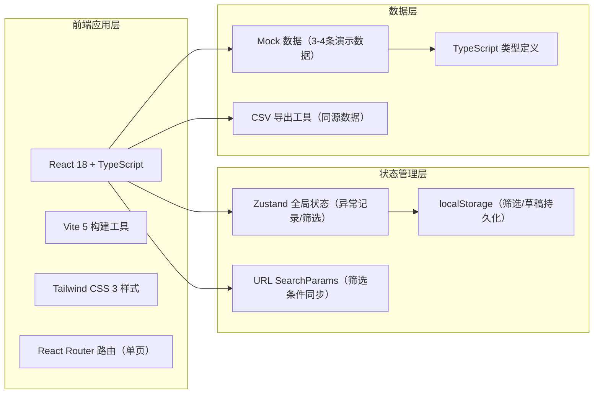
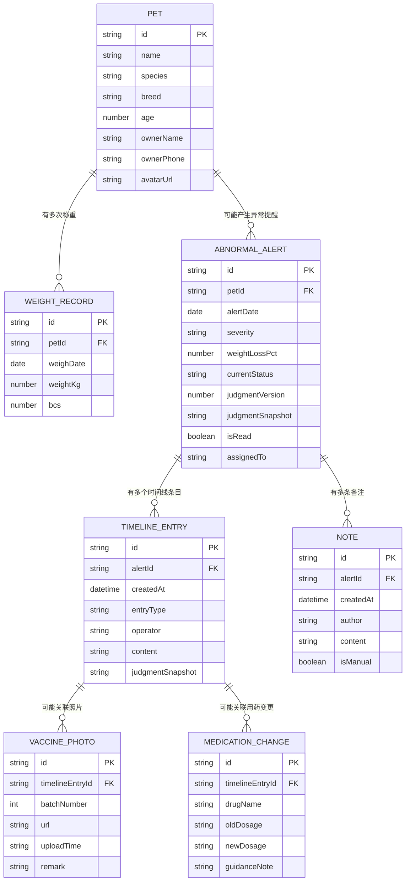

## 1. 架构设计



## 2. 技术描述
- **前端框架**：React@18 + TypeScript@5 + Vite@5
- **样式方案**：Tailwind CSS@3 + CSS Variables（主题色）
- **状态管理**：Zustand（轻量）+ React Hooks
- **路由**：React Router DOM@6（单页应用）
- **图标**：Lucide React（线性图标库）
- **CSV导出**：纯前端实现（不依赖外部库）
- **图表**：自绘 SVG 迷你趋势图（避免引入重型图表库）
- **数据来源**：内置 Mock 数据（3-4条演示用）
- **持久化**：URL SearchParams + localStorage 双写

## 3. 路由定义
| 路由 | 目的 |
|------|------|
| `/` | 主工作台：筛选区 + 异常列表 + 详情侧栏（query参数携带筛选条件） |

## 4. 数据模型

### 4.1 ER 图



### 4.2 TypeScript 类型定义

```typescript
export type Severity = 'mild' | 'moderate' | 'severe';
export type AlertStatus = 'pending' | 'in_progress' | 'resolved' | 'follow_up';
export type TimelineEntryType = 
  | 'judgment_created'
  | 'judgment_rerun'
  | 'note_added'
  | 'vaccine_photo_uploaded'
  | 'medication_changed'
  | 'material_supplemented'
  | 'status_updated';

export interface Pet {
  id: string;
  name: string;
  species: '犬' | '猫' | '其他';
  breed: string;
  age: number;
  ownerName: string;
  ownerPhone: string;
  avatarUrl: string;
}

export interface WeightRecord {
  id: string;
  petId: string;
  weighDate: string;
  weightKg: number;
  bcs: number;
}

export interface VaccinePhoto {
  id: string;
  timelineEntryId: string;
  batchNumber: number;
  url: string;
  uploadTime: string;
  remark?: string;
}

export interface MedicationChange {
  id: string;
  timelineEntryId: string;
  drugName: string;
  oldDosage: string;
  newDosage: string;
  guidanceNote: string;
}

export interface TimelineEntry {
  id: string;
  alertId: string;
  createdAt: string;
  entryType: TimelineEntryType;
  operator: string;
  content: string;
  judgmentSnapshot: string;
  photos?: VaccinePhoto[];
  medication?: MedicationChange;
}

export interface Note {
  id: string;
  alertId: string;
  createdAt: string;
  author: string;
  content: string;
  isManual: boolean;
}

export interface AbnormalAlert {
  id: string;
  petId: string;
  alertDate: string;
  severity: Severity;
  weightLossPct: number;
  currentStatus: AlertStatus;
  judgmentVersion: number;
  judgmentSnapshot: string;
  isRead: boolean;
  assignedTo: string;
  pet?: Pet;
  weightRecords?: WeightRecord[];
  timeline?: TimelineEntry[];
  notes?: Note[];
}

export interface FilterState {
  keyword: string;
  dateFrom: string;
  dateTo: string;
  severities: Severity[];
  statuses: AlertStatus[];
  assignedTo: string;
}
```

### 4.3 演示数据（3-4条）
| 宠物名 | 主人 | 减重比例 | 异常等级 | 状态 | 场景说明 |
|-------|------|---------|---------|------|---------|
| 豆豆 | 张女士 | -8.3% | severe（重度） | in_progress | 已上传2批疫苗照，有用药变更，需重跑判断 |
| 咪咪 | 李先生 | -4.1% | moderate（中度） | pending | 新产生异常，无操作记录 |
| 旺财 | 王大哥 | -2.2% | mild（轻度） | follow_up | 已补录材料，重跑过一次判断，历史完整 |
| 奶茶 | 赵小姐 | -5.7% | moderate（中度） | resolved | 已回访结束，有多条备注+完整时间线 |

## 5. 关键实现说明

### 5.1 筛选条件持久化
- 初始化：`URL → localStorage → 默认值` 优先级读取
- 变更时：同时写入 URL query string 和 localStorage
- 刷新后：三者完全一致，筛选/列表/导出口径统一

### 5.2 历史不覆盖机制
- 所有写操作（备注/照片/用药/重跑）均为**追加**时间线条目，永不更新已有条目
- `judgmentSnapshot` 字段在每次判断时存一份快照，防止后续修改影响历史判断
- 疫苗照批次号递增，批次间有视觉分隔线

### 5.3 用药剂量变更处理指引
1. 用户修改剂量 → 触发警告弹窗
2. 弹窗显示3步标准处理指引
3. 用户确认后，生成 `medication_changed` 类型时间线条目，含 `guidanceNote` 字段
4. 接手人查看时间线即可看到完整指引

### 5.4 CSV 导出同源保证
- 导出逻辑直接读取当前筛选条件下的 `filteredAlerts` 状态（与列表渲染完全同一份数据）
- 每行携带 `judgmentVersion` 和 `judgmentSnapshot` 摘要
- 文件名格式：`宠物减重异常_YYYYMMDD_HHmm_v{版本号}.csv`
- 导出前自动触发一次"历史连续性校验"，有断档会提示

### 5.5 重跑判断与历史连续性校验
- 重跑判断：递增 `judgmentVersion`，根据当前最新材料重新计算减重异常等级
- 连续性校验：检查时间线条目时间戳是否单调递增，`judgmentVersion` 是否连续无跳号
- 校验结果：通过→绿色徽标；不通过→红色警告+具体断档位置提示
