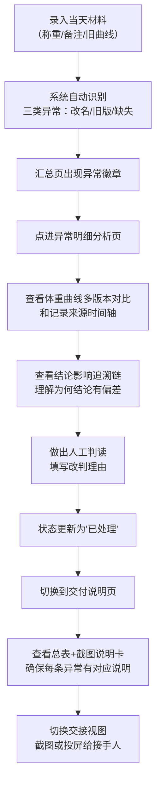
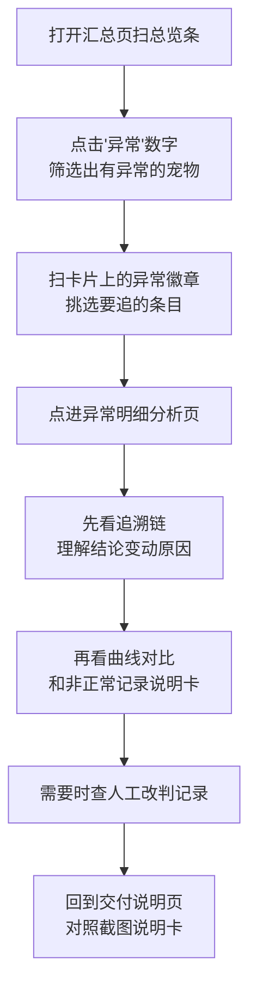

## 1. 产品概述
"宠物减重回访追踪"是为救助站志愿者小乔设计的轻量级数据追溯系统，解决人工记忆不可靠的痛点，将体重曲线、异常补充信息、处理状态三者关联留存，让接手同事能快速看懂"为什么结论是这样"。

- 核心问题：旧版体重曲线、改名记录、口头备注混入后，结论改动原因说不清；疫苗日期缺失等特殊处理看不到逻辑
- 目标用户：救助站志愿者小乔及其接手同事
- 产品价值：所有异常变动均有"影响追溯链"，汇总→异常→截图说明三步闭环，不用写大段文档也能交接

## 2. 核心功能

### 2.1 用户角色
| 角色 | 使用方式 | 核心诉求 |
|------|----------|----------|
| 志愿者小乔 | 日常录入、标记异常、生成交付物 | 不用记、结论变更原因留痕 |
| 接手同事 | 扫汇总、追异常、看截图说明 | 快速看懂、数字变动找得到原因 |

### 2.2 功能模块
1. **追踪汇总页**：宠物卡片列表、体重趋势缩略图、异常标记徽章、处理状态总览、筛选面板
2. **异常明细分析页**：体重曲线多版本叠加对比、改名/换称呼关联映射、影响结论追溯链、非正常记录原因标注、人工改判记录
3. **交付说明页**：汇总总表、处理状态截图说明卡、人工改判说明卡、一键导出交付视图

### 2.3 页面详情
| 页面名称 | 模块名称 | 功能描述 |
|-----------|-------------|---------------------|
| 追踪汇总页 | 顶部总览条 | 显示在访宠物数、异常条数、待人工复核数、已完成数，点击各数字跳转对应筛选 |
| 追踪汇总页 | 筛选面板 | 按宠物名称/别名搜索、按处理状态筛选、按异常类型筛选、按时间范围筛选 |
| 追踪汇总页 | 宠物卡片列表 | 每张卡含：宠物头像+名称+别名、体重缩略曲线、最近一次体重、异常徽章、处理状态标签、最新更新时间 |
| 追踪汇总页 | 卡片异常悬浮层 | 悬停卡片显示异常摘要：哪类异常、影响结论等级、处理人 |
| 异常明细分析页 | 基本信息栏 | 宠物主名+历史曾用名映射、当前处理状态、接手人、累计记录条数 |
| 异常明细分析页 | 体重曲线对比区 | 多版本曲线叠加（旧版/新版/修订版用不同颜色+虚线区分），点击数据点弹出该次测量来源与备注 |
| 异常明细分析页 | 记录来源时间轴 | 按时间展示全部材料：正规称重/旧版曲线/改名补充/口头备注/疫苗缺失，每条标注来源可信度、是否被纳入计算 |
| 异常明细分析页 | 结论影响追溯链 | 瀑布式流程图：原始结论→哪条材料产生冲突→冲突点是什么→人工怎么判→最终结论变化了多少 |
| 异常明细分析页 | 非正常记录说明卡 | 疫苗日期缺失等"没按正常记录走"的材料，独立卡片说明原因、处理方式、对结论的影响程度 |
| 异常明细分析页 | 人工改判记录 | 每次人工判读的时间、判读人、判读理由、改判前后对比值 |
| 交付说明页 | 交付总表 | 宠物名称、起始体重、当前体重、减重率、异常数、处理状态、结论置信度 |
| 交付说明页 | 处理状态截图卡 | 每张异常配一张"截图说明卡"：左侧异常摘要、右侧对应曲线截图+影响链说明文字 |
| 交付说明页 | 人工改判说明卡 | 罗列所有人工干预条目：改判点、原由、改判前后数值差、改判人签字 |
| 交付说明页 | 交付模式切换 | 一键切换"交接视图"：隐藏操作按钮、突出总表+截图说明卡、适合投屏/打印/截图转发 |

## 3. 核心流程

志愿者小乔日常使用流程：

接手同事接手流程：

## 4. 用户界面设计

### 4.1 设计风格
- **色彩基调**：温暖质朴的救助站风格。主色用"陶土橙"#C87941（像喂食器），次色用"鼠尾草绿"#8FA68C（健康自然的减重感），异常强调色用"铁锈红"#B5523A，完成态用"石墨灰"#565264。背景用米白色#FAF7F2（纸张质感），卡片白底配浅橙阴影。
- **按钮风格**：圆角矩形（8px），主按钮陶土橙填充+白色文字，次按钮描边橙，异常按钮铁锈红。全部按钮带极细的下阴影（2px y-offset）模拟轻触感。
- **字体选择**：标题用"霞鹜文楷"（温暖手写感），正文用"思源黑体"（清晰易读）；数字和百分比用等宽字体。
- **布局风格**：卡片化布局，卡片之间留白 generous。汇总页用网格（桌面端3列），分析页用两栏主从布局（左60%曲线+时间轴，右40%追溯链+说明卡），交付页是纵列的"打印友好"布局。
- **图标/装饰**：用手绘线描风格的小图标（爪印、餐勺、体重秤、铅笔改名、疫苗瓶），异常徽章是带锯齿边的小旗子形状，处理状态标签是圆角小吊牌。

### 4.2 页面设计概览
| 页面名称 | 模块名称 | UI元素 |
|-----------|-------------|-------------|
| 追踪汇总页 | 顶部总览条 | 陶土橙渐变背景条，四个数字块（在访/异常/待复核/已完成），数字用大号霞鹜文楷，下挂小字描述 |
| 追踪汇总页 | 宠物卡片 | 米白卡片+轻微橙阴影，左侧爪印头像占位，中上是主名+曾用名（小号灰字括号），中间是3cm宽的迷你SVG折线曲线，右下异常小旗子徽章，底部吊牌式状态标签 |
| 追踪汇总页 | 筛选面板 | 浅米色背景的横向条，搜索框带爪印icon，筛选chip用鼠尾草绿描边，选中后填充 |
| 异常明细分析页 | 曲线对比区 | 白色大卡片，标题"体重曲线对比"带餐勺icon，SVG折线图支持多版本叠加，数据点可点击弹气泡 |
| 异常明细分析页 | 记录时间轴 | 左侧竖线（不同颜色代表不同来源），每条记录是一个节点，节点图标区分来源类型（秤/旧文件/铅笔/嘴巴/疫苗瓶），右侧文字说明+是否纳入计算的开关状态 |
| 异常明细分析页 | 追溯链 | 瀑布式横向流程，每个节点是圆角方块带箭头，冲突节点用铁锈红边框高亮，人工判读节点用铅笔边框手写感 |
| 异常明细分析页 | 非正常记录卡 | 浅灰斜纹背景的卡片（像便利贴），顶部疫苗瓶或问号icon，正文说明"没按正常走"的原因，底部影响程度条（0-100%） |
| 交付说明页 | 交付总表 | 斑马纹表格，表头陶土橙底白字，异常行整行浅红底，处理状态列用吊牌标签 |
| 交付说明页 | 截图说明卡 | 双列卡片网格，每张卡左侧浅灰区放异常描述，右侧内嵌缩略曲线图+箭头指向异常点，底部手写体小字说明"此异常导致结论±Xkg" |
| 交付说明页 | 交接视图切换 | 右上角大按钮"切换交接视图"，切换后所有编辑按钮隐藏，卡片背景变白，字体稍放大，适合截图转发 |

### 4.3 响应式
- 桌面端优先（≥1200px）：汇总页3列卡片，分析页左6右4双栏
- 平板（768-1199px）：汇总页2列卡片，分析页上下堆叠
- 移动端（<768px）：汇总页单列，分析页全部纵列，时间轴简化为列表

### 4.4 动效细节
- 卡片加载：从下往上淡入+轻微上浮，依次stagger 80ms
- 曲线绘制：新打开分析页时，SVG路径用stroke-dasharray动画从左到右"画"出来（600ms）
- 追溯链节点：依次横向滑入，冲突节点多一次红色pulse强调
- 交接视图切换：整体轻微zoom（0.98→1.0）过渡，编辑按钮淡出同时总表放大
- 徽章闪烁：新生成的异常徽章在汇总页有3次缓慢pulse（铁锈红→白→铁锈红）提醒小乔
