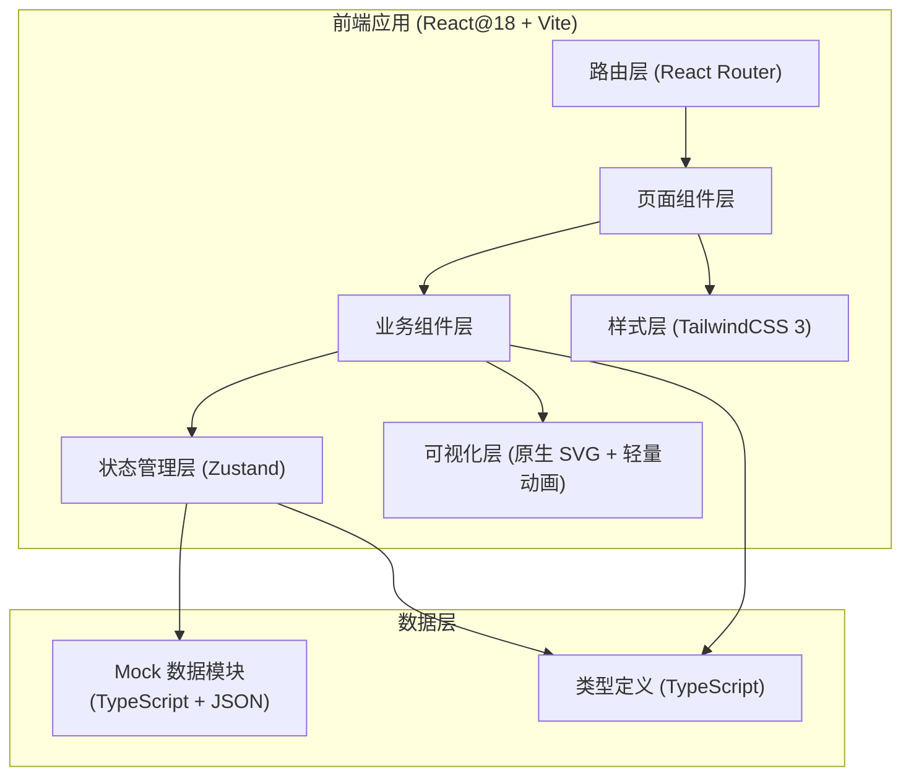
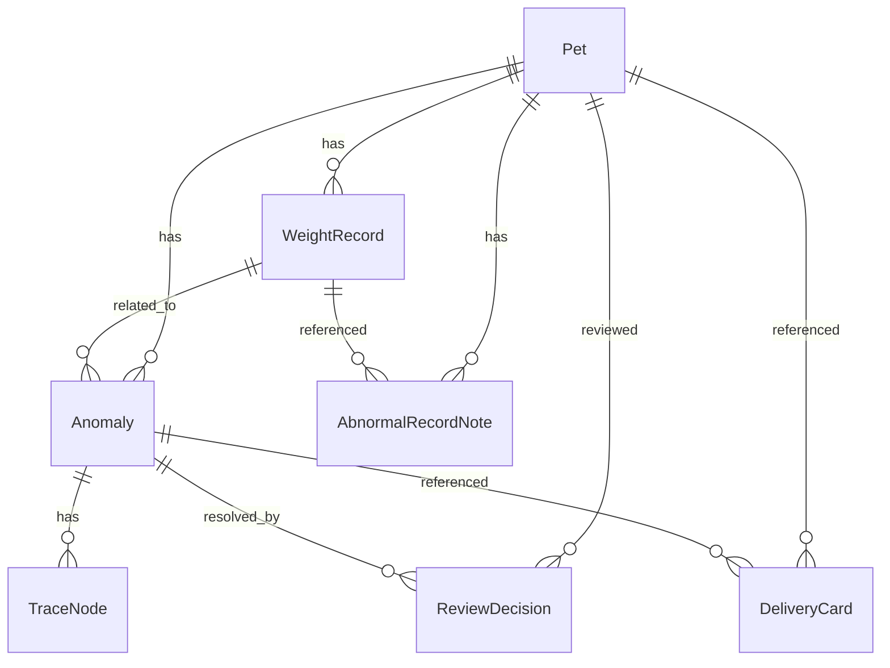

## 1. 架构设计



## 2. 技术选型说明

- **前端框架**: React@18 + TypeScript@5 —— 组件化开发，类型安全，利于接手维护
- **初始化工具**: Vite@5 —— 启动快，构建轻，适合纯前端轻量应用
- **路由**: react-router-dom@6 —— 汇总页/分析页/交付页三路由切换
- **状态管理**: zustand@4 —— 轻量无boilerplate，管理筛选状态、当前宠物、交付模式开关
- **样式**: tailwindcss@3 + postcss + autoprefixer —— 快速实现卡片、标签、表格样式，响应式不费力
- **图表**: 原生 SVG + 自绘折线组件 —— 体重曲线多版本叠加、交互点气泡，不引入重型图表库
- **动画**: 原生 CSS transitions + keyframes —— 曲线绘制动画、卡片入场、徽章脉冲，无额外依赖
- **字体**: 霞鹜文楷 LXGW WenKai（Google Fonts CDN）+ 思源黑体 Noto Sans SC + JetBrains Mono（数字等宽）
- **后端/数据库**: 无后端，全部Mock数据写在 TypeScript 模块里 —— 用户明确是救助站内部使用，数据量小，纯前端即可

## 3. 路由定义

| 路由路径 | 页面名称 | 核心功能 |
|----------|----------|----------|
| `/` 或 `/dashboard` | 追踪汇总页 | 总览条、筛选面板、宠物卡片网格、异常徽章、悬浮层 |
| `/pet/:id` | 异常明细分析页 | 信息栏、体重曲线对比、记录时间轴、追溯链、非正常记录卡、人工改判 |
| `/delivery` | 交付说明页 | 交付总表、截图说明卡网格、人工改判说明、交接视图切换 |
| `*` | 404 兜底页 | 温馨提示 + 返回汇总按钮 |

## 4. 类型定义（模拟 API Schema）

```typescript
// === 核心实体 ===

type RecordSource = 
  | 'official'      // 正规称重
  | 'old_version'   // 旧版体重曲线
  | 'name_change'   // 改名/换称呼补充
  | 'verbal'        // 口头备注
  | 'missing_vaccine' // 疫苗日期缺失

type Status = 'pending' | 'reviewing' | 'processed' | 'completed'
type AnomalyType = 'rename' | 'old_curve' | 'verbal_mismatch' | 'missing_vaccine' | 'data_conflict'
type ImpactLevel = 'low' | 'medium' | 'high' | 'critical'

// 宠物主档
interface Pet {
  id: string
  name: string
  aliases: string[]            // 历史曾用名
  species: 'cat' | 'dog' | 'other'
  avatarEmoji: string          // 爪印/猫/狗 emoji
  startWeight: number          // kg, 入站体重
  currentWeight: number        // kg, 当前体重
  targetWeight?: number
  status: Status
  anomalyCount: number
  highAnomalyCount: number     // 高/严重异常数
  lastUpdatedAt: string
  reviewer?: string
  confidenceScore: number      // 结论置信度 0-100
}

// 单次称重记录
interface WeightRecord {
  id: string
  petId: string
  date: string
  weight: number
  source: RecordSource
  versionLabel?: string        // "旧版2024-03"/"修订版" 等
  isIncluded: boolean          // 是否纳入计算
  note?: string
  credibility: 1 | 2 | 3 | 4 | 5  // 可信度星级
  capturedByName?: string      // 以什么名字被记录（可能是旧名/别名）
}

// 异常条目
interface Anomaly {
  id: string
  petId: string
  type: AnomalyType
  title: string
  description: string
  detectedAt: string
  level: ImpactLevel
  relatedRecordIds: string[]
  affectedConclusion: string   // 文字描述影响了什么结论
  status: 'open' | 'resolved'
  resolvedBy?: string
  resolvedAt?: string
  resolution?: string          // 人工判读/处理说明
}

// 追溯链节点
interface TraceNode {
  id: string
  anomalyId: string
  step: number                 // 1,2,3...
  type: 'original' | 'conflict' | 'analysis' | 'human_decision' | 'final'
  title: string
  detail: string
  beforeValue?: string
  afterValue?: string
  delta?: string               // 比如 "+0.6kg" / "减重率从12%变为8%"
}

// 人工改判记录
interface ReviewDecision {
  id: string
  anomalyId: string
  petId: string
  reviewer: string
  reviewedAt: string
  reason: string
  beforeWeight: number
  afterWeight: number
  beforeRate: string
  afterRate: string
  signatureEmoji: string
}

// 非正常记录说明（疫苗缺失等）
interface AbnormalRecordNote {
  id: string
  petId: string
  recordId: string
  title: string
  reasonWhySkipped: string     // 为什么没按正常走
  handling: string             // 处理方式
  impactLevel: ImpactLevel
  impactDescription: string
  impactPercent: number        // 0-100 影响程度条
}

// 交付截图说明卡
interface DeliveryCard {
  id: string
  petId: string
  anomalyId: string
  summaryText: string          // 左侧异常摘要
  curveHighlight: {            // 右侧曲线截图高亮信息
    date: string
    weightDiff: string
    arrowNote: string
  }
  impactStatement: string      // 底部"此异常导致..."
}
```

## 5. 数据模型 ER 图



## 6. 项目目录结构

```
/
├── index.html
├── package.json
├── vite.config.ts
├── tsconfig.json
├── tailwind.config.js
├── postcss.config.js
├── src/
│   ├── main.tsx               # 入口
│   ├── App.tsx                # 路由出口
│   ├── index.css              # Tailwind 入口 + 全局样式 + 字体
│   ├── router/
│   │   └── index.tsx          # 路由配置
│   ├── types/
│   │   └── index.ts           # 所有类型定义
│   ├── data/
│   │   ├── mockPets.ts        # 宠物 Mock 数据（含别名、体重序列）
│   │   ├── mockAnomalies.ts   # 异常 Mock（含改名、旧曲线、疫苗缺失）
│   │   ├── mockTraces.ts      # 追溯链 Mock
│   │   └── mockReviews.ts     # 人工改判 Mock
│   ├── store/
│   │   └── useAppStore.ts     # Zustand store：筛选、当前宠物、交接模式
│   ├── components/
│   │   ├── common/            # 通用：Badge、Tag、Button、SearchBar、EmptyState
│   │   ├── dashboard/         # 汇总页组件：OverviewBar、FilterPanel、PetCard、PetGrid
│   │   ├── analysis/          # 分析页组件：PetHeader、WeightChart、RecordTimeline、TraceChain、AbnormalNoteCard、ReviewTable
│   │   └── delivery/          # 交付页组件：DeliveryTable、DeliveryCardGrid、ReviewCard、DeliveryToggle
│   └── pages/
│       ├── DashboardPage.tsx
│       ├── AnalysisPage.tsx
│       ├── DeliveryPage.tsx
│       └── NotFoundPage.tsx
```

## 7. 构建产物与部署说明

- 构建命令：`npm run build` → 产物输出至 `dist/`
- 预览命令：`npm run preview`
- 因为纯前端无后端，可直接部署到任何静态托管（Vercel / Netlify / nginx），也可直接 `dist/index.html` 双击本地打开
- 数据安全：救助站内部使用，Mock数据全部本地，无需联网
