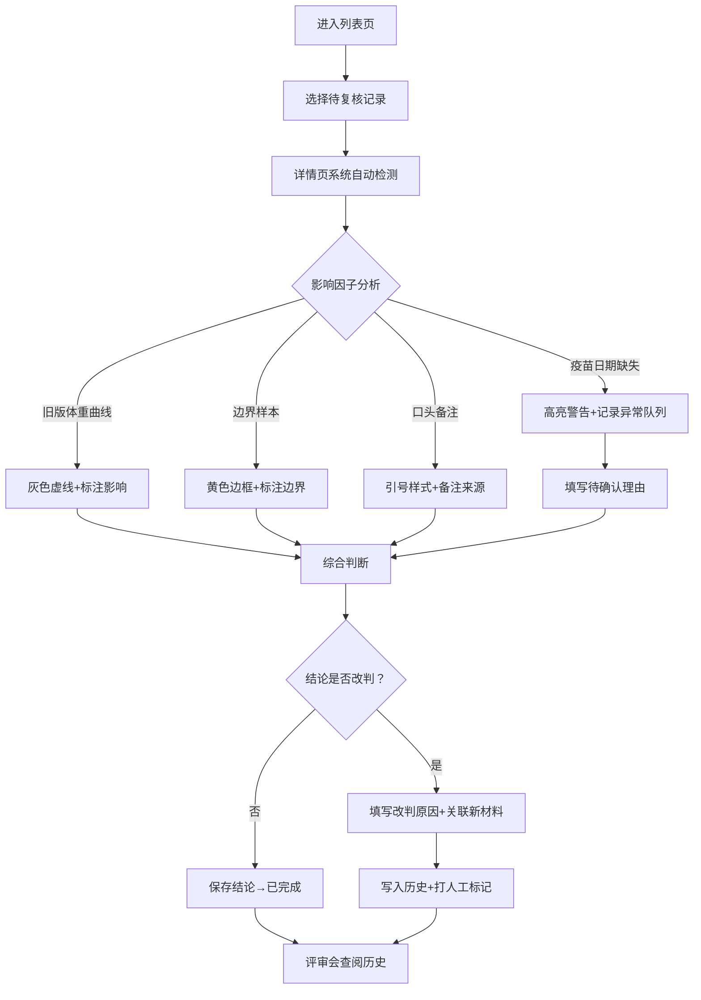

## 1. 产品概述
异宠温控记录复核系统，面向兽医助理和评审团队，解决温控记录人工复核效率低、用药提醒易遗漏、结论追溯困难的问题。核心价值是通过结构化数据和可追溯历史，降低人工复核疏漏，为评审会提供清晰的决策依据。

## 2. 核心功能

### 2.1 用户角色
| 角色 | 说明 | 核心权限 |
|------|------|----------|
| 兽医助理（阿宁等） | 日常复核操作员 | 查看列表、详情、录入备注、发起改判、补录信息 |
| 接手同事 / 评审员 | 会议前查阅者 | 查看完整历史、异常队列、改判对比、人工修改痕迹 |

### 2.2 功能模块
1. **记录列表页**：待复核 / 已复核 / 异常队列筛选、快速搜索、状态标签
2. **记录详情页**：温控曲线、体重曲线（区分旧版）、疫苗日期校验、影响因子标注、结论展示
3. **改判操作**：修改结论、录入改判原因、关联新备注 / 补录材料
4. **历史追溯页**：时间线展示每次变更、旧材料 vs 新材料对比、人工修改标记
5. **异常队列**：疫苗缺失待确认、边界样本、旧版体重曲线混入等高优先级记录

### 2.3 页面详情
| 页面名称 | 模块名称 | 功能描述 |
|-----------|-------------|---------------------|
| 记录列表页 | 顶部筛选区 | 状态筛选（全部/待复核/已复核/异常）、日期范围、宠物类型、关键字搜索 |
| 记录列表页 | 列表卡片 | 编号、宠物名/主人、状态徽章（红=异常/黄=待确认/绿=正常）、结论摘要、更新时间、操作按钮 |
| 记录列表页 | 异常队列入口 | 侧边栏常驻异常统计卡片，点击直接筛选异常记录 |
| 记录详情页 | 基础信息栏 | 宠物档案、就诊日期、复核员、结论状态 |
| 记录详情页 | 温控数据区 | 温度曲线、阈值线、异常点高亮 |
| 记录详情页 | 体重曲线区 | 新旧版本标识（旧版=灰色虚线+水印）、数据点标注 |
| 记录详情页 | 影响因子面板 | 逐条列出影响结论的因子（旧版曲线？边界样本？口头备注？疫苗缺失？），每条标注影响方向 |
| 记录详情页 | 疫苗缺失提示 | 醒目的警告块：待确认理由 + 受影响记录列表 + 跳转补录按钮 |
| 记录详情页 | 操作栏 | 改判按钮、补录按钮、查看历史按钮 |
| 改判弹窗 | 结论选择 | 正常 / 需观察 / 异常 |
| 改判弹窗 | 改判原因 | 必填文本框 |
| 改判弹窗 | 关联材料 | 勾选本次补录的备注 / 数据 |
| 历史追溯页 | 时间线 | 每次复核 / 改判 / 补录 节点，人工操作高亮橙色标签 |
| 历史追溯页 | 版本对比 | 旧材料 vs 新材料 并排展示、结论变化箭头 |
| 异常队列页 | 分类 Tab | 疫苗缺失 / 边界样本 / 旧版曲线混入 / 待确认 |
| 异常队列页 | 处理建议 | 每条异常附带处理建议和快捷操作 |

## 3. 核心流程
兽医助理从列表挑选待复核记录 → 进入详情，系统自动检测并标注影响因子（旧版体重曲线 / 边界样本 / 口头备注 / 疫苗缺失）→ 若疫苗缺失，阻止直接标记正常，强制记录待确认理由并写入异常队列 → 正常出具结论或发起改判 → 改判时必须填写原因 + 关联新材料 → 变更写入历史，人工操作打标 → 评审会前，接手同事打开历史追溯页，可清晰看到橙色标记的人工修改节点和结论演变。

## 4. 用户界面设计

### 4.1 设计风格
- **主色**：深森林绿 #1F4D3B（专业、医疗感）
- **辅色**：暖琥珀 #D97706（异常/人工操作高亮）、朱砂红 #B91C1C（疫苗缺失警告）、浅石灰 #F0F4F2（背景）
- **按钮风格**：圆角 10px，主按钮深绿带轻微阴影，hover 上浮效果
- **字体**：标题 Lora（衬线、稳重），正文 Noto Sans SC（清晰易读）
- **布局风格**：卡片式 + 左右分栏，左侧导航 + 中间内容 + 右侧异常边栏
- **图标**：Lucide 线性图标，异常用三角感叹号，人工用铅笔+手形标识

### 4.2 页面设计概述
| 页面名称 | 模块名称 | UI 元素 |
|-----------|-------------|-------------|
| 记录列表页 | 顶部筛选区 | 胶囊状筛选 Tab、下拉日期选择器、圆角搜索框 |
| 记录列表页 | 列表卡片 | 左侧状态色条（红/黄/绿）、卡片阴影 hover 加深、右下操作按钮组 |
| 记录详情页 | 体重曲线区 | 旧版曲线灰色虚线 + "旧版"斜体水印角标；新版实线深绿 |
| 记录详情页 | 疫苗缺失块 | 红边红底浅背景 + 三角感叹号图标 + 独立待确认表单区 |
| 历史追溯页 | 时间线节点 | 人工修改节点外框琥珀色 + "人工"徽章 + 鼠标悬停弹出操作人/时间 |
| 异常队列页 | 分类卡片 | 每张卡片左上图标 + 中间统计数 + 下方处理建议文字 |

### 4.3 响应式
桌面优先，1440px 基准设计；窄屏（<1024px）右侧异常边栏折叠为底部抽屉；移动端（<768px）列表卡片单列堆叠，图表简化为关键数据展示。
