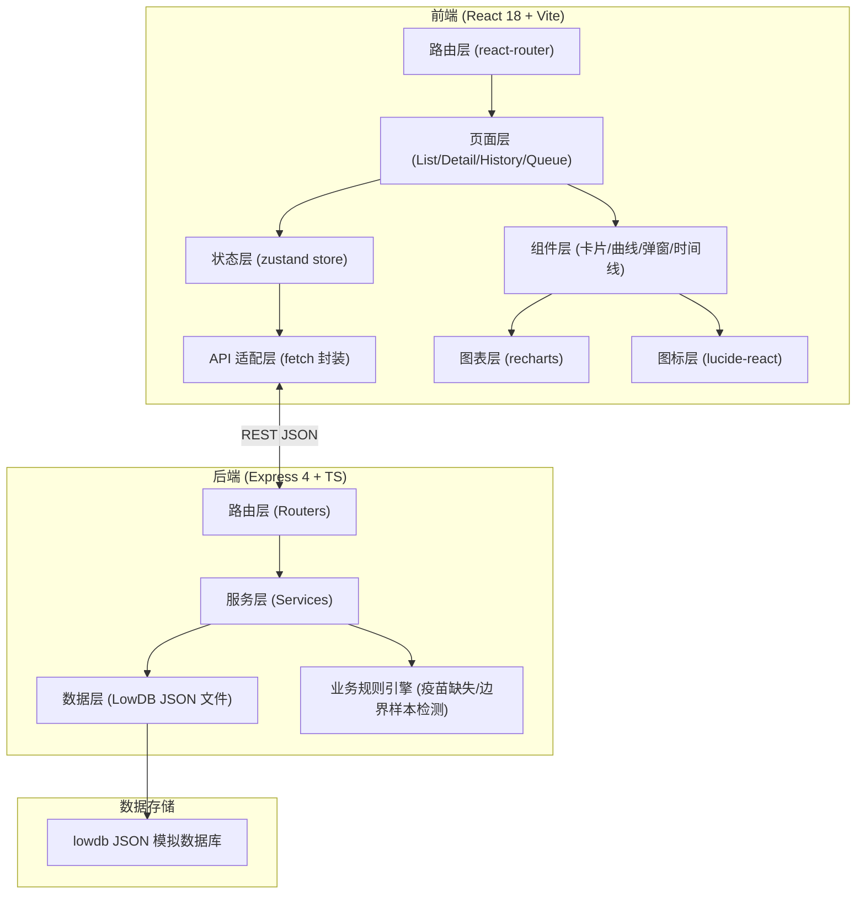
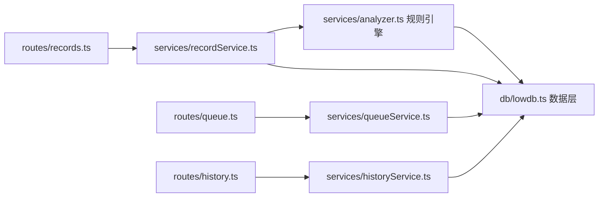
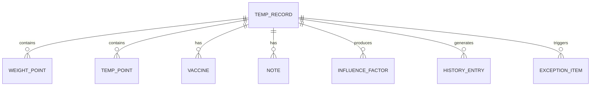

## 1. 架构设计


## 2. 技术描述
- **前端**：React@18 + TypeScript + react-router-dom@6 + zustand@4 + tailwindcss@3 + recharts@2 + lucide-react + vite@5
- **后端**：Express@4 + TypeScript + cors + lowdb@7（JSON 文件嵌入式数据库，无需安装额外服务）
- **初始化工具**：vite-init 使用 react-express-ts 模板
- **数据库**：lowdb JSON 文件，存储于 `api/db/data.json`，项目初始化即包含示例数据

## 3. 路由定义
| 前端路由 | 页面 | 说明 |
|----------|------|------|
| `/` | RecordListPage | 温控记录列表（含筛选、搜索） |
| `/records/:id` | RecordDetailPage | 记录详情（温控/体重曲线、影响因子、疫苗缺失提示） |
| `/records/:id/history` | HistoryPage | 历史追溯页（时间线 + 版本对比） |
| `/queue` | ExceptionQueuePage | 异常队列页（分类 Tab + 处理建议） |

| 后端 API 路由 | 方法 | 说明 |
|--------------|------|------|
| `/api/records` | GET | 获取记录列表（支持 status / keyword / startDate / endDate 查询） |
| `/api/records/:id` | GET | 获取单条详情（含曲线数据、影响因子、历史快照） |
| `/api/records/:id/conclusion` | PUT | 改判结论（body: conclusion, reason, supplements, operator） |
| `/api/records/:id/supplement` | POST | 补录信息（body: type, content, operator） |
| `/api/records/:id/history` | GET | 获取完整历史变更记录 |
| `/api/queue` | GET | 获取异常队列（按 type 分类：vaccine / boundary / legacyCurve / pending） |
| `/api/queue/:id/ack` | POST | 确认异常处理（body: note, operator） |
| `/api/records/analyze` | POST | 分析影响因子（body: 原数据，返回检测到的因子列表） |

## 4. API 类型定义
```typescript
// === 共享类型 shared/types.ts ===

export type RecordStatus = 'pending' | 'confirmed' | 'exception';
export type Conclusion = 'normal' | 'observe' | 'abnormal';
export type ExceptionType = 'vaccine_missing' | 'boundary_sample' | 'legacy_curve' | 'pending_reason';
export type HistoryAction = 'create' | 'review' | 'rejudge' | 'supplement' | 'ack_exception';

export interface TempPoint { t: string; value: number; }
export interface WeightPoint { t: string; value: number; version: 'new' | 'legacy'; }
export interface VaccineRecord { date: string | null; name: string; }
export interface Note { id: string; content: string; source: 'verbal' | 'written'; operator: string; time: string; }

export interface InfluenceFactor {
  id: string;
  type: 'legacy_curve' | 'boundary_sample' | 'verbal_note' | 'vaccine_missing';
  label: string;
  impact: 'positive' | 'negative' | 'neutral';
  description: string;
  affectedRecords: string[];
}

export interface TempRecord {
  id: string;
  code: string;
  petName: string;
  ownerName: string;
  petType: string;
  visitDate: string;
  reviewer: string;
  status: RecordStatus;
  conclusion: Conclusion;
  tempCurve: TempPoint[];
  tempThreshold: { min: number; max: number };
  weightCurve: WeightPoint[];
  vaccines: VaccineRecord[];
  notes: Note[];
  factors: InfluenceFactor[];
  pendingReason?: string;
  hasLegacyCurve: boolean;
  isBoundarySample: boolean;
  updatedAt: string;
  createdAt: string;
}

export interface HistoryEntry {
  id: string;
  recordId: string;
  action: HistoryAction;
  isManual: boolean;
  operator: string;
  time: string;
  summary: string;
  reason?: string;
  oldSnapshot: Partial<TempRecord>;
  newSnapshot: Partial<TempRecord>;
}

export interface ExceptionItem {
  id: string;
  recordId: string;
  type: ExceptionType;
  title: string;
  reason: string;
  affectedRecords: string[];
  status: 'open' | 'acknowledged' | 'resolved';
  createdAt: string;
  acknowledgedBy?: string;
  acknowledgedAt?: string;
  suggestion: string;
}

// === 请求/响应 ===
export interface RejudgeRequest {
  conclusion: Conclusion;
  reason: string;
  supplementIds: string[];
  operator: string;
}
export interface SupplementRequest {
  type: 'vaccine' | 'weight' | 'note';
  content: any;
  operator: string;
}
```

## 5. 后端分层图


## 6. 数据模型

### 6.1 ER 图


### 6.2 lowdb 初始化数据结构
```json
{
  "records": [ /* TempRecord[] 预置5-7条，覆盖：正常、疫苗缺失、旧版体重曲线、边界样本、口头备注混入、已改判 */ ],
  "history": [ /* HistoryEntry[] 预置对应记录的初始历史 */ ],
  "queue":   [ /* ExceptionItem[] 预置若干异常项 */ ]
}
```
初始化数据要点：
- 至少 1 条疫苗日期缺失（vaccines[0].date = null）
- 至少 1 条混入旧版体重曲线（weightCurve 中 version = 'legacy' 的点）
- 至少 1 条边界样本（isBoundarySample = true，温度值在阈值 ±0.1℃ 内）
- 至少 1 条包含口头备注（notes[].source = 'verbal'）
- 至少 1 条已完成改判（conclusion 从 abnormal → observe，带改判原因）
- 评审会前人工修改痕迹：某条 history 中 isManual = true 的节点
