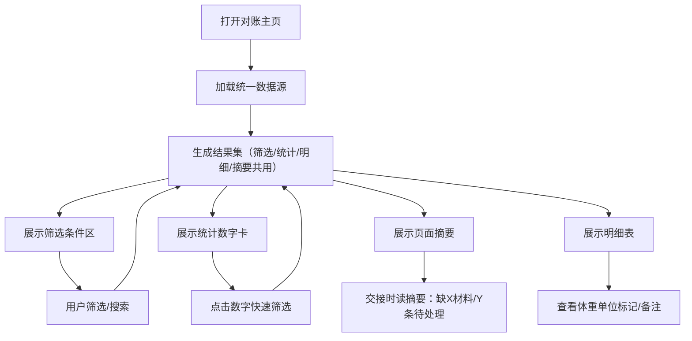

## 1. 产品概述

异宠温控排程对账系统是为救助站志愿者小乔设计的月度对账工具，解决人工兜底、回访结论丢失、异常记录混入等问题。将筛选条件、统计数字、明细表、页面摘要绑定到同一结果集，实现月底复核时已确认/待补件/退回三分明，交接时一眼看出哪些处理完、哪些缺材料。

- 目标用户：救助站志愿者小乔及接手同事
- 核心价值：结束人工兜底，用统一结果集替代多份零散Excel

## 2. 核心特性

### 2.1 用户角色
| 角色 | 身份 | 核心权限 |
|------|------|----------|
| 复核志愿者 | 小乔/月底复核人 | 全部功能、状态标记、导出 |
| 接手同事 | 交接接收人 | 查看摘要、筛选缺材料记录 |

### 2.2 功能模块
1. **对账主页**：筛选条件区、统计数字卡、页面摘要、明细表

### 2.3 页面详情
| 页面名称 | 模块名称 | 功能描述 |
|----------|----------|----------|
| 对账主页 | 筛选条件区 | 按状态筛选（全部/已确认/待补件/退回）、按日期范围筛选、按主人昵称搜索，四区域实时联动 |
| 对账主页 | 统计数字卡 | 显示总数、已确认数、待补件数、退回数，数字点击即筛选 |
| 对账主页 | 页面摘要 | 文字说明：本月已处理X条，Y条处理完毕，Z条缺材料（列出具体缺什么），W条被退回及原因 |
| 对账主页 | 明细表 | 序号、排程日期、异宠类型、主人昵称、微信备注原文、原始体重、标准化体重(g)、温控方案、状态标签、缺件提示、退回原因 |

## 3. 核心流程

救助站志愿者小乔月底打开对账系统 → 系统自动从统一数据源生成结果集 → 小乔通过筛选条件切换查看不同状态 → 统计数字和摘要实时更新 → 点击数字卡快速定位待补件/退回 → 查看摘要中"缺材料清单"并联系主人 → 确认无误后交接给同事，同事只需看摘要和明细表即可。

## 4. 用户界面设计

### 4.1 设计风格
- **主色**：暖橙色（#E87722）—— 救助站温暖感，"待补件"提醒色
- **辅色**：深绿（#2D6A4F）—— 已确认安全；红（#C1121F）—— 退回警示；浅灰（#F5F5F0）—— 背景米白
- **按钮风格**：方角微圆（4px），实心按钮配阴影，筛选chip为描边+实心切换
- **字体**：标题"ZCOOL XiaoWei"文艺手写体（救助站人情味），正文"LXGW WenKai"霞鹜文楷清晰可读
- **布局风格**：卡片式分区，顶部筛选栏+中间四格统计卡+下方摘要+底部明细表
- **图标风格**：Lucide图标，待补件用package-open，退回用rotate-ccw，已确认用check-circle-2

### 4.2 页面设计概览
| 页面名称 | 模块名称 | UI元素 |
|----------|----------|--------|
| 对账主页 | 筛选条件区 | 顶部横排，状态chip三选一+日期范围+昵称搜索框+重置按钮，筛选时结果集瞬时刷新 |
| 对账主页 | 统计数字卡 | 四张卡片横排，总数/已确认(绿)/待补件(橙)/退回(红)，数字大号加粗，hover上浮，点击即筛选 |
| 对账主页 | 页面摘要 | 米黄色背景圆角卡片，标题"本月对账摘要"，三段文字+缺件清单项目符号，交接时可直接读 |
| 对账主页 | 明细表 | 斑马纹表格，状态列用彩色标签，原始体重若单位异常（非g）显示黄色背景三角告警，微信备注过长用省略号hover显示全文 |

### 4.3 响应式
桌面端为主（1280px+），统计卡四列；平板端统计卡两列；手机端单列堆叠，表格横向滚动。

### 4.4 细节标记
- 体重单位混写：原始体重列若原始值不是g（如"2.3kg""5斤""1200"无单位），标准化体重(g)列旁显示⚠️图标+tooltip"原始单位已换算"，但不影响标准化结果
- 微信备注：若备注含"回访结论"关键词但无后续处理记录，行尾标📌图标提醒小乔接着查
- 坏材料（退回/待补件）：摘要中加粗列出，明细表中整行背景浅染对应颜色
