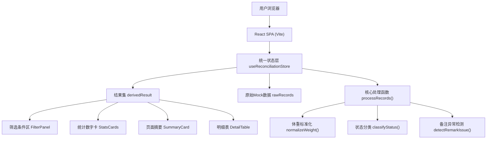
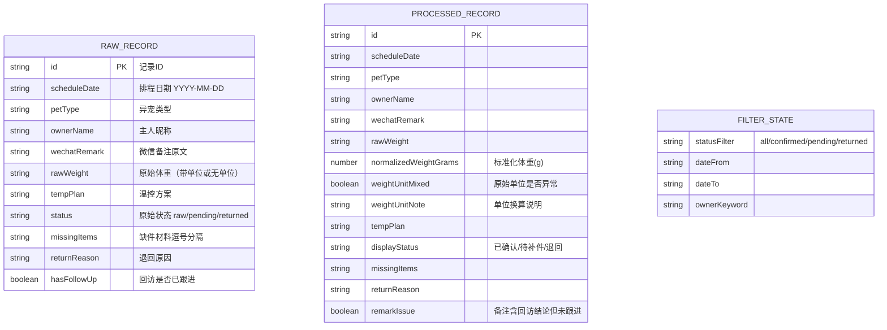

## 1. 架构设计



## 2. 技术说明
- 前端：React@18 + TypeScript + Vite@5 + TailwindCSS@3
- 状态管理：Zustand（轻量，四组件共享结果集）
- 图标：lucide-react
- 字体：Google Fonts（ZCOOL XiaoWei + LXGW WenKai）
- 后端：无，纯前端Mock数据

## 3. 路由定义
| 路由 | 用途 |
|------|------|
| / | 异宠温控排程对账主页 |

## 4. 数据模型

### 4.1 数据模型定义


### 4.2 核心处理逻辑
- `normalizeWeight(rawWeight: string): { grams: number, mixed: boolean, note: string }`
  - "2.3kg" → 2300g，mixed=true，note="kg→g"
  - "5斤" → 2500g，mixed=true，note="斤→g (×500)"
  - "1200"（无单位）→ 1200g，mixed=true，note="无单位，默认克"
  - "800g" → 800g，mixed=false
- `classifyStatus(status, missingItems, returnReason)` 生成 displayStatus
- `detectRemarkIssue(wechatRemark, hasFollowUp)` 标记备注异常
- 四组件全部消费 `derivedResult = filter + sort(processedRecords)`

## 5. 目录结构
```
src/
  types/
    reconciliation.ts       # 类型定义
  data/
    mockRecords.ts          # 样例数据（15-20条，混合各场景）
  store/
    useReconciliationStore.ts  # Zustand store：raw数据 + process函数 + 筛选状态 + 派生结果集
  components/
    FilterPanel.tsx         # 筛选条件区
    StatsCards.tsx          # 统计数字卡（4张）
    SummaryCard.tsx         # 页面摘要
    DetailTable.tsx         # 明细表
  App.tsx                   # 组装全部组件
  main.tsx
  index.css
```
