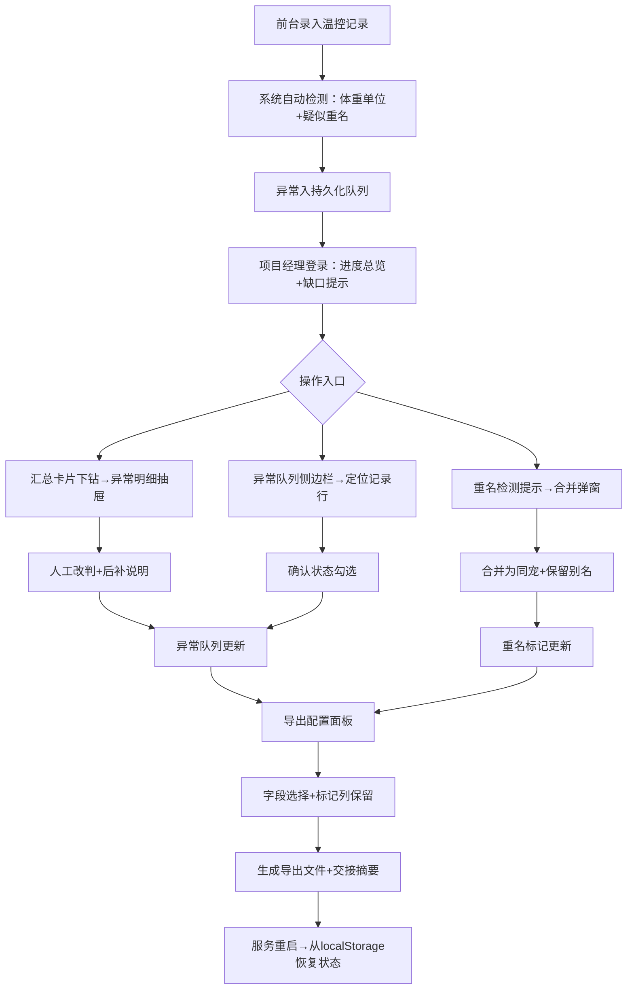

## 1. 产品概述
宠物医院异宠（爬行类、鸟类、小型哺乳动物等非常规宠物）温控记录的审核与批量导出工具，解决前台录入不一致、异常处理交接断层、导出数据不规范等痛点。
- 核心问题：同宠异名、体重单位混乱、异常状态服务重启丢失、汇总无法溯源、交接无自解释
- 目标用户：前台录入人员（小温）、审核项目经理；核心价值：缩短审核时间60%，消除重复录入返工

## 2. 核心功能

### 2.1 用户角色
| 角色 | 登录方式 | 核心权限 |
|------|----------|----------|
| 前台录入 | 工号登录 | 录入数据、上传微信备注截图、标记疑问 |
| 项目经理 | 工号登录+权限 | 宠物合并/别名、异常判责、改判说明、状态确认、批量导出、进度总览 |

### 2.2 功能模块
1. **温控记录列表页**：筛选面板、体重单位标记、重名聚合标签、异常队列侧边栏、操作指引浮动卡
2. **异常明细抽屉**：下钻溯源（汇总数据联动高亮）、人工改判区、后补说明时间线、主人微信备注原文
3. **重名合并弹窗**：同名/疑似同宠检测、合并预览、别名保留、主人信息交叉验证
4. **导出配置面板**：字段选择、单位规范化选项、标记列保留、导出记录与缺口清单
5. **进度总览头部**：处理进度条、缺口数、异常分类统计、交接摘要（自动生成）

### 2.3 页面详情
| 页面名称 | 模块名称 | 功能描述 |
|---------|---------|---------|
| 温控记录列表 | 顶部进度总览 | 实时展示已处理/总数、异常分类计数、缺口警告、交接摘要文本 |
| 温控记录列表 | 筛选面板 | 日期、宠物品类、处理状态、体重单位异常、重名标记、异常类型多条件组合筛选 |
| 温控记录列表 | 记录表格行 | 体重单位异常角标⚠️、重名聚合徽标(2)、异常类型彩色标签、确认状态复选框 |
| 温控记录列表 | 异常队列侧边栏 | 按异常类型分组、持久化存储(localStorage)、服务重启不丢失、点击跳转并高亮对应行 |
| 温控记录列表 | 操作指引浮动卡 | 三区块：「📁材料区」「🔍异常区」「📤导出区」，可收起/展开 |
| 异常明细抽屉 | 汇总联动下钻 | 点击汇总某异常类型→抽屉打开+汇总卡片脉冲高亮+表格对应行闪烁标记 |
| 异常明细抽屉 | 改判面板 | 下拉选择判责结果、必填改判原因文本框、后补说明（支持追加时间戳+操作人） |
| 异常明细抽屉 | 微信备注展示 | 原文卡片（含录入时间、录入人）、现场痕迹关键词高亮（如「昨天」「刚测」「家里」） |
| 重名合并弹窗 | 检测列表 | 自动检测疑似同宠（同主人手机+品类相似/同音名）、人工勾选确认合并 |
| 重名合并弹窗 | 合并预览 | 合并后主名、别名列表、温控记录合并数、主人信息确认 |
| 导出配置面板 | 字段配置 | 体重原始单位/规范化双列、单位异常标记列、重名别名列、改判说明列可选 |
| 导出配置面板 | 缺口清单 | 未确认数、待改判数、重名待合并数，点击直接定位到对应筛选结果 |

## 3. 核心流程
前台录入后，系统自动检测体重单位异常和疑似重名，异常入队列。项目经理登录后从进度总览看到缺口→从异常队列或汇总下钻进入明细→人工改判+后补说明→合并重名→确认状态→配置导出（标记字段保留）→导出文件+交接摘要。服务重启时从本地存储恢复异常队列和确认状态。

## 4. 用户界面设计

### 4.1 设计风格
- **主色调**：临床青 `#0EA5A8`（专业冷静）+ 警示橙 `#F59E0B`（异常强调）+ 深墨灰 `#1E293B`（正文）
- **辅助色**：体重异常 `#EF4444` 角标，重名聚合 `#8B5CF6` 徽标，已确认 `#10B981` 对勾
- **按钮风格**：方中带圆（圆角6px），主按钮有2px底部描边阴影，悬停上浮2px
- **字体**：标题用「思源宋体 CN SemiBold」（专业医疗感），正文用「JetBrains Mono」+「PingFang SC」混排（数据清晰）
- **布局风格**：三栏式（左筛选+中表格+右异常队列），顶部固定进度总览条，浮动指引卡右下锚定
- **图标风格**：Lucide 线性图标 + 彩色 emoji 混合（操作指引用 emoji，数据标签用线性图标）

### 4.2 页面设计概览
| 页面名称 | 模块名称 | UI 元素 |
|---------|---------|---------|
| 温控记录列表 | 顶部进度总览 | 渐变背景条（青→墨）、进度条内部有流光动画、缺口数字红色脉冲跳动、交接摘要用引号卡片样式 |
| 温控记录列表 | 筛选面板 | 分组折叠、每条件为标签式按钮、选中后有对应色彩边框 |
| 温控记录列表 | 记录表格 | 斑马纹+行悬停左侧色条、单元格圆角、异常标签为胶囊形、单位异常角标带⚠️旋转动画 |
| 温控记录列表 | 异常队列侧边栏 | 可拖拽改变宽度、分组标题带计数气泡、选中项左侧青条+背景浅青光晕 |
| 温控记录列表 | 操作指引浮动卡 | 半透明毛玻璃、折叠后只有图标展开、展开后三区块用竖线分割+图标引导 |
| 异常明细抽屉 | 联动下钻效果 | 抽屉滑入时对应汇总卡片有3次脉冲呼吸动画、表格行有黄色高亮渐隐 |
| 异常明细抽屉 | 改判面板 | 判责结果卡片式选择（带图标）、后补说明为时间线气泡式追加 |
| 异常明细抽屉 | 微信备注卡片 | 仿微信聊天气泡样式、关键词（现场痕迹）用黄色荧光笔高亮 |
| 重名合并弹窗 | 检测列表 | 每组疑似配Venn图示（两圆交叠示意）、差异字段红色标红 |
| 导出配置面板 | 缺口清单 | 缺口项为可点击跳转卡片、箭头指向→、悬停展开对应筛选条件预览 |

### 4.3 响应式
桌面端优先（1440px基准），三栏布局；1024px以下异常队列折叠为底部抽屉；768px以下筛选面板收起为顶部下拉，表格支持横向滚动。触摸设备行高增加到56px。

### 4.4 动画与微交互
- 进度条加载：流光从左扫到右，重复2s/次
- 异常行闪烁：被下钻定位时，行背景黄→白闪烁3次，1.5s完成
- 改判提交：确认按钮内部打勾旋转动画，成功后抽屉自动关闭+异常队列计数-1
- 合并成功：弹窗关闭后对应行徽标数字+1动画，紫色光晕扩散
