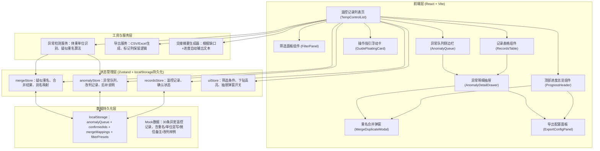
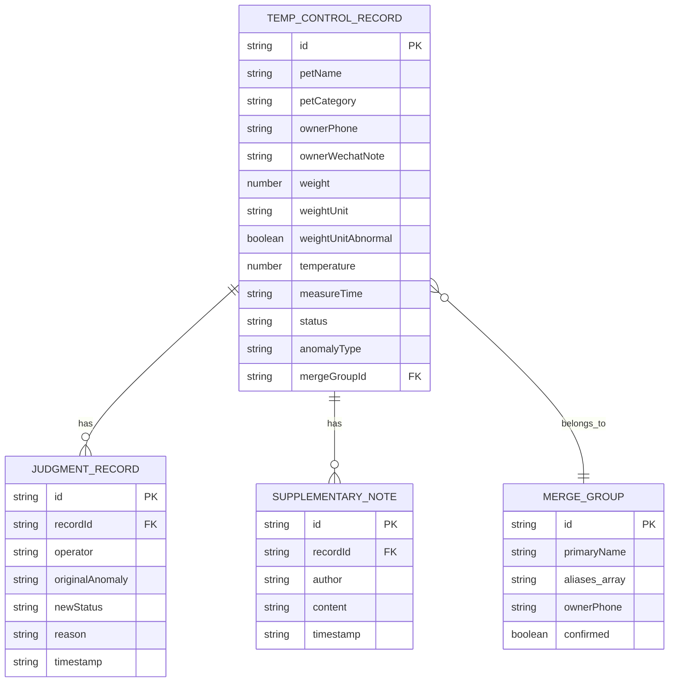

## 1. 架构设计



## 2. 技术说明
- **前端**：React@18.2 + TypeScript@5.4 + Vite@5.2
- **样式**：TailwindCSS@3.4 + CSS变量（主题系统）+ Framer Motion@11（动画）
- **状态管理**：Zustand@4.5（含persist中间件做localStorage持久化）
- **UI组件**：Lucide React@0.408（图标）+ 自研表格/抽屉/弹窗（避免组件库臃肿）
- **导出**：xlsx@0.18.5（Excel导出）+ 自定义CSV Writer
- **初始化工具**：pnpm create vite@latest --template react-ts
- **后端**：无后端，使用Mock数据 + localStorage模拟服务端持久化
- **数据库**：无真实DB，用localStorage模拟；数据文件为 src/data/mockRecords.ts（30条含各种异常场景）

## 3. 路由定义
| 路由 | 用途 |
|------|------|
| / | 温控记录列表页（主界面，单页应用无多路由） |
| /export/preview | 导出预览页（可选，弹窗模式优先） |

## 4. 类型定义（核心）

```typescript
// 温控记录核心类型
interface TempControlRecord {
  id: string;
  petName: string;
  petCategory: 'reptile' | 'bird' | 'smallMammal' | 'other';
  species: string;          // 具体品种，如"豹纹守宫""玄凤鹦鹉"
  ownerName: string;
  ownerPhone: string;
  ownerWechatNote: string;  // 主人微信备注原文（含现场痕迹）
  weight: number;
  weightUnit: 'kg' | 'g' | '斤' | 'lb';  // 原始单位，混写场景
  weightNormalizedKg: number;             // 规范化为kg
  weightUnitAbnormal: boolean;            // 是否单位异常（非标准kg）
  temperature: number;      // 体温/环境温度
  measureTime: string;
  status: 'pending' | 'confirmed' | 'anomaly';
  anomalyType?: AnomalyType[];
  confirmedBy?: string;
  confirmedAt?: string;
  mergeGroupId?: string;    // 重名合并组ID
  aliases?: string[];       // 合并后保留的别名
  judgments?: JudgmentRecord[];  // 改判记录
  supplementaryNotes?: SupplementaryNote[];  // 后补说明
}

type AnomalyType = 
  | 'weight_unit_mixed'     // 体重单位混写
  | 'duplicate_pet'         // 疑似同宠异名
  | 'temp_out_of_range'     // 温度异常
  | 'missing_data'          // 字段缺失
  | 'wechat_note_flag';     // 微信备注含特殊标记

interface JudgmentRecord {
  id: string;
  operator: string;
  originalAnomaly: AnomalyType;
  newStatus: 'confirmed' | 'anomaly' | 'pending';
  reason: string;
  timestamp: string;
}

interface SupplementaryNote {
  id: string;
  author: string;
  content: string;
  timestamp: string;
}

interface MergeGroup {
  id: string;
  primaryName: string;
  aliases: string[];
  mergedRecordIds: string[];
  ownerPhone: string;
  confirmed: boolean;
}

// 持久化存储结构（localStorage key: yichong_temp_persist_v1）
interface PersistedState {
  confirmedIds: string[];
  anomalyQueue: { recordId: string; anomalyTypes: AnomalyType[]; resolved: boolean }[];
  mergeGroups: MergeGroup[];
  judgmentsMap: Record<string, JudgmentRecord[]>;
  supplementaryMap: Record<string, SupplementaryNote[]>;
  lastSavedAt: string;
  lastOperator: string;
}
```

## 5. 数据模型（Mock）

### 5.1 ER关系



### 5.2 Mock数据设计（30条样例）
- **正常记录**：15条，kg单位，无异常，状态confirmed
- **体重单位混写**：5条（2条"斤"、2条"g"、1条"lb"），带weightUnitAbnormal=true
- **疑似同宠异名**：4条组成2组（组1："小绿"/"绿哥"同主人138xxxx1234豹纹守宫；组2："团子"/"汤圆"同主人139xxxx5678金丝熊）
- **温度异常**：3条（2条偏高+1条偏低），temp_out_of_range标记
- **含人工改判样例**：2条带judgments，展示改判后状态
- **含后补说明样例**：2条带supplementaryNotes，展示时间线气泡
- **含现场痕迹微信备注样例**：6条ownerWechatNote包含关键词"昨天家里测的""刚到医院""路上2小时""笼子里量的""昨天还正常""今天有点蔫"

## 6. 核心算法与逻辑

### 6.1 体重单位异常检测
```
输入：weightUnit字段
规则：weightUnit !== 'kg' → 标记weightUnitAbnormal=true
规范化：斤→÷2，g→÷1000，lb→×0.453592 → 存入weightNormalizedKg
筛选：筛选面板提供"仅看单位异常"开关，导出时双列保留（原始值+单位列 + 规范化值列 + 异常标记列）
```

### 6.2 疑似重名检测算法
```
相似度规则（满足任意2条即入队）：
  1. ownerPhone完全相同
  2. petCategory相同 + species相同
  3. petName拼音编辑距离≤2（同音/错别字）
输出：mergeCandidates数组，每组包含candidateIds、matchReasons、confidenceScore
```

### 6.3 异常队列持久化策略
```
写入时机：每次状态变更/改判/合并后0.3s防抖写入localStorage
读取时机：应用初始化时从yichong_temp_persist_v1读取，与mock数据合并
版本迁移：persistVersion字段，结构变更时自动迁移旧数据
交接场景：lastSavedAt + lastOperator自动写入，交接摘要基于此生成
```

### 6.4 汇总下钻联动
```
交互链：点击顶部汇总卡片X（如"单位异常 5"）→
  uiStore.setDrillDown({ type: 'weight_unit_mixed', recordIds }) →
  1) 对应汇总卡片3次脉冲动画（Framer Motion）
  2) 表格自动滚动到首条匹配行
  3) 匹配行背景黄→白闪烁3次（CSS keyframes）
  4) 异常明细抽屉自动打开首条
```

### 6.5 交接摘要生成器
```
模板：
"截至{time}，共{total}条记录，已确认{confirmed}条（{rate}%），待处理缺口{gap}条：
 • 体重单位异常待确认：{w}条
 • 疑似重名待合并：{d}组
 • 温度异常待改判：{t}条
 • 后补说明未填：{s}条
上次操作：{operator} 于 {lastTime} 执行{lastAction}。"
```
