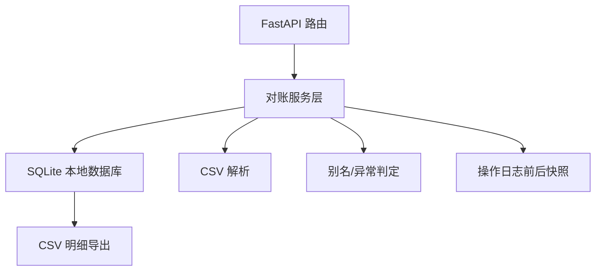

# 宠物训练课排程对账技术架构

## 架构

本项目交付主体是 Python FastAPI + SQLite 后端服务。所有导入、确认、撤回、异常隔离、日志和 CSV 导出都落在同一份 SQLite 数据库中，保证接班人看到的汇总、异常、处理记录和导出明细来自同一口径。

## 模块

| 文件 | 职责 |
| --- | --- |
| `pet_training_reconcile/api.py` | FastAPI 路由、请求模型、CSV 响应 |
| `pet_training_reconcile/database.py` | SQLite 连接与 schema 初始化 |
| `pet_training_reconcile/service.py` | 导入、确认、撤回、别名绑定、异常影响范围、日志、导出 |
| `samples/training_schedules.csv` | 可直接导入的样例 CSV |
| `tests/test_reconcile_service.py` | 端到端服务层和 API 冒烟验证 |

## 数据表

- `sources`：记录 CSV/手写单来源、导入人、原始 payload。
- `pets` / `aliases`：规范宠物与别名映射。
- `schedules`：训练课排程，状态包括 `pending`、`confirmed`、`withdrawn`、`anomaly`。
- `medical_records`：病历手写单，记录是否已接上排程。
- `operation_logs`：确认、撤回、别名绑定的前后状态快照。

## 关键约束

- 未绑定别名进入 `anomaly`，不计入正常汇总。
- 异常记录必须先 `/aliases/bind`，不能直接确认。
- `confirm` 和 `withdraw` 均写入 `operation_logs`，保留人工处理前后差异。
- `/exports/schedules.csv` 从 SQLite 查询生成，不另起一份口径。
