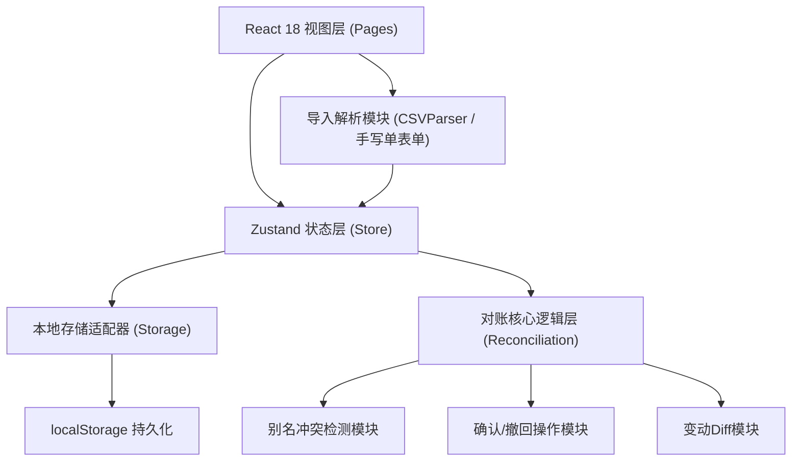
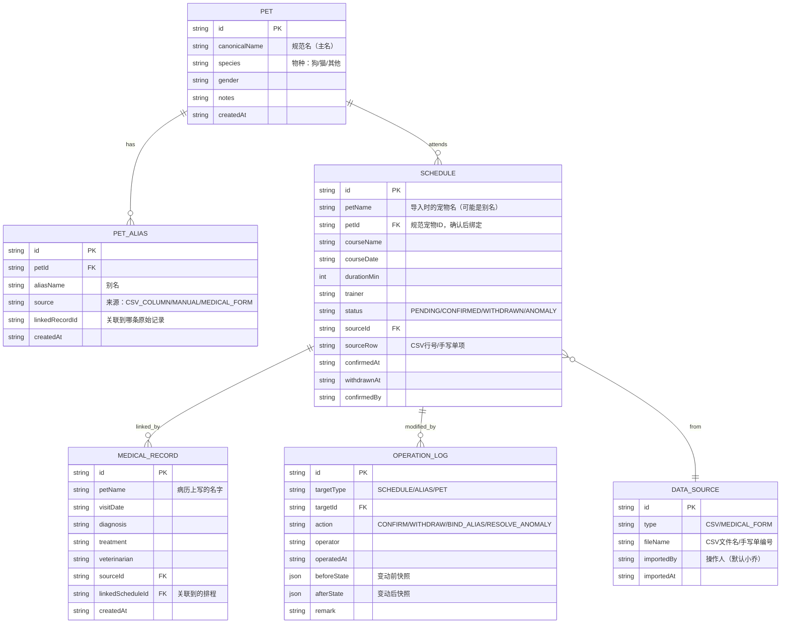

## 1. 架构设计

纯前端单页应用，所有数据持久化到浏览器 localStorage，不依赖后端服务。状态管理用 zustand，UI组件库用自定义 Tailwind + lucide-react 图标。

## 2. 技术说明

- 前端：React@18 + TypeScript + Vite@5
- 样式：tailwindcss@3 + PostCSS
- 状态：zustand@4
- 路由：react-router-dom@6
- 图标：lucide-react
- 数据存储：localStorage（封装适配器，未来可替换为 IndexedDB）
- CSV解析：纯手写解析器（无外部依赖，处理简单CSV格式）
- 初始化：react-ts 模板（纯前端，无后端）

## 3. 路由定义

| Route | 页面 | 用途 |
|-------|------|------|
| `/` | Dashboard 对账总览 | 汇总卡片 + 快捷操作 + 使用说明 |
| `/import` | ImportCenter 导入中心 | CSV上传 + 手写单录入 |
| `/schedules` | ScheduleList 排程明细 | 列表、确认/撤回、别名关联 |
| `/anomalies` | AnomalyTracker 异常追踪 | 别名冲突列表 + 来源/影响钻取 |
| `/logs` | OperationLog 操作日志 | 时间线 + 确认前后Diff对比 |

## 4. 数据模型

### 4.1 数据模型定义

### 4.2 初始演示数据（localStorage seed）

预置以下数据以便小乔和接班人直接看到效果：

1. **PET 规范宠物2只**：
   - P001 "小黄"（中华田园犬，公）
   - P002 "阿黑"（拉布拉多，母）

2. **PET_ALIAS 展示别名冲突**：
   - P001 ← "小黄"（正常）
   - P001 ← "黄黄"（手写病历上的别名，手动样例）
   - P002 ← "阿黑"（正常）
   - 冲突示例：CSV里有一条"阿黑"，手写单里又写了一个"黑妞"，系统检测"黑妞"未绑定，标记异常

3. **SCHEDULE 正常记录3条 + 异常1条**：
   - 小黄 - 基础服从课 2026-06-01 60min（已确认，样例）
   - 阿黑 - 社交课 2026-06-02 45min（待确认）
   - 黄黄 - 基础服从课 2026-06-03 60min（手写单来源，正常，待关联小黄）
   - 黑妞 - 召回课 2026-06-04 30min（来源CSV，别名冲突，异常区）

4. **MEDICAL_RECORD 手写单2条**：
   - 黄黄 2026-06-03 皮肤检查（正常样例，已关联到排程）
   - 黑妞 2026-06-04 疫苗接种（异常样例，别名冲突）

5. **OPERATION_LOG 至少1条确认记录**：
   - 小黄 6/1 基础服从课的确认前后Diff

## 5. 核心模块职责

| 模块文件 | 职责 |
|----------|------|
| `src/store/useReconcileStore.ts` | 统一状态管理 + localStorage 持久化 |
| `src/utils/csvParser.ts` | 训练课CSV解析，字段映射 |
| `src/utils/reconciliation.ts` | 别名检测、确认/撤回状态流转、异常判定 |
| `src/utils/diff.ts` | 操作前后 JSON 深比较，生成可读 Diff |
| `src/utils/seedData.ts` | 首次启动注入演示数据 |
| `src/pages/*.tsx` | 5个路由页面 |
| `src/components/*.tsx` | 统计卡、异常卡、DiffViewer、时间线、步骤说明等复用组件 |
