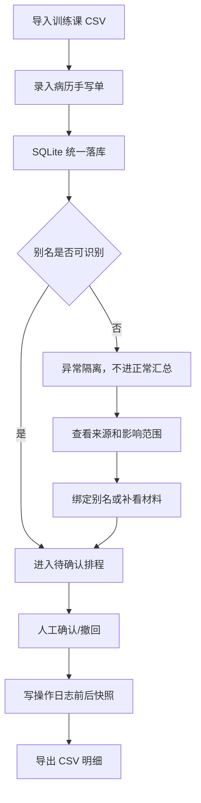

# 宠物训练课排程对账 PRD

## 目标

救助站志愿者小乔需要一个本地后端服务，把训练课 CSV、病历手写单、宠物别名、人工确认/撤回和 CSV 明细接到同一份数据中。接班同事要能从汇总一路追到异常来源，社区公示前也能看到人工确认前后到底改了什么。

## 核心需求

1. 支持训练课 CSV 导入，字段包括宠物名、课程、日期、时长、训练师。
2. 支持少量病历手写单录入，并尝试按宠物别名和日期接到排程。
3. 宠物别名重复或未绑定时，不进入正常汇总，必须进入异常区。
4. 异常信息要同时给出补看来源和影响范围。
5. 支持人工确认排程，并写入确认前后快照。
6. 支持撤回排程，并保留撤回前后状态。
7. 支持 CSV 明细导出，让处理记录和导出结果能对上。
8. 说明材料按接班人顺序写清楚：先导入、再看异常、再确认/撤回、最后导出。

## 用户流程

## 验收点

- 工作区存在可运行的 FastAPI 服务和 SQLite schema。
- `POST /imports/schedules`、`POST /medical-records`、`POST /schedules/{id}/confirm`、`POST /schedules/{id}/withdraw`、`GET /exports/schedules.csv` 覆盖核心链路。
- 未绑定别名样例 `黑妞` 会进入异常，不计入正常汇总。
- `/logs` 能返回人工处理前后的 JSON 快照。
- `pytest -q` 通过导入、异常隔离、确认、撤回、别名绑定、CSV 导出和 API 冒烟测试。
