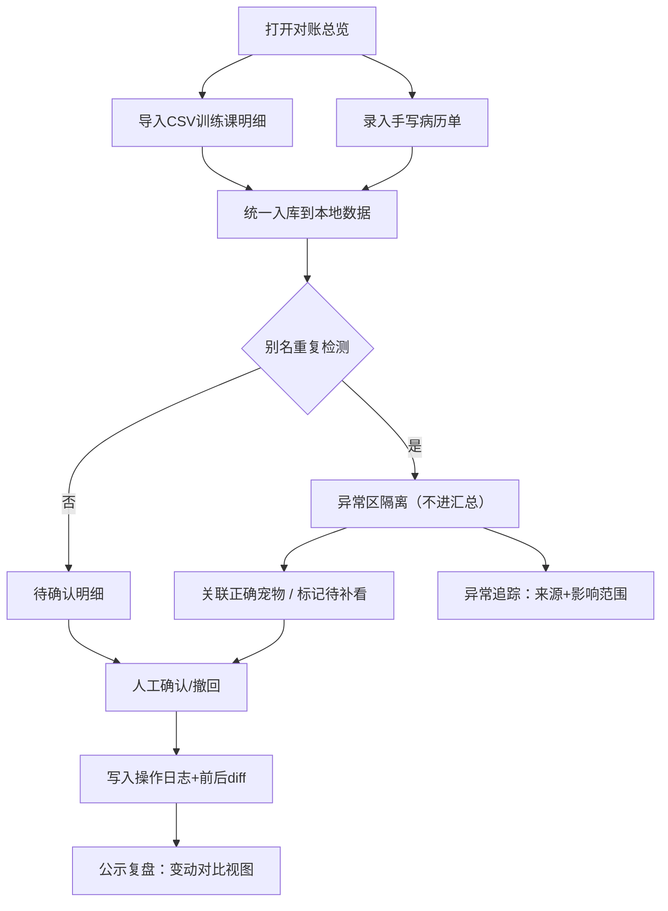

## 1. 产品概述

宠物救助站内部对账工具，解决志愿者小乔"宠物训练课排程对账"全靠人工记忆的痛点。核心价值：把病历手写单、训练课CSV明细、同一只宠物的多个别名之间的关系结构化留存，让接手同事能从汇总一路追到异常原始记录，公示复盘时能看到人工确认前后的完整变动。

- 目标用户：救助站志愿者（小乔及其接班人）
- 核心问题：手写病历与排程对账断链、宠物别名混淆导致汇总失真、确认变动无痕迹

## 2. 核心功能

### 2.1 用户角色
| 角色 | 注册方式 | 核心权限 |
|------|----------|----------|
| 志愿者（单角色） | 本地直接使用 | 导入、确认、撤回、查看明细与日志 |

### 2.2 功能模块
1. **对账总览页**：汇总卡片、异常提示、操作入口
2. **导入中心**：CSV训练课明细导入、病历手写单少量录入（带一条正常样例）
3. **排程明细页**：确认/撤回、别名关联、钻取到原始来源
4. **异常追踪页**：别名重复隔离展示、来源+影响范围联动
5. **操作日志页**：确认前后变动对比、按接班人顺序写的使用说明

### 2.3 页面详情
| 页面名称 | 模块名称 | 功能描述 |
|----------|----------|----------|
| 对账总览 | 汇总统计卡 | 显示总课时、已确认、待确认、异常数 |
| 对账总览 | 快捷操作区 | 导入CSV、录入手写单、查看异常 |
| 对账总览 | 使用说明嵌入 | 按接班人1→N顺序展示操作流程 |
| 导入中心 | CSV上传 | 解析训练课排程字段、预览、去重入库 |
| 导入中心 | 手写单录入 | 表单录入病历，自动附带一条正常样例记录 |
| 排程明细 | 列表+筛选 | 按宠物/日期/状态筛选，行内确认/撤回 |
| 排程明细 | 别名关联弹层 | 为宠物绑定别名，标记来源（手写单/CSV） |
| 异常追踪 | 别名冲突列表 | 重复别名不进汇总，单独列出来源+影响范围 |
| 异常追踪 | 钻取链路 | 点击异常→展示关联的全部原始记录 |
| 操作日志 | 变动时间线 | 确认/撤回操作记录，展示前后字段diff |
| 操作日志 | 确认对比视图 | 公示复盘用，并排展示确认前/确认后数据 |

## 3. 核心流程

志愿者小乔打开系统 → 导入CSV训练课明细 + 录入手写病历 → 系统检测宠物别名重复 → 别名冲突进入异常区（不计入汇总） → 小乔逐一确认正常排程 → 发现别名重复可关联正确宠物 → 接班人打开总览 → 从汇总卡片钻取到异常 → 异常页展示来源手写单/CSV + 影响哪些排程 → 公示复盘时打开操作日志 → 查看每次确认/撤回的前后变动对比。

## 4. 用户界面设计

### 4.1 设计风格
- 主色：温暖的土黄色系 `#d97706`（琥珀色），体现救助站"守护"的温度
- 次色：深墨绿 `#166534` 作为确认/正常状态色，柔和红 `#b91c1c` 标记异常
- 中性色：暖灰 `#fafaf9` 背景 + `#44403c` 文字，长时间看不疲劳
- 按钮风格：圆角 10px，浅投影，hover 时轻微上浮 + 阴影加深
- 字体：标题用「思源宋体」增加人文气息，正文用系统无衬线保证可读性
- 布局：卡片式 + 顶部导航 + 左侧步骤说明，桌面端优先
- 图标风格：Lucide 线性图标，异常区用虚线边框营造"待处理"氛围

### 4.2 页面设计概要
| 页面名称 | 模块名称 | UI元素 |
|----------|----------|----------|
| 对账总览 | 汇总卡片区 | 4张统计卡片横向排列，数字大+标签小，异常卡红框脉动 |
| 对账总览 | 使用说明侧栏 | 左侧1→7步骤编号+描述，点击跳到对应功能 |
| 排程明细 | 数据表格 | 斑马纹行，状态色块，行内操作按钮，点击行展开来源 |
| 异常追踪 | 冲突卡片 | 每张卡=一个别名冲突，内含来源列表+影响排程列表，可折叠 |
| 操作日志 | 时间线 | 左侧竖线时间轴，右侧变动卡，前后diff用删除线/高亮对比 |

### 4.3 响应式
桌面端优先（≥1280px），中等屏幕（768-1279px）汇总卡片自动换行，移动端（<768px）表格转卡片列表，导航收起为汉堡菜单。
