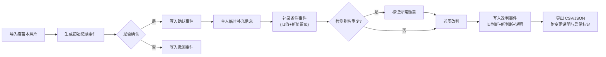

## 1. 产品概述
宠物训练课回访追踪系统，面向寄养店长老周等一线运营人员，解决疫苗本照片信息零散、新旧记录冲突、宠物别名混淆、人工判断变更无迹可查的问题。系统以事件溯源为核心，所有导入、修改、撤回、改判均留痕，支持按时间线回溯与导出差异比对。

- 目标用户：寄养店店长、宠物训练课回访专员
- 核心价值：收口后端入口，让历史可追溯、差异可说明、异常可标记

## 2. 核心功能

### 2.1 用户角色
| 角色 | 注册方式 | 核心权限 |
|------|----------|----------|
| 寄养店店长 | 默认角色（本地演示） | 导入记录、确认/撤回、改判、筛选、导出、查看时间线 |

### 2.2 功能模块
1. **记录导入页**：批量上传疫苗本照片/截图、解析基础信息、标注导入来源
2. **回访追踪主列表**：宠物档案行、别名重复异常标红、筛选面板、操作栏
3. **详情时间线页**：按时间倒序展示所有事件（导入→确认→撤回→补录→改判），每次变更保留快照
4. **改判与补录弹窗**：旧值/新值对比、必填改判说明、预览导出差异
5. **导出中心**：CSV/JSON 导出、异常标记列、导出变更说明摘要

### 2.3 页面详情
| 页面名称 | 模块名称 | 功能描述 |
|----------|----------|----------|
| 回访追踪主列表 | 筛选面板 | 按宠物名/别名、训练课进度、异常类型（别名重复/人工改判/待确认）筛选；筛选结果保留异常痕迹提示条 |
| 回访追踪主列表 | 记录行 | 展示宠物基本信息、当前状态、异常徽章；支持确认、撤回、补录、改判快捷操作 |
| 详情时间线页 | 事件卡片 | 每个事件展示：类型、时间、操作人、变更前后快照、来源（照片/补录/改判）、备注说明 |
| 详情时间线页 | 照片留影区 | 疫苗本原始照片缩略图、历史版本截图，点击放大查看 |
| 改判弹窗 | 差异预览 | 展示旧判断 vs 新判断，实时计算对导出字段的影响（例如："训练状态由'未完成'→'已完成'，导出第 5 列变更"） |
| 导出中心 | 导出预览 | 显示即将导出的行数、异常行数、与上次导出的差异条目 |

## 3. 核心流程

老周导入疫苗本照片 → 系统生成初始记录并标记来源 → 老周确认/撤回 → 主人临时补充信息 → 老周补录备注（系统自动与旧值对比留痕） → 发现别名重复 → 系统在筛选与导出中标记异常 → 老周调整判断 → 填写改判说明（旧判断+新判断+说明永久留存） → 导出时附带变更说明摘要。

## 4. 用户界面设计

### 4.1 设计风格
- **主色调**：深鼠尾草绿 `#4A6741`（沉稳专业），辅色：土橙 `#C97B3B`（异常提示）、暖米白 `#FAF6EE`（背景）
- **按钮风格**：微圆角（6px）、深绿底白字主按钮、浅灰描边次按钮、红橙底用于撤回/异常
- **字体**：标题用「思源宋体 CN SemiBold」（复古档案感），正文用「思源黑体 CN Regular」，数字与时间用等宽字体「JetBrains Mono」
- **布局风格**：左右双栏——左窄筛选 + 右宽列表；卡片式事件时间线，竖轴虚线连接
- **图标**：lucide-react 线性图标，异常状态加圆角 badge 叠加
- **整体调性**：档案卷宗感 + 现代管理后台，纸张纹理浅底 + 印章式异常戳记

### 4.2 页面设计概述
| 页面名称 | 模块名称 | UI 元素 |
|----------|----------|---------|
| 回访追踪主列表 | 顶部标题区 | 大标题「宠物训练课回访追踪」+ 副标题「事件溯源 · 全量留痕」+ 导入/导出主按钮 |
| 回访追踪主列表 | 筛选面板 | 卡片容器，标签式筛选组（全部/别名重复/人工改判/待确认）+ 搜索框 |
| 回访追踪主列表 | 记录列表 | 斑马纹行、异常行左侧土橙色竖条、别名重复用「⚠️ 别名冲突」徽章 |
| 详情时间线页 | 时间线区 | 左侧时间轴节点（圆形图标表示事件类型：📷导入、✅确认、↩️撤回、📝补录、⚖️改判），右侧卡片含前后对比表 |
| 改判弹窗 | 对比区 | 两列并排：旧判断（灰底删除线）vs 新判断（绿底高亮），下方文本域强制填写改判理由 |
| 导出中心 | 变更摘要 | 带编号的差异列表，每条显示「行号 + 字段 + 旧值 → 新值 + 变更原因」 |

### 4.3 响应性
- 桌面优先设计（≥1280px）：双栏布局，筛选栏固定 280px
- 平板（768–1279px）：筛选栏折叠为顶部抽屉
- 移动端（<768px）：列表单列，时间线简化，操作按钮收至更多菜单

### 4.4 3D 场景指引
本项目不涉及 3D 场景。
