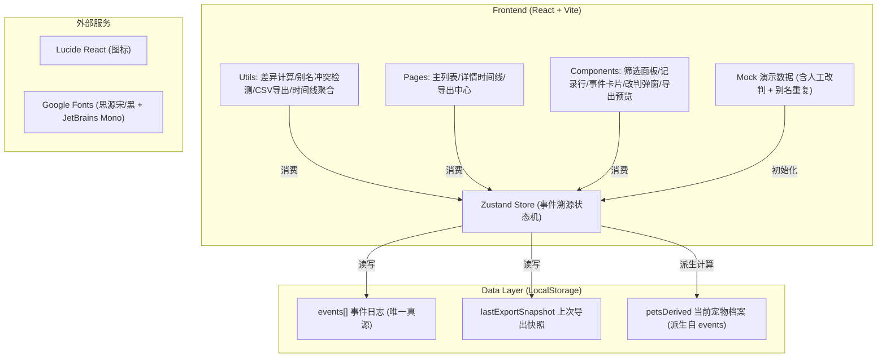
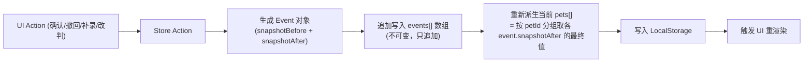
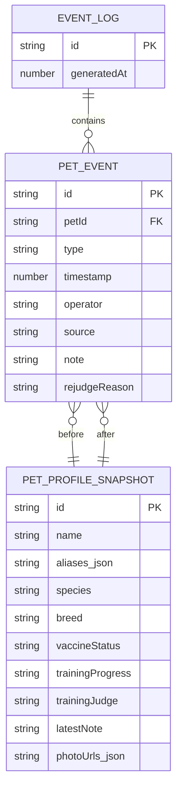

## 1. 架构设计



## 2. 技术描述
- **前端**：React@18 + TypeScript + Vite + tailwindcss@3 + zustand@4 + react-router-dom@6 + lucide-react
- **初始化工具**：vite-init（使用 `react-ts` 模板）
- **后端**：无（纯前端，本地 LocalStorage 作为持久化存储，收口后端入口的需求通过前端状态机 + 事件日志实现）
- **数据存储**：LocalStorage 存 `events` 数组（事件溯源唯一真源）+ `lastExportSnapshot`（用于导出差异比对）
- **演示数据**：内置 6 条宠物档案，其中 1 条含人工改判事件、2 条宠物别名重复、1 条含补录备注后导出变化

## 3. 路由定义
| 路由 | 用途 |
|------|------|
| / | 回访追踪主列表（含筛选、记录行、快捷操作） |
| /pet/:id | 宠物详情时间线页（事件卡片 + 照片留影 + 改判/补录入口） |
| /export | 导出中心（导出预览 + 变更摘要 + CSV/JSON 下载） |

## 4. API 定义
无后端 API。前端内部模块接口：

```typescript
// 事件溯源核心类型
type EventType =
  | 'import'      // 导入（疫苗本照片）
  | 'confirm'     // 确认
  | 'revoke'      // 撤回
  | 'addendum'    // 补录备注
  | 'rejudge'     // 人工改判

interface BaseEvent {
  id: string;
  petId: string;
  type: EventType;
  timestamp: number;
  operator: string;
  source?: 'vaccine_photo' | 'owner_supplement' | 'manual';
  note?: string;
  snapshotBefore: PetProfile;
  snapshotAfter: PetProfile;
}

interface PetProfile {
  name: string;
  aliases: string[];
  species: '狗' | '猫' | '其他';
  breed: string;
  vaccineStatus: string;
  trainingProgress: '未开始' | '进行中' | '已完成' | '中止';
  trainingJudge: '合格' | '不合格' | '待评定';
  latestNote: string;
  photoUrls: string[];
}

interface RejudgeEvent extends BaseEvent {
  type: 'rejudge';
  rejudgeReason: string;  // 改判说明（必填）
  oldJudge: '合格' | '不合格' | '待评定';
  newJudge: '合格' | '不合格' | '待评定';
}

// Store Actions 接口
interface PetStore {
  events: BaseEvent[];
  pets: (PetProfile & { petId: string; anomalies: Anomaly[]; lastModifiedAt: number })[];
  importPet: (profile: PetProfile, source: string, photoUrls: string[]) => void;
  confirmPet: (petId: string) => void;
  revokePet: (petId: string, reason: string) => void;
  addNote: (petId: string, note: string) => ExportDiff[];  // 返回本次补录对导出的影响
  rejudgePet: (petId: string, oldJudge, newJudge, reason: string) => void;
  detectAliasDuplicates: () => Map<string, string[]>;
  computeExportDiffSinceLast: () => ExportDiff[];
  markExported: () => void;
  exportCSV: () => Blob;
  exportJSON: () => Blob;
}

interface Anomaly {
  type: 'alias_duplicate' | 'manual_rejudge' | 'pending_confirm' | 'conflict_history';
  message: string;
  relatedPetIds?: string[];
}

interface ExportDiff {
  petId: string;
  petName: string;
  field: string;
  oldValue: string;
  newValue: string;
  reason: string;   // 对应事件的说明/备注
  eventType: EventType;
}
```

## 5. 服务端架构图
无后端服务。纯前端事件溯源架构：



## 6. 数据模型

### 6.1 数据模型定义


### 6.2 初始化数据（演示数据）
内置 **6 条** 演示宠物档案，刻意包含以下「不干净」的场景：

| # | 宠物名 | 别名 | 异常场景 | 事件序列 |
|---|--------|------|----------|----------|
| 1 | 豆豆 | 豆包、小胖 | **别名重复**（与 #2 共用「豆包」） | import → confirm → addendum（主人补：疫苗加强针） |
| 2 | 豆包 | 豆豆、团子 | **别名重复**（与 #1 共用「豆豆」）+ 历史冲突备注 | import → revoke → import(新照片) → confirm |
| 3 | 旺财 | 阿财 | **人工改判**（不合格→合格） | import → confirm → rejudge(理由：训练课视频显示已达标) |
| 4 | 雪球 | — | 正常（对照用） | import → confirm |
| 5 | 煤球 | 小黑 | 待确认 + 补录导出变化 | import → addendum(主人补：已完成脱敏训练) → pending_confirm |
| 6 | 毛毛 | 毛豆、毛毛 | 别名自重复 + 中止训练 | import → confirm → addendum → rejudge(待评定→中止) |

核心原则：**演示数据绝不只展示正常样例**，必须让异常徽章、改判痕迹、导出差异摘要在首次进入时即可见。
