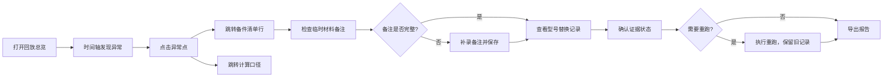

## 1. 产品概述
泵站巡检工单回放系统，用于解决备件清单与停机窗口不匹配、临时材料备注散落、型号替换无追踪等痛点，让排班同事无需依赖设备工程师老何人工兜底即可独立完成工单核对与沟通。
- 主要目的：可视化展示备件异常、追溯计算口径、管理补录记录、确保重跑一致性
- 目标用户：排班同事、设备工程师、巡检团队
- 核心价值：异常一眼可见、证据链完整可追溯、补录重跑前后一致

## 2. 核心功能

### 2.1 用户角色
| 角色 | 登录方式 | 核心权限 |
|------|----------|----------|
| 排班同事 | 工号登录 | 查看回放、补录备注、确认证据、导出报告 |
| 设备工程师 | 工号登录 | 全部权限 + 型号替换审核 + 计算口径维护 |

### 2.2 功能模块
1. **工单回放总览页**：异常时间轴图表、异常统计卡片、工单列表
2. **备件清单面板**：备件明细、到货时间 vs 停机窗口对比、临时材料备注、型号替换拦截记录
3. **计算口径面板**：计算规则说明、参数来源、追溯链接
4. **证据管理**：已确认/待补证据状态分类、补录入口
5. **回放记录**：历史重跑记录、新旧对比、版本导出

### 2.3 页面详情
| 页面名称 | 模块名称 | 功能描述 |
|----------|----------|----------|
| 工单回放总览页 | 异常时间轴图 | 甘特图形式展示停机窗口与备件到货时间的错位，红色高亮异常区间 |
| 工单回放总览页 | 异常统计卡片 | 4张卡片：总异常数 / 到货延误 / 型号替换拦截 / 待补证据数 |
| 工单回放总览页 | 工单列表 | 3-4条示例工单，含状态标签（顺利/补录/异常），点击展开详情 |
| 备件清单面板 | 备件明细表 | 每条备件显示：型号、需求量、到货时间、停机窗口、状态标记 |
| 备件清单面板 | 临时材料区 | 后补备注独立字段展示，可编辑补录，编辑后实时同步 |
| 备件清单面板 | 型号替换记录 | 显示替换申请、拦截原因、审批状态，点击展开详细拦截说明 |
| 计算口径面板 | 规则说明 | 停机窗口计算方式、到货时间判定标准、延误阈值定义 |
| 计算口径面板 | 参数追溯 | 每个参数可点击跳转回原始数据来源（工单/备件表） |
| 证据管理 | 状态分组 | 已确认（绿色勾选）/ 待补证据（黄色提示）分组展示 |
| 证据管理 | 补录入口 | 待补证据条目旁有「补录」按钮，弹出上传/备注表单 |
| 回放记录 | 历史版本 | 按时间列出重跑记录，显示本次修改内容摘要 |
| 回放记录 | 新旧对比 | 选中两次版本可对比差异，旧记录保留不被覆盖 |
| 回放记录 | 导出功能 | 导出PDF/Excel报告，含版本号、生成时间 |

## 3. 核心流程
排班同事打开工单回放 → 从时间轴图一眼发现异常 → 点击异常点跳转至对应备件清单行和计算口径 → 检查临时材料备注是否已补录（未补录则补录）→ 查看型号替换被拦截原因 → 确认证据状态（已确认/待补）→ 如需重跑，执行后旧记录保留、新记录带版本号 → 导出含完整证据链的报告用于沟通

## 4. 用户界面设计
### 4.1 设计风格
- 主色调：深海军蓝 #0A2342（专业可信工业风）
- 辅助色：珊瑚橙 #FF6B4A（异常告警）、翡翠绿 #2ECC71（已确认）、琥珀黄 #F4A423（待补证据）
- 中性色：冷灰 #E8ECEF（背景）、深灰 #2D3748（正文）、#718096（次要文本）
- 按钮风格：方角微圆角（4px），主按钮实心蓝+悬停变深+1px内阴影
- 字体：标题使用思源黑体 Heavy（粗体工业感），正文使用思源黑体 Regular，代码/数字使用 JetBrains Mono
- 布局：顶部导航 + 左侧工单列表 + 右侧主内容区（上半图下半表），卡片带1px描边和2px轻微投影
- 图标风格：Lucide线性图标，异常图标加实心填充

### 4.2 页面设计概览
| 页面名称 | 模块名称 | UI元素 |
|----------|----------|--------|
| 总览页 | 异常时间轴 | 甘特图条，异常段珊瑚橙高亮，悬停显示tooltip，点击跳转 |
| 总览页 | 统计卡片 | 4列网格，每张卡片大号数字+小字说明+左上图标，异常卡片带脉冲动画 |
| 总览页 | 工单列表 | 每行左侧状态色块（绿/黄/红），右侧工单编号+泵站名+时间，展开用∨箭头 |
| 备件清单 | 明细表 | 斑马纹行，异常行背景浅橙，状态列带彩色圆点标签 |
| 备件清单 | 临时材料 | 独立卡片，浅黄背景+编辑图标，点击变输入框 |
| 备件清单 | 替换拦截 | 折叠面板，标题显示「型号替换 - 已拦截」，展开显示拦截原因+规则 |
| 计算口径 | 规则区 | 编号列表，每条规则末尾加「🔗追溯」链接 |
| 证据管理 | 状态分组 | 两个Tab切换，待补Tab右上角有数字徽章 |
| 回放记录 | 版本列表 | 时间线样式，节点圆圈+连接线，选中项高亮边框 |

### 4.3 响应式
- 桌面优先设计，最小支持 1280px 宽度
- 平板宽度（768-1280px）：左侧工单列表折叠为图标栏，可展开
- 移动宽度（<768px）：上下堆叠布局，关键数据卡片优先展示

### 4.4 3D场景指导（不适用）
本项目无3D场景需求。
